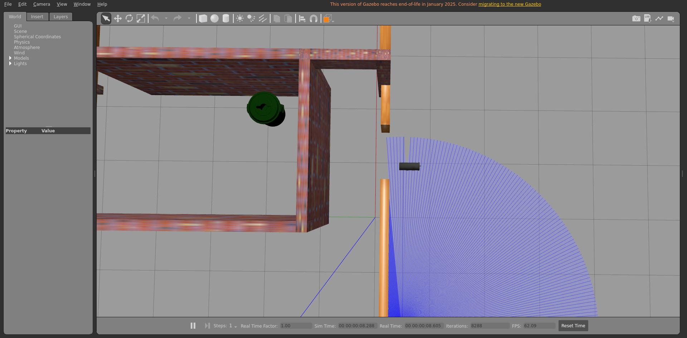
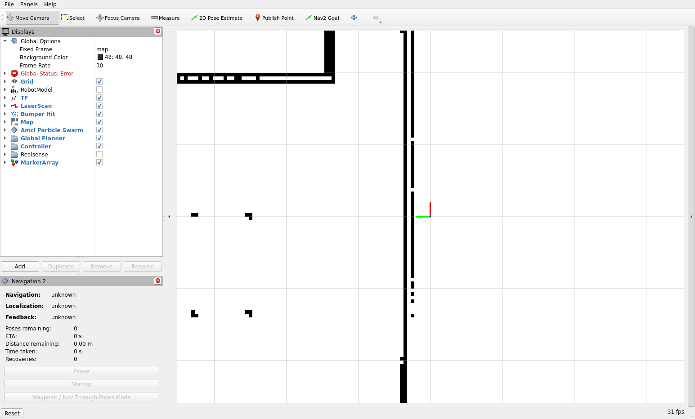
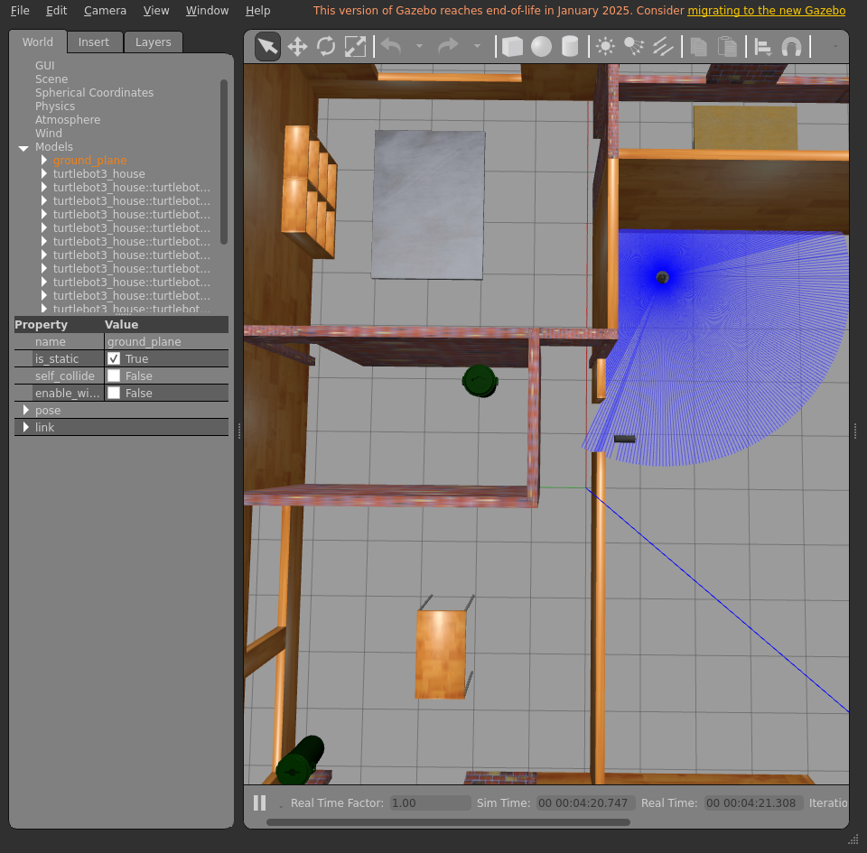
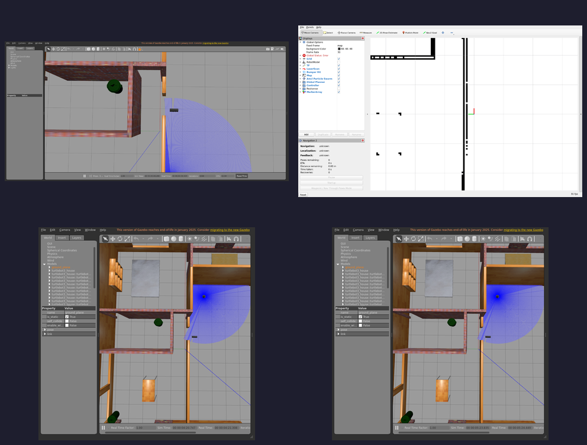

# Integration report — `feature/dev-setup`

| Field | Value |
|-------|-------|
| Result | **FAIL ❌** |
| Branch | `feature/dev-setup` |
| Commit | `808b73c` |
| Run at (UTC) | 20260706T174508Z |
| Host | bragg3d-Precision-7560 |
| ROS setup | /opt/ros/humble/setup.bash |
| Model | burger |
| Terminal | xterm |

## Steps walked

- Terminal 1 — Gazebo + TurtleBot3
- Terminal 2 — Nav2
- Static transform map->odom (fixes 'frame [map] does not exist')
- Terminal 3 — Nav2 API server
- Terminal 4 — LLM voice node

## Feature verdict

- Robot navigated correctly: **no**
- Notes: failed to get to kitchen, tried to cheat pathfinding resulting in the robot getting stuck in a corner, attempted to path around walls, a route that did not exist... the route to the kitchen was simple and straightforward

## Artifacts (screenshots / posters — slideshow material)

