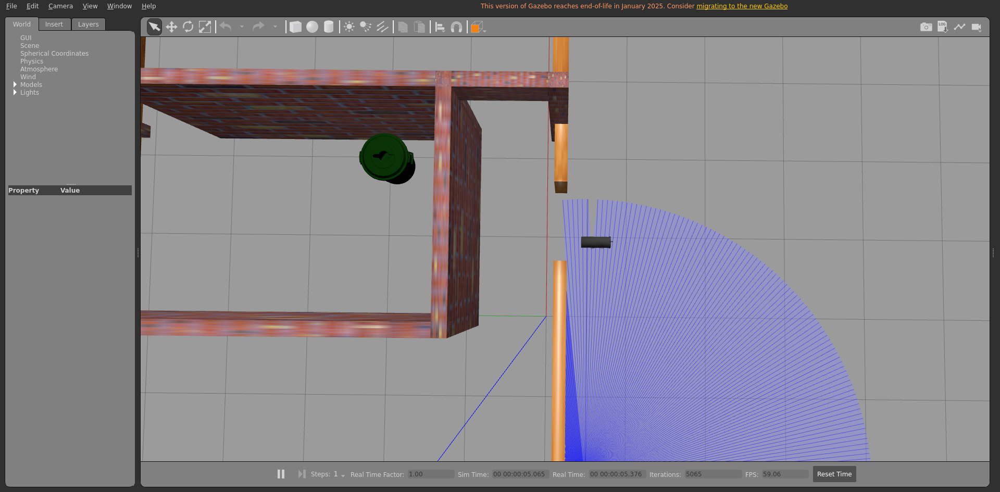
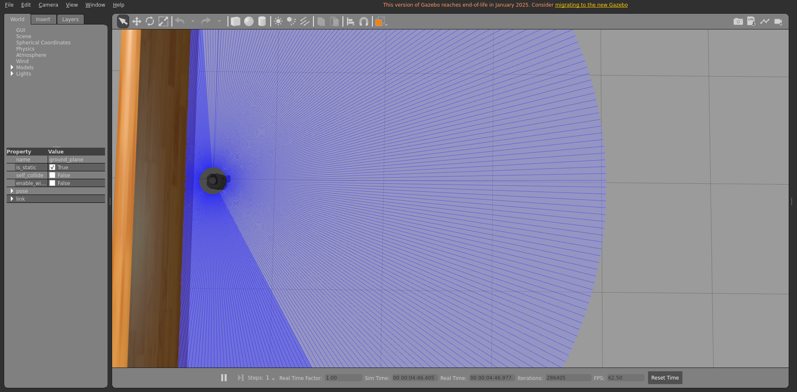
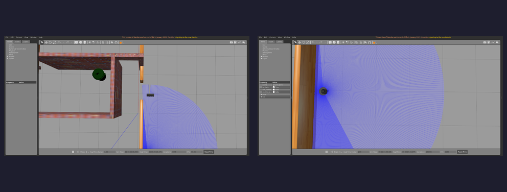

# Integration report — `feature/dev-setup`

| Field | Value |
|-------|-------|
| Result | **INCOMPLETE ⏹️ (run ended before the feature verdict)** |
| Branch | `feature/dev-setup` |
| Commit | `3c7e373` |
| Run at (UTC) | 20260706T183716Z |
| Host | bragg3d-Precision-7560 |
| ROS setup | /opt/ros/humble/setup.bash |
| Model | burger |
| Terminal | xterm |

## Steps walked

- Terminal 1 — Gazebo + TurtleBot3
- Terminal 2 — Nav2

## Feature verdict

- Robot navigated correctly: **(not reached)**
- Notes: (none)

## Artifacts (screenshots / posters — slideshow material)

