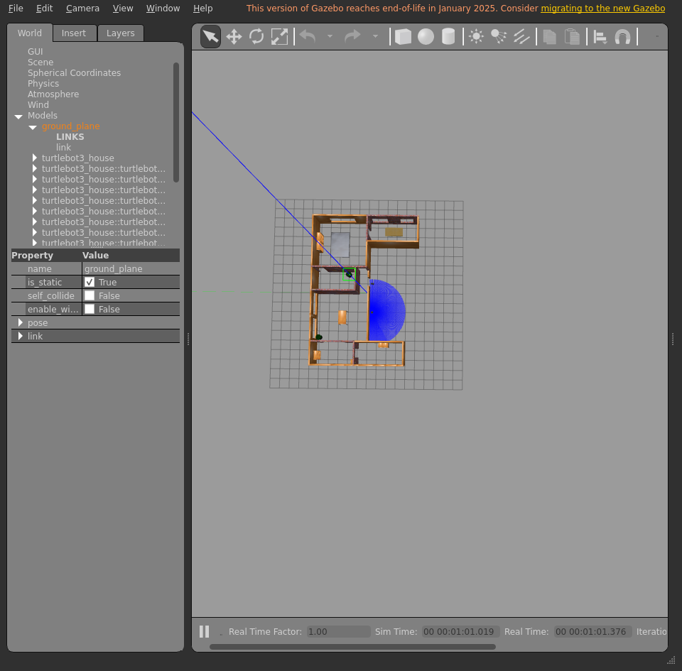
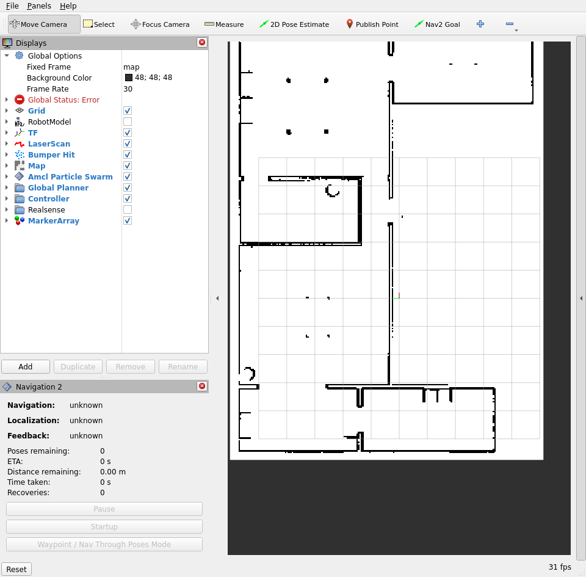
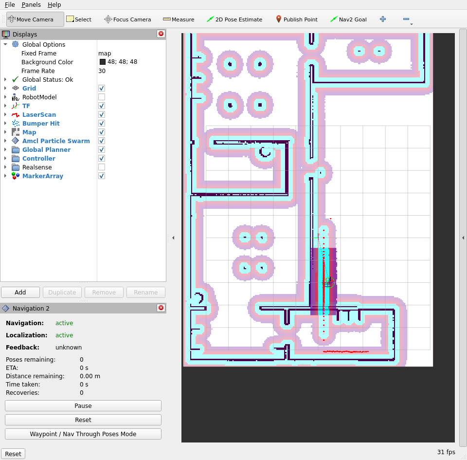
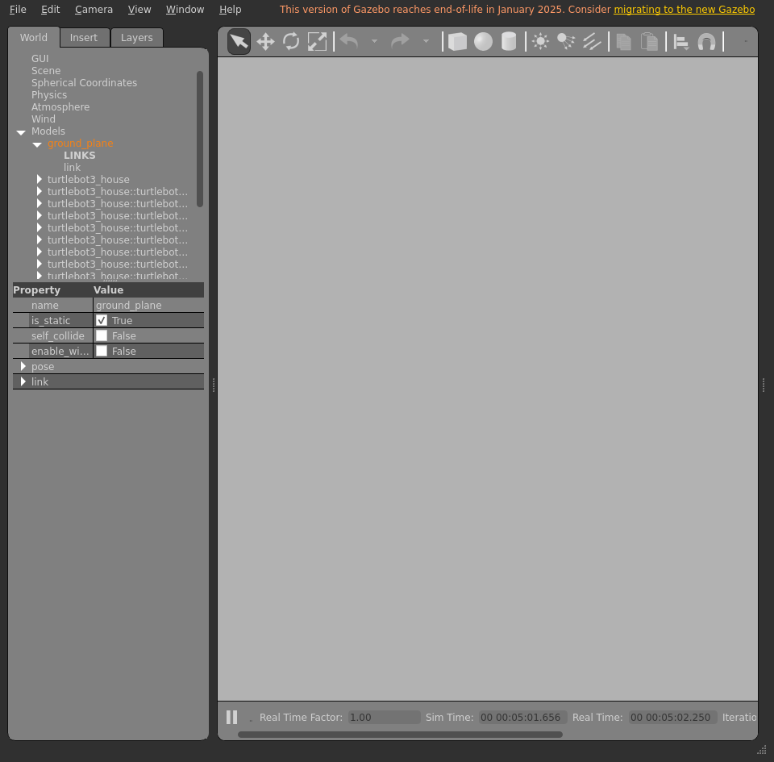
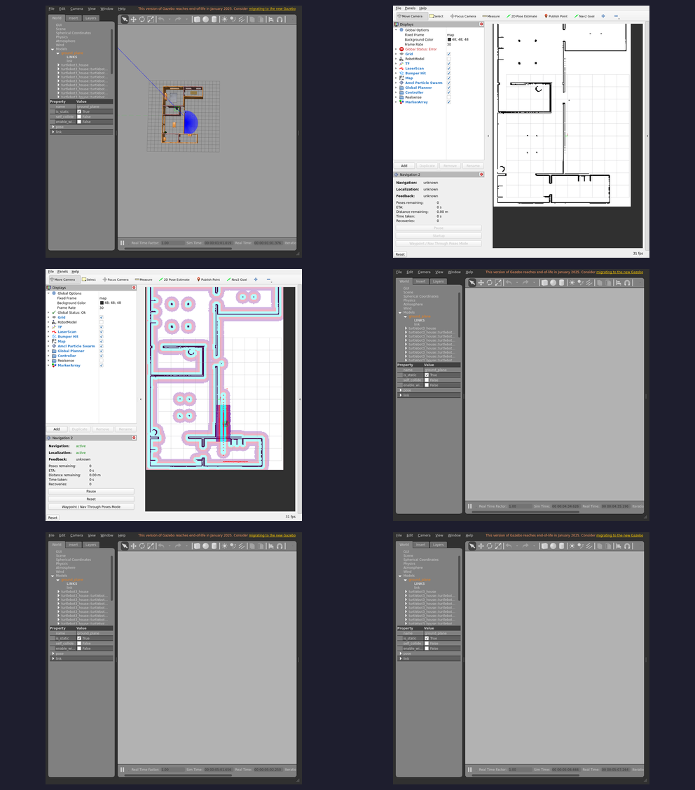

# Integration report — `feature/dev-setup`

| Field | Value |
|-------|-------|
| Result | **FAIL ❌** |
| Branch | `feature/dev-setup` |
| Commit | `3c7e373` |
| Run at (UTC) | 20260706T184213Z |
| Host | bragg3d-Precision-7560 |
| ROS setup | /opt/ros/humble/setup.bash |
| Model | burger |
| Terminal | xterm |

## Steps walked

- Terminal 1 — Gazebo + TurtleBot3
- Terminal 2 — Nav2
- Localization — seed AMCL initial pose
- Terminal 3 — Nav2 API server
- Terminal 4 — LLM voice node

## Feature verdict

- Robot navigated correctly: **no**
- Notes: header:  stamp:    sec: 204    nanosec: 297000000  frame_id: mappose:  pose:    position:      x: -0.06623175025525813      y: -0.5602234050257626      z: 0.0    orientation:      x: 0.0      y: 0.0      z: 0.009182881146519996      w: 0.9999578364580423  covariance:  - 0.2286588523446893  - -0.0008466805842841027  - 0.0  - 0.0  - 0.0  - 0.0  - -0.0008466805842841027  - 0.24724450418277577  - 0.0  - 0.0  - 0.0  - 0.0  - 0.0  - 0.0  - 0.0  - 0.0  - 0.0  - 0.0  - 0.0  - 0.0  - 0.0  - 0.0  - 0.0  - 0.0  - 0.0  - 0.0  - 0.0  - 0.0  - 0.0  - 0.0  - 0.0  - 0.0  - 0.0  - 0.0  - 0.0  - 0.06402490236084683--- (results from the echo pose thing)

## Artifacts (screenshots / posters — slideshow material)

