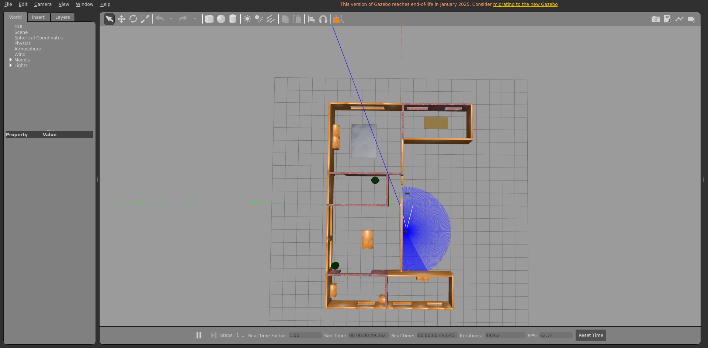
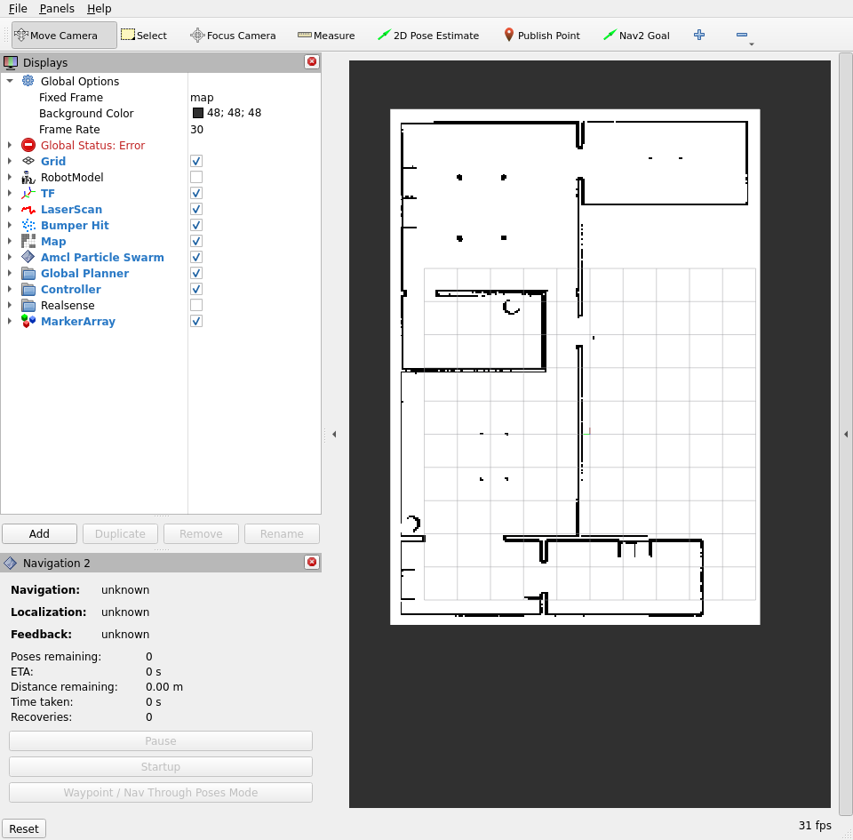
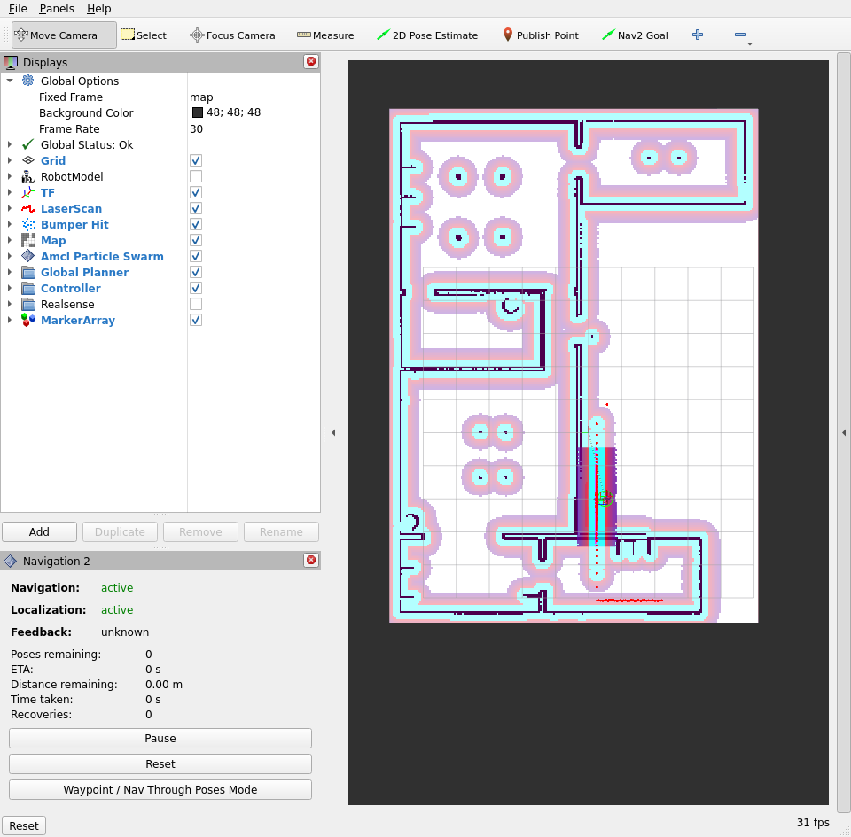
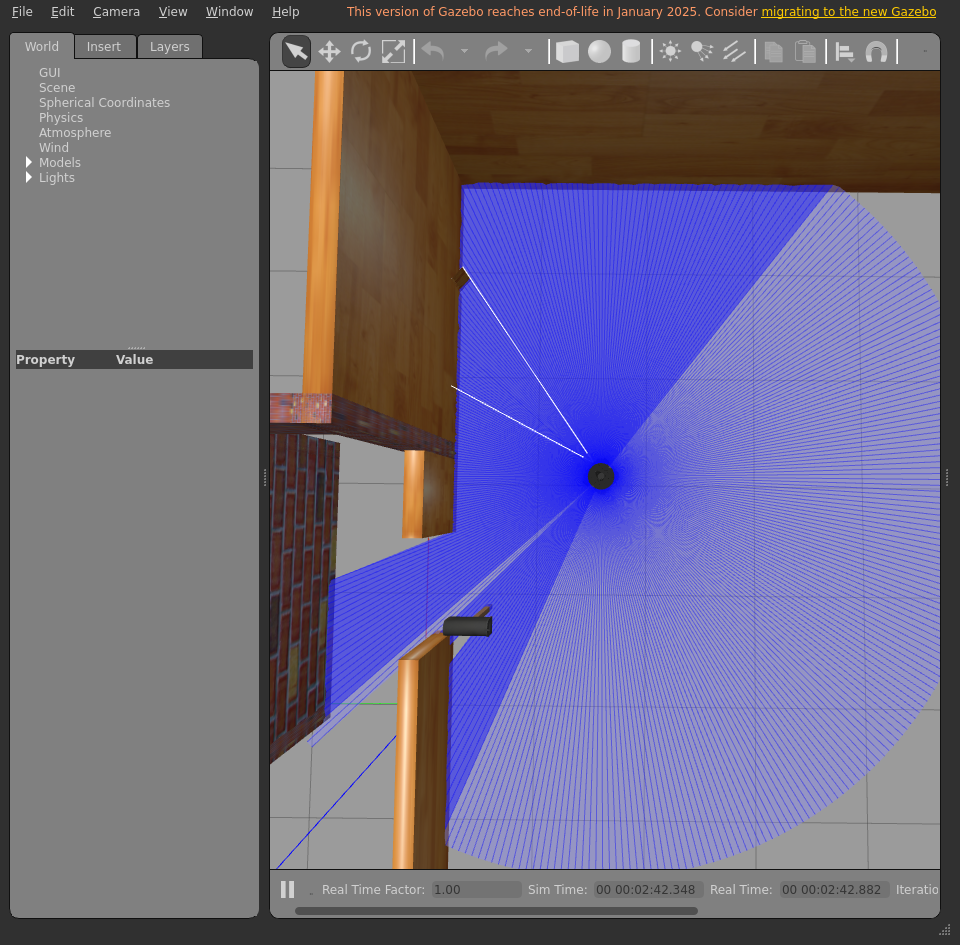
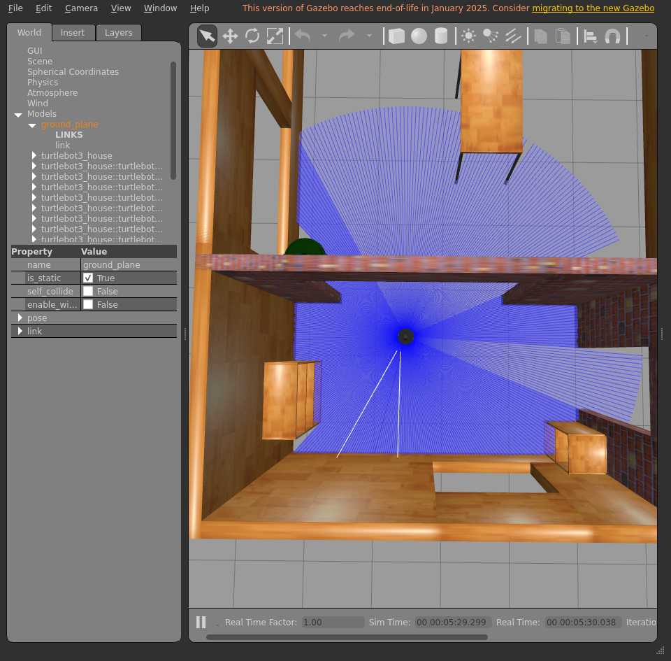
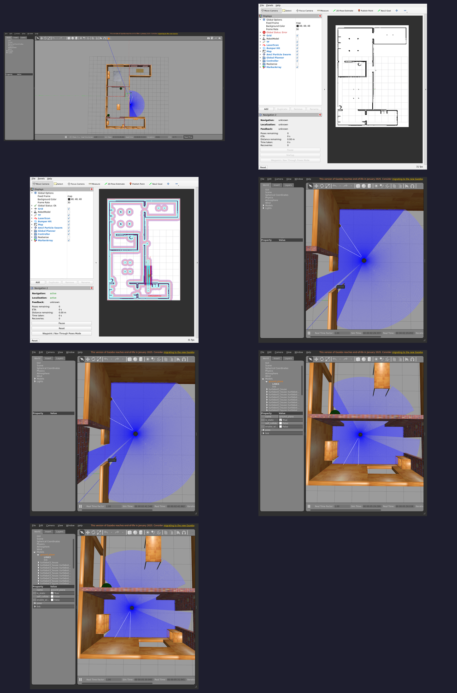

# Integration report — `feature/dev-setup`

| Field | Value |
|-------|-------|
| Result | **FAIL ❌** |
| Branch | `feature/dev-setup` |
| Commit | `a361e3e` |
| Run at (UTC) | 20260707T195332Z |
| Host | bragg3d-Precision-7560 |
| ROS setup | /opt/ros/humble/setup.bash |
| Model | waffle |
| Terminal | xterm |

## Steps walked

- Terminal 1 — Gazebo + TurtleBot3
- Terminal 2 — Nav2
- Localization — seed AMCL initial pose
- Direct Nav2 goal — drive to kitchen (bypasses the LLM)
- Terminal 3 — Nav2 API server
- Terminal 4 — LLM voice node

## Feature verdict

- Robot navigated correctly: **no**
- Notes: the robot did make it to the kitchen, but the initial script did not get it to the kitchen, but, when i got to the step where i could press X to send it another input, it actually made it

## Artifacts (screenshots / posters — slideshow material)










## Terminal logs (last 300 lines each)

<details><summary><code>1-gazebo</code></summary>

```
=== 1-gazebo ===
[INFO] [launch]: All log files can be found below /home/ubuntu/.ros/log/2026-07-07-19-53-32-926352-bragg3d-Precision-7560-17856
[INFO] [launch]: Default logging verbosity is set to INFO
urdf_file_name : turtlebot3_waffle.urdf
urdf_file_name : turtlebot3_waffle.urdf
urdf_file_name : turtlebot3_waffle.urdf
[INFO] [gzserver-1]: process started with pid [17858]
[INFO] [gzclient-2]: process started with pid [17860]
[INFO] [robot_state_publisher-3]: process started with pid [17862]
[INFO] [spawn_entity.py-4]: process started with pid [17864]
[robot_state_publisher-3] [INFO] [1783454013.940123062] [robot_state_publisher]: got segment base_footprint
[robot_state_publisher-3] [INFO] [1783454013.940228640] [robot_state_publisher]: got segment base_link
[robot_state_publisher-3] [INFO] [1783454013.940234825] [robot_state_publisher]: got segment base_scan
[robot_state_publisher-3] [INFO] [1783454013.940238569] [robot_state_publisher]: got segment camera_depth_frame
[robot_state_publisher-3] [INFO] [1783454013.940242294] [robot_state_publisher]: got segment camera_depth_optical_frame
[robot_state_publisher-3] [INFO] [1783454013.940246108] [robot_state_publisher]: got segment camera_link
[robot_state_publisher-3] [INFO] [1783454013.940249749] [robot_state_publisher]: got segment camera_rgb_frame
[robot_state_publisher-3] [INFO] [1783454013.940253215] [robot_state_publisher]: got segment camera_rgb_optical_frame
[robot_state_publisher-3] [INFO] [1783454013.940256711] [robot_state_publisher]: got segment caster_back_left_link
[robot_state_publisher-3] [INFO] [1783454013.940260204] [robot_state_publisher]: got segment caster_back_right_link
[robot_state_publisher-3] [INFO] [1783454013.940263615] [robot_state_publisher]: got segment imu_link
[robot_state_publisher-3] [INFO] [1783454013.940266993] [robot_state_publisher]: got segment wheel_left_link
[robot_state_publisher-3] [INFO] [1783454013.940270541] [robot_state_publisher]: got segment wheel_right_link
[spawn_entity.py-4] [INFO] [1783454014.194711571] [spawn_entity]: Spawn Entity started
[spawn_entity.py-4] [INFO] [1783454014.194927927] [spawn_entity]: Loading entity XML from file /opt/ros/humble/share/turtlebot3_gazebo/models/turtlebot3_waffle/model.sdf
[spawn_entity.py-4] [INFO] [1783454014.195425542] [spawn_entity]: Waiting for service /spawn_entity, timeout = 30
[spawn_entity.py-4] [INFO] [1783454014.195612704] [spawn_entity]: Waiting for service /spawn_entity
[spawn_entity.py-4] [INFO] [1783454033.225548214] [spawn_entity]: Calling service /spawn_entity
[gzserver-1] [INFO] [1783454034.082122677] [turtlebot3_imu]: <initial_orientation_as_reference> is unset, using default value of false to comply with REP 145 (world as orientation reference)
[spawn_entity.py-4] [INFO] [1783454034.137597270] [spawn_entity]: Spawn status: SpawnEntity: Successfully spawned entity [waffle]
[gzserver-1] [INFO] [1783454034.267427554] [camera_driver]: Publishing camera info to [/camera/camera_info]
[gzserver-1] [INFO] [1783454034.347181111] [turtlebot3_diff_drive]: Wheel pair 1 separation set to [0.287000m]
[gzserver-1] [INFO] [1783454034.347211287] [turtlebot3_diff_drive]: Wheel pair 1 diameter set to [0.066000m]
[gzserver-1] [INFO] [1783454034.347571375] [turtlebot3_diff_drive]: Subscribed to [/cmd_vel]
[gzserver-1] [INFO] [1783454034.348261754] [turtlebot3_diff_drive]: Advertise odometry on [/odom]
[gzserver-1] [INFO] [1783454034.349059052] [turtlebot3_diff_drive]: Publishing odom transforms between [odom] and [base_footprint]
[gzserver-1] [INFO] [1783454034.353619449] [turtlebot3_joint_state]: Going to publish joint [wheel_left_joint]
[gzserver-1] [INFO] [1783454034.353634455] [turtlebot3_joint_state]: Going to publish joint [wheel_right_joint]
[INFO] [spawn_entity.py-4]: process has finished cleanly [pid 17864]
```

</details>

<details><summary><code>2-nav2</code></summary>

```
=== 2-nav2 ===
[INFO] [launch]: All log files can be found below /home/ubuntu/.ros/log/2026-07-07-19-54-44-330617-bragg3d-Precision-7560-19195
[INFO] [launch]: Default logging verbosity is set to INFO
[INFO] [robot_state_publisher-1]: process started with pid [19246]
[INFO] [rviz2-2]: process started with pid [19248]
[INFO] [component_container_isolated-3]: process started with pid [19250]
[robot_state_publisher-1] [INFO] [1783454084.927261381] [robot_state_publisher]: got segment base_footprint
[robot_state_publisher-1] [INFO] [1783454084.927319388] [robot_state_publisher]: got segment base_link
[robot_state_publisher-1] [INFO] [1783454084.927325571] [robot_state_publisher]: got segment base_scan
[robot_state_publisher-1] [INFO] [1783454084.927329267] [robot_state_publisher]: got segment camera_depth_frame
[robot_state_publisher-1] [INFO] [1783454084.927332962] [robot_state_publisher]: got segment camera_depth_optical_frame
[robot_state_publisher-1] [INFO] [1783454084.927336828] [robot_state_publisher]: got segment camera_link
[robot_state_publisher-1] [INFO] [1783454084.927340442] [robot_state_publisher]: got segment camera_rgb_frame
[robot_state_publisher-1] [INFO] [1783454084.927344007] [robot_state_publisher]: got segment camera_rgb_optical_frame
[robot_state_publisher-1] [INFO] [1783454084.927347658] [robot_state_publisher]: got segment caster_back_left_link
[robot_state_publisher-1] [INFO] [1783454084.927351279] [robot_state_publisher]: got segment caster_back_right_link
[robot_state_publisher-1] [INFO] [1783454084.927354699] [robot_state_publisher]: got segment imu_link
[robot_state_publisher-1] [INFO] [1783454084.927358256] [robot_state_publisher]: got segment wheel_left_link
[robot_state_publisher-1] [INFO] [1783454084.927361735] [robot_state_publisher]: got segment wheel_right_link
[component_container_isolated-3] [INFO] [1783454084.951843964] [nav2_container]: Load Library: /opt/ros/humble/lib/libmap_server_core.so
[component_container_isolated-3] [INFO] [1783454084.958995340] [nav2_container]: Found class: rclcpp_components::NodeFactoryTemplate<nav2_map_server::CostmapFilterInfoServer>
[component_container_isolated-3] [INFO] [1783454084.959023058] [nav2_container]: Found class: rclcpp_components::NodeFactoryTemplate<nav2_map_server::MapSaver>
[component_container_isolated-3] [INFO] [1783454084.959027824] [nav2_container]: Found class: rclcpp_components::NodeFactoryTemplate<nav2_map_server::MapServer>
[component_container_isolated-3] [INFO] [1783454084.959031462] [nav2_container]: Instantiate class: rclcpp_components::NodeFactoryTemplate<nav2_map_server::MapServer>
[component_container_isolated-3] [INFO] [1783454084.962033525] [map_server]: 
[component_container_isolated-3] 	map_server lifecycle node launched. 
[component_container_isolated-3] 	Waiting on external lifecycle transitions to activate
[component_container_isolated-3] 	See https://design.ros2.org/articles/node_lifecycle.html for more information.
[component_container_isolated-3] [INFO] [1783454084.962075648] [map_server]: Creating
[INFO] [launch_ros.actions.load_composable_nodes]: Loaded node '/map_server' in container '/nav2_container'
[component_container_isolated-3] [INFO] [1783454084.964025604] [nav2_container]: Load Library: /opt/ros/humble/lib/libamcl_core.so
[component_container_isolated-3] [INFO] [1783454084.966108154] [nav2_container]: Found class: rclcpp_components::NodeFactoryTemplate<nav2_amcl::AmclNode>
[component_container_isolated-3] [INFO] [1783454084.966140494] [nav2_container]: Instantiate class: rclcpp_components::NodeFactoryTemplate<nav2_amcl::AmclNode>
[component_container_isolated-3] [INFO] [1783454084.968554096] [amcl]: 
[component_container_isolated-3] 	amcl lifecycle node launched. 
[component_container_isolated-3] 	Waiting on external lifecycle transitions to activate
[component_container_isolated-3] 	See https://design.ros2.org/articles/node_lifecycle.html for more information.
[component_container_isolated-3] [INFO] [1783454084.968848924] [amcl]: Creating
[INFO] [launch_ros.actions.load_composable_nodes]: Loaded node '/amcl' in container '/nav2_container'
[component_container_isolated-3] [INFO] [1783454084.970935118] [nav2_container]: Load Library: /opt/ros/humble/lib/libnav2_lifecycle_manager_core.so
[component_container_isolated-3] [INFO] [1783454084.971546898] [nav2_container]: Found class: rclcpp_components::NodeFactoryTemplate<nav2_lifecycle_manager::LifecycleManager>
[component_container_isolated-3] [INFO] [1783454084.971564784] [nav2_container]: Instantiate class: rclcpp_components::NodeFactoryTemplate<nav2_lifecycle_manager::LifecycleManager>
[component_container_isolated-3] [INFO] [1783454084.974373604] [lifecycle_manager_localization]: Creating
[component_container_isolated-3] [INFO] [1783454084.976017451] [lifecycle_manager_localization]: Creating and initializing lifecycle service clients
[INFO] [launch_ros.actions.load_composable_nodes]: Loaded node '/lifecycle_manager_localization' in container '/nav2_container'
[component_container_isolated-3] [INFO] [1783454084.976749076] [lifecycle_manager_localization]: Starting managed nodes bringup...
[component_container_isolated-3] [INFO] [1783454084.976771734] [lifecycle_manager_localization]: Configuring map_server
[component_container_isolated-3] [INFO] [1783454084.976860932] [map_server]: Configuring
[component_container_isolated-3] [INFO] [1783454084.976915274] [map_io]: Loading yaml file: /nav2gpt/nav2gpt_ws/install/ros2ai/share/ros2ai/maps/house.yaml
[component_container_isolated-3] [INFO] [1783454084.977084386] [map_io]: resolution: 0.05
[component_container_isolated-3] [INFO] [1783454084.977090110] [map_io]: origin[0]: -5.75
[component_container_isolated-3] [INFO] [1783454084.977092644] [map_io]: origin[1]: -5.13
[component_container_isolated-3] [INFO] [1783454084.977095057] [map_io]: origin[2]: 0
[component_container_isolated-3] [INFO] [1783454084.977097607] [map_io]: free_thresh: 0.25
[component_container_isolated-3] [INFO] [1783454084.977100043] [map_io]: occupied_thresh: 0.65
[component_container_isolated-3] [INFO] [1783454084.977102738] [map_io]: mode: trinary
[component_container_isolated-3] [INFO] [1783454084.977105441] [map_io]: negate: 0
[component_container_isolated-3] [INFO] [1783454084.977225985] [map_io]: Loading image_file: /nav2gpt/nav2gpt_ws/install/ros2ai/share/ros2ai/maps/house.pgm
[component_container_isolated-3] [INFO] [1783454084.981381270] [map_io]: Read map /nav2gpt/nav2gpt_ws/install/ros2ai/share/ros2ai/maps/house.pgm: 311 X 223 map @ 0.05 m/cell
[component_container_isolated-3] [INFO] [1783454084.982380990] [lifecycle_manager_localization]: Configuring amcl
[component_container_isolated-3] [INFO] [1783454084.982512532] [amcl]: Configuring
[component_container_isolated-3] [INFO] [1783454084.982578057] [amcl]: initTransforms
[component_container_isolated-3] [INFO] [1783454084.984989475] [amcl]: initPubSub
[component_container_isolated-3] [INFO] [1783454084.985423966] [amcl]: Subscribed to map topic.
[component_container_isolated-3] [INFO] [1783454084.986169860] [lifecycle_manager_localization]: Activating map_server
[component_container_isolated-3] [INFO] [1783454084.986240683] [map_server]: Activating
[component_container_isolated-3] [INFO] [1783454084.986312934] [map_server]: Creating bond (map_server) to lifecycle manager.
[component_container_isolated-3] [INFO] [1783454084.986360405] [amcl]: Received a 311 X 223 map @ 0.050 m/pix
[rviz2-2] [INFO] [1783454085.023002079] [rviz2]: Stereo is NOT SUPPORTED
[rviz2-2] [INFO] [1783454085.023057246] [rviz2]: OpenGl version: 4.6 (GLSL 4.6)
[rviz2-2] [INFO] [1783454085.039164745] [rviz2]: Stereo is NOT SUPPORTED
[component_container_isolated-3] [INFO] [1783454085.087130264] [lifecycle_manager_localization]: Server map_server connected with bond.
[component_container_isolated-3] [INFO] [1783454085.087161456] [lifecycle_manager_localization]: Activating amcl
[component_container_isolated-3] [INFO] [1783454085.087245631] [amcl]: Activating
[component_container_isolated-3] [INFO] [1783454085.087294348] [amcl]: Creating bond (amcl) to lifecycle manager.
[component_container_isolated-3] [WARN] [1783454085.095594148] [amcl]: New subscription discovered on topic '/particle_cloud', requesting incompatible QoS. No messages will be sent to it. Last incompatible policy: RELIABILITY_QOS_POLICY
[component_container_isolated-3] [INFO] [1783454085.145708440] [nav2_container]: Load Library: /opt/ros/humble/lib/libcontroller_server_core.so
[component_container_isolated-3] [INFO] [1783454085.147555569] [nav2_container]: Found class: rclcpp_components::NodeFactoryTemplate<nav2_controller::ControllerServer>
[component_container_isolated-3] [INFO] [1783454085.147592020] [nav2_container]: Instantiate class: rclcpp_components::NodeFactoryTemplate<nav2_controller::ControllerServer>
[component_container_isolated-3] [INFO] [1783454085.151118652] [controller_server]: 
[component_container_isolated-3] 	controller_server lifecycle node launched. 
[component_container_isolated-3] 	Waiting on external lifecycle transitions to activate
[component_container_isolated-3] 	See https://design.ros2.org/articles/node_lifecycle.html for more information.
[component_container_isolated-3] [INFO] [1783454085.155836794] [controller_server]: Creating controller server
[component_container_isolated-3] [INFO] [1783454085.160176971] [local_costmap.local_costmap]: 
[component_container_isolated-3] 	local_costmap lifecycle node launched. 
[component_container_isolated-3] 	Waiting on external lifecycle transitions to activate
[component_container_isolated-3] 	See https://design.ros2.org/articles/node_lifecycle.html for more information.
[component_container_isolated-3] [INFO] [1783454085.160793739] [local_costmap.local_costmap]: Creating Costmap
[INFO] [launch_ros.actions.load_composable_nodes]: Loaded node '/controller_server' in container '/nav2_container'
[component_container_isolated-3] [INFO] [1783454085.163476454] [nav2_container]: Load Library: /opt/ros/humble/lib/libsmoother_server_core.so
[component_container_isolated-3] [INFO] [1783454085.164713459] [nav2_container]: Found class: rclcpp_components::NodeFactoryTemplate<nav2_smoother::SmootherServer>
[component_container_isolated-3] [INFO] [1783454085.164733983] [nav2_container]: Instantiate class: rclcpp_components::NodeFactoryTemplate<nav2_smoother::SmootherServer>
[component_container_isolated-3] [INFO] [1783454085.167628193] [smoother_server]: 
[component_container_isolated-3] 	smoother_server lifecycle node launched. 
[component_container_isolated-3] 	Waiting on external lifecycle transitions to activate
[component_container_isolated-3] 	See https://design.ros2.org/articles/node_lifecycle.html for more information.
[component_container_isolated-3] [INFO] [1783454085.168737083] [smoother_server]: Creating smoother server
[INFO] [launch_ros.actions.load_composable_nodes]: Loaded node '/smoother_server' in container '/nav2_container'
[component_container_isolated-3] [INFO] [1783454085.172073911] [nav2_container]: Load Library: /opt/ros/humble/lib/libplanner_server_core.so
[component_container_isolated-3] [INFO] [1783454085.173194241] [nav2_container]: Found class: rclcpp_components::NodeFactoryTemplate<nav2_planner::PlannerServer>
[component_container_isolated-3] [INFO] [1783454085.173256977] [nav2_container]: Instantiate class: rclcpp_components::NodeFactoryTemplate<nav2_planner::PlannerServer>
[component_container_isolated-3] [INFO] [1783454085.177175007] [planner_server]: 
[component_container_isolated-3] 	planner_server lifecycle node launched. 
[component_container_isolated-3] 	Waiting on external lifecycle transitions to activate
[component_container_isolated-3] 	See https://design.ros2.org/articles/node_lifecycle.html for more information.
[component_container_isolated-3] [INFO] [1783454085.178531155] [planner_server]: Creating
[component_container_isolated-3] [INFO] [1783454085.181719839] [global_costmap.global_costmap]: 
[component_container_isolated-3] 	global_costmap lifecycle node launched. 
[component_container_isolated-3] 	Waiting on external lifecycle transitions to activate
[component_container_isolated-3] 	See https://design.ros2.org/articles/node_lifecycle.html for more information.
[component_container_isolated-3] [INFO] [1783454085.182021523] [global_costmap.global_costmap]: Creating Costmap
[INFO] [launch_ros.actions.load_composable_nodes]: Loaded node '/planner_server' in container '/nav2_container'
[component_container_isolated-3] [INFO] [1783454085.184296512] [nav2_container]: Load Library: /opt/ros/humble/lib/libbehavior_server_core.so
[component_container_isolated-3] [INFO] [1783454085.186856173] [nav2_container]: Found class: rclcpp_components::NodeFactoryTemplate<behavior_server::BehaviorServer>
[component_container_isolated-3] [INFO] [1783454085.186879947] [nav2_container]: Instantiate class: rclcpp_components::NodeFactoryTemplate<behavior_server::BehaviorServer>
[component_container_isolated-3] [INFO] [1783454085.188028731] [lifecycle_manager_localization]: Server amcl connected with bond.
[component_container_isolated-3] [INFO] [1783454085.188099540] [lifecycle_manager_localization]: Managed nodes are active
[component_container_isolated-3] [INFO] [1783454085.188111118] [lifecycle_manager_localization]: Creating bond timer...
[component_container_isolated-3] [INFO] [1783454085.190168071] [behavior_server]: 
[component_container_isolated-3] 	behavior_server lifecycle node launched. 
[component_container_isolated-3] 	Waiting on external lifecycle transitions to activate
[component_container_isolated-3] 	See https://design.ros2.org/articles/node_lifecycle.html for more information.
[INFO] [launch_ros.actions.load_composable_nodes]: Loaded node '/behavior_server' in container '/nav2_container'
[component_container_isolated-3] [INFO] [1783454085.193433594] [nav2_container]: Load Library: /opt/ros/humble/lib/libbt_navigator_core.so
[component_container_isolated-3] [INFO] [1783454085.194465921] [nav2_container]: Found class: rclcpp_components::NodeFactoryTemplate<nav2_bt_navigator::BtNavigator>
[component_container_isolated-3] [INFO] [1783454085.194506478] [nav2_container]: Instantiate class: rclcpp_components::NodeFactoryTemplate<nav2_bt_navigator::BtNavigator>
[component_container_isolated-3] [INFO] [1783454085.198047231] [bt_navigator]: 
[component_container_isolated-3] 	bt_navigator lifecycle node launched. 
[component_container_isolated-3] 	Waiting on external lifecycle transitions to activate
[component_container_isolated-3] 	See https://design.ros2.org/articles/node_lifecycle.html for more information.
[component_container_isolated-3] [INFO] [1783454085.198122996] [bt_navigator]: Creating
[rviz2-2] [INFO] [1783454085.199166400] [rviz2]: Trying to create a map of size 311 x 223 using 1 swatches
[INFO] [launch_ros.actions.load_composable_nodes]: Loaded node '/bt_navigator' in container '/nav2_container'
[component_container_isolated-3] [INFO] [1783454085.200516728] [nav2_container]: Load Library: /opt/ros/humble/lib/libwaypoint_follower_core.so
[component_container_isolated-3] [INFO] [1783454085.201077811] [nav2_container]: Found class: rclcpp_components::NodeFactoryTemplate<nav2_waypoint_follower::WaypointFollower>
[component_container_isolated-3] [INFO] [1783454085.201108721] [nav2_container]: Instantiate class: rclcpp_components::NodeFactoryTemplate<nav2_waypoint_follower::WaypointFollower>
[component_container_isolated-3] [INFO] [1783454085.204360697] [waypoint_follower]: 
[component_container_isolated-3] 	waypoint_follower lifecycle node launched. 
[component_container_isolated-3] 	Waiting on external lifecycle transitions to activate
[component_container_isolated-3] 	See https://design.ros2.org/articles/node_lifecycle.html for more information.
[component_container_isolated-3] [INFO] [1783454085.204847473] [waypoint_follower]: Creating
[rviz2-2] [ERROR] [1783454085.204950488] [rviz2]: Vertex Program:rviz/glsl120/indexed_8bit_image.vert Fragment Program:rviz/glsl120/indexed_8bit_image.frag GLSL link result : 
[rviz2-2] active samplers with a different type refer to the same texture image unit
[INFO] [launch_ros.actions.load_composable_nodes]: Loaded node '/waypoint_follower' in container '/nav2_container'
[component_container_isolated-3] [INFO] [1783454085.206711924] [nav2_container]: Load Library: /opt/ros/humble/lib/libvelocity_smoother_core.so
[component_container_isolated-3] [INFO] [1783454085.207265364] [nav2_container]: Found class: rclcpp_components::NodeFactoryTemplate<nav2_velocity_smoother::VelocitySmoother>
[component_container_isolated-3] [INFO] [1783454085.207287406] [nav2_container]: Instantiate class: rclcpp_components::NodeFactoryTemplate<nav2_velocity_smoother::VelocitySmoother>
[component_container_isolated-3] [INFO] [1783454085.210791848] [velocity_smoother]: 
[component_container_isolated-3] 	velocity_smoother lifecycle node launched. 
[component_container_isolated-3] 	Waiting on external lifecycle transitions to activate
[component_container_isolated-3] 	See https://design.ros2.org/articles/node_lifecycle.html for more information.
[INFO] [launch_ros.actions.load_composable_nodes]: Loaded node '/velocity_smoother' in container '/nav2_container'
[component_container_isolated-3] [INFO] [1783454085.212370762] [nav2_container]: Found class: rclcpp_components::NodeFactoryTemplate<nav2_lifecycle_manager::LifecycleManager>
[component_container_isolated-3] [INFO] [1783454085.212397701] [nav2_container]: Instantiate class: rclcpp_components::NodeFactoryTemplate<nav2_lifecycle_manager::LifecycleManager>
[component_container_isolated-3] [INFO] [1783454085.214864629] [lifecycle_manager_navigation]: Creating
[component_container_isolated-3] [INFO] [1783454085.215549243] [lifecycle_manager_navigation]: Creating and initializing lifecycle service clients
[INFO] [launch_ros.actions.load_composable_nodes]: Loaded node '/lifecycle_manager_navigation' in container '/nav2_container'
[component_container_isolated-3] [INFO] [1783454085.217836520] [lifecycle_manager_navigation]: Starting managed nodes bringup...
[component_container_isolated-3] [INFO] [1783454085.217861306] [lifecycle_manager_navigation]: Configuring controller_server
[component_container_isolated-3] [INFO] [1783454085.217935536] [controller_server]: Configuring controller interface
[component_container_isolated-3] [INFO] [1783454085.218045817] [controller_server]: getting goal checker plugins..
[component_container_isolated-3] [INFO] [1783454085.218107271] [controller_server]: Controller frequency set to 20.0000Hz
[component_container_isolated-3] [INFO] [1783454085.218136501] [local_costmap.local_costmap]: Configuring
[component_container_isolated-3] [INFO] [1783454085.219339633] [local_costmap.local_costmap]: Using plugin "voxel_layer"
[component_container_isolated-3] [INFO] [1783454085.221167123] [local_costmap.local_costmap]: Subscribed to Topics: scan
[component_container_isolated-3] [INFO] [1783454085.223019040] [local_costmap.local_costmap]: Initialized plugin "voxel_layer"
[component_container_isolated-3] [INFO] [1783454085.223042722] [local_costmap.local_costmap]: Using plugin "inflation_layer"
[component_container_isolated-3] [INFO] [1783454085.223446976] [local_costmap.local_costmap]: Initialized plugin "inflation_layer"
[component_container_isolated-3] [INFO] [1783454085.225838006] [controller_server]: Created progress_checker : progress_checker of type nav2_controller::SimpleProgressChecker
[component_container_isolated-3] [INFO] [1783454085.226565620] [controller_server]: Created goal checker : general_goal_checker of type nav2_controller::SimpleGoalChecker
[component_container_isolated-3] [INFO] [1783454085.226852928] [controller_server]: Controller Server has general_goal_checker  goal checkers available.
[component_container_isolated-3] [INFO] [1783454085.227846229] [controller_server]: Created controller : FollowPath of type dwb_core::DWBLocalPlanner
[component_container_isolated-3] [INFO] [1783454085.228483585] [controller_server]: Setting transform_tolerance to 0.200000
[component_container_isolated-3] [INFO] [1783454085.232549273] [controller_server]: Using critic "RotateToGoal" (dwb_critics::RotateToGoalCritic)
[component_container_isolated-3] [INFO] [1783454085.232908873] [controller_server]: Critic plugin initialized
[component_container_isolated-3] [INFO] [1783454085.233013947] [controller_server]: Using critic "Oscillation" (dwb_critics::OscillationCritic)
[component_container_isolated-3] [INFO] [1783454085.233343677] [controller_server]: Critic plugin initialized
[component_container_isolated-3] [INFO] [1783454085.233414502] [controller_server]: Using critic "BaseObstacle" (dwb_critics::BaseObstacleCritic)
[component_container_isolated-3] [INFO] [1783454085.233533369] [controller_server]: Critic plugin initialized
[component_container_isolated-3] [INFO] [1783454085.233640970] [controller_server]: Using critic "GoalAlign" (dwb_critics::GoalAlignCritic)
[component_container_isolated-3] [INFO] [1783454085.233884964] [controller_server]: Critic plugin initialized
[component_container_isolated-3] [INFO] [1783454085.233970741] [controller_server]: Using critic "PathAlign" (dwb_critics::PathAlignCritic)
[component_container_isolated-3] [INFO] [1783454085.234139195] [controller_server]: Critic plugin initialized
[component_container_isolated-3] [INFO] [1783454085.234226931] [controller_server]: Using critic "PathDist" (dwb_critics::PathDistCritic)
[component_container_isolated-3] [INFO] [1783454085.234408766] [controller_server]: Critic plugin initialized
[component_container_isolated-3] [INFO] [1783454085.234492495] [controller_server]: Using critic "GoalDist" (dwb_critics::GoalDistCritic)
[component_container_isolated-3] [INFO] [1783454085.234633974] [controller_server]: Critic plugin initialized
[component_container_isolated-3] [INFO] [1783454085.234650439] [controller_server]: Controller Server has FollowPath  controllers available.
[component_container_isolated-3] [INFO] [1783454085.236976360] [lifecycle_manager_navigation]: Configuring smoother_server
[component_container_isolated-3] [INFO] [1783454085.237130706] [smoother_server]: Configuring smoother server
[component_container_isolated-3] [INFO] [1783454085.239339528] [smoother_server]: Created smoother : simple_smoother of type nav2_smoother::SimpleSmoother
[component_container_isolated-3] [INFO] [1783454085.239653987] [smoother_server]: Smoother Server has simple_smoother  smoothers available.
[component_container_isolated-3] [INFO] [1783454085.241022224] [lifecycle_manager_navigation]: Configuring planner_server
[component_container_isolated-3] [INFO] [1783454085.241118287] [planner_server]: Configuring
[component_container_isolated-3] [INFO] [1783454085.241172183] [global_costmap.global_costmap]: Configuring
[component_container_isolated-3] [INFO] [1783454085.242395394] [amcl]: createLaserObject
[component_container_isolated-3] [INFO] [1783454085.242860373] [global_costmap.global_costmap]: Using plugin "static_layer"
[component_container_isolated-3] [INFO] [1783454085.243410541] [global_costmap.global_costmap]: Subscribing to the map topic (/map) with transient local durability
[component_container_isolated-3] [INFO] [1783454085.243573866] [global_costmap.global_costmap]: Initialized plugin "static_layer"
[component_container_isolated-3] [INFO] [1783454085.243583333] [global_costmap.global_costmap]: Using plugin "obstacle_layer"
[component_container_isolated-3] [INFO] [1783454085.244006803] [global_costmap.global_costmap]: Subscribed to Topics: scan
[component_container_isolated-3] [INFO] [1783454085.245105846] [global_costmap.global_costmap]: Initialized plugin "obstacle_layer"
[component_container_isolated-3] [INFO] [1783454085.245120712] [global_costmap.global_costmap]: Using plugin "inflation_layer"
[component_container_isolated-3] [INFO] [1783454085.245583768] [global_costmap.global_costmap]: Initialized plugin "inflation_layer"
[component_container_isolated-3] [INFO] [1783454085.247118938] [global_costmap.global_costmap]: StaticLayer: Resizing costmap to 311 X 223 at 0.050000 m/pix
[component_container_isolated-3] [INFO] [1783454085.247345830] [planner_server]: Created global planner plugin GridBased of type nav2_navfn_planner/NavfnPlanner
[component_container_isolated-3] [INFO] [1783454085.247365372] [planner_server]: Configuring plugin GridBased of type NavfnPlanner
[component_container_isolated-3] [INFO] [1783454085.247700460] [planner_server]: Planner Server has GridBased  planners available.
[component_container_isolated-3] [INFO] [1783454085.249848041] [lifecycle_manager_navigation]: Configuring behavior_server
[component_container_isolated-3] [INFO] [1783454085.249922050] [behavior_server]: Configuring
[component_container_isolated-3] [INFO] [1783454085.251418910] [behavior_server]: Creating behavior plugin spin of type nav2_behaviors/Spin
[component_container_isolated-3] [INFO] [1783454085.251885708] [behavior_server]: Configuring spin
[component_container_isolated-3] [INFO] [1783454085.253005727] [behavior_server]: Creating behavior plugin backup of type nav2_behaviors/BackUp
[component_container_isolated-3] [INFO] [1783454085.253445860] [behavior_server]: Configuring backup
[component_container_isolated-3] [INFO] [1783454085.254697034] [behavior_server]: Creating behavior plugin drive_on_heading of type nav2_behaviors/DriveOnHeading
[component_container_isolated-3] [INFO] [1783454085.255330624] [behavior_server]: Configuring drive_on_heading
[component_container_isolated-3] [INFO] [1783454085.256678560] [behavior_server]: Creating behavior plugin assisted_teleop of type nav2_behaviors/AssistedTeleop
[component_container_isolated-3] [INFO] [1783454085.257632921] [behavior_server]: Configuring assisted_teleop
[component_container_isolated-3] [INFO] [1783454085.259425926] [behavior_server]: Creating behavior plugin wait of type nav2_behaviors/Wait
[component_container_isolated-3] [INFO] [1783454085.259903215] [behavior_server]: Configuring wait
[component_container_isolated-3] [INFO] [1783454085.261323129] [lifecycle_manager_navigation]: Configuring bt_navigator
[component_container_isolated-3] [INFO] [1783454085.261408606] [bt_navigator]: Configuring
[component_container_isolated-3] [INFO] [1783454085.290335416] [lifecycle_manager_navigation]: Configuring waypoint_follower
[component_container_isolated-3] [INFO] [1783454085.290432321] [waypoint_follower]: Configuring
[component_container_isolated-3] [INFO] [1783454085.292697555] [waypoint_follower]: Created waypoint_task_executor : wait_at_waypoint of type nav2_waypoint_follower::WaitAtWaypoint
[component_container_isolated-3] [INFO] [1783454085.293103047] [lifecycle_manager_navigation]: Configuring velocity_smoother
[component_container_isolated-3] [INFO] [1783454085.293188211] [velocity_smoother]: Configuring velocity smoother
[component_container_isolated-3] [INFO] [1783454085.294657877] [lifecycle_manager_navigation]: Activating controller_server
[component_container_isolated-3] [INFO] [1783454085.294753904] [controller_server]: Activating
[component_container_isolated-3] [INFO] [1783454085.294783253] [local_costmap.local_costmap]: Activating
[component_container_isolated-3] [INFO] [1783454085.294796145] [local_costmap.local_costmap]: Checking transform
[component_container_isolated-3] [INFO] [1783454085.294887052] [local_costmap.local_costmap]: start
[component_container_isolated-3] [INFO] [1783454085.545300517] [controller_server]: Creating bond (controller_server) to lifecycle manager.
[component_container_isolated-3] [INFO] [1783454085.646647431] [lifecycle_manager_navigation]: Server controller_server connected with bond.
[component_container_isolated-3] [INFO] [1783454085.646707283] [lifecycle_manager_navigation]: Activating smoother_server
[component_container_isolated-3] [INFO] [1783454085.646840888] [smoother_server]: Activating
[component_container_isolated-3] [INFO] [1783454085.646869861] [smoother_server]: Creating bond (smoother_server) to lifecycle manager.
[component_container_isolated-3] [INFO] [1783454085.747956558] [lifecycle_manager_navigation]: Server smoother_server connected with bond.
[component_container_isolated-3] [INFO] [1783454085.748042852] [lifecycle_manager_navigation]: Activating planner_server
[component_container_isolated-3] [INFO] [1783454085.748275794] [planner_server]: Activating
[component_container_isolated-3] [INFO] [1783454085.748328074] [global_costmap.global_costmap]: Activating
[component_container_isolated-3] [INFO] [1783454085.748338883] [global_costmap.global_costmap]: Checking transform
[component_container_isolated-3] [INFO] [1783454114.294343864] [amcl]: initialPoseReceived
[component_container_isolated-3] [INFO] [1783454114.294421731] [amcl]: Setting pose (79.800000): -1.997 -0.500 0.002
[component_container_isolated-3] [INFO] [1783454115.748515844] [global_costmap.global_costmap]: start
[rviz2-2] [INFO] [1783454116.108651996] [rviz2]: Trying to create a map of size 60 x 60 using 1 swatches
[rviz2-2] [INFO] [1783454116.780463221] [rviz2]: Trying to create a map of size 311 x 223 using 1 swatches
[component_container_isolated-3] [INFO] [1783454116.798975280] [planner_server]: Activating plugin GridBased of type NavfnPlanner
[component_container_isolated-3] [INFO] [1783454116.799419083] [planner_server]: Creating bond (planner_server) to lifecycle manager.
[component_container_isolated-3] [INFO] [1783454116.900459213] [lifecycle_manager_navigation]: Server planner_server connected with bond.
[component_container_isolated-3] [INFO] [1783454116.900491503] [lifecycle_manager_navigation]: Activating behavior_server
[component_container_isolated-3] [INFO] [1783454116.900669832] [behavior_server]: Activating
[component_container_isolated-3] [INFO] [1783454116.900686147] [behavior_server]: Activating spin
[component_container_isolated-3] [INFO] [1783454116.900701744] [behavior_server]: Activating backup
[component_container_isolated-3] [INFO] [1783454116.900728511] [behavior_server]: Activating drive_on_heading
[component_container_isolated-3] [INFO] [1783454116.900735450] [behavior_server]: Activating assisted_teleop
[component_container_isolated-3] [INFO] [1783454116.900742115] [behavior_server]: Activating wait
[component_container_isolated-3] [INFO] [1783454116.900750227] [behavior_server]: Creating bond (behavior_server) to lifecycle manager.
[component_container_isolated-3] [INFO] [1783454117.001962637] [lifecycle_manager_navigation]: Server behavior_server connected with bond.
[component_container_isolated-3] [INFO] [1783454117.002010234] [lifecycle_manager_navigation]: Activating bt_navigator
[component_container_isolated-3] [INFO] [1783454117.002149339] [bt_navigator]: Activating
[component_container_isolated-3] [INFO] [1783454117.015258624] [bt_navigator]: Creating bond (bt_navigator) to lifecycle manager.
[component_container_isolated-3] [INFO] [1783454117.116240116] [lifecycle_manager_navigation]: Server bt_navigator connected with bond.
[component_container_isolated-3] [INFO] [1783454117.116306668] [lifecycle_manager_navigation]: Activating waypoint_follower
[component_container_isolated-3] [INFO] [1783454117.116497309] [waypoint_follower]: Activating
[component_container_isolated-3] [INFO] [1783454117.116528707] [waypoint_follower]: Creating bond (waypoint_follower) to lifecycle manager.
[component_container_isolated-3] [INFO] [1783454117.217602278] [lifecycle_manager_navigation]: Server waypoint_follower connected with bond.
[component_container_isolated-3] [INFO] [1783454117.217639408] [lifecycle_manager_navigation]: Activating velocity_smoother
[component_container_isolated-3] [INFO] [1783454117.217853527] [velocity_smoother]: Activating
[component_container_isolated-3] [INFO] [1783454117.217895008] [velocity_smoother]: Creating bond (velocity_smoother) to lifecycle manager.
[component_container_isolated-3] [INFO] [1783454117.318912801] [lifecycle_manager_navigation]: Server velocity_smoother connected with bond.
[component_container_isolated-3] [INFO] [1783454117.318972329] [lifecycle_manager_navigation]: Managed nodes are active
[component_container_isolated-3] [INFO] [1783454117.318986315] [lifecycle_manager_navigation]: Creating bond timer...
[component_container_isolated-3] [INFO] [1783454120.350358352] [bt_navigator]: Begin navigating from current location (-2.00, -0.50) to (-4.00, 4.00)
[component_container_isolated-3] [INFO] [1783454120.371201360] [controller_server]: Received a goal, begin computing control effort.
[component_container_isolated-3] [WARN] [1783454120.371252694] [controller_server]: No goal checker was specified in parameter 'current_goal_checker'. Server will use only plugin loaded general_goal_checker . This warning will appear once.
[component_container_isolated-3] [INFO] [1783454121.421431325] [controller_server]: Passing new path to controller.
[component_container_isolated-3] [INFO] [1783454122.471431964] [controller_server]: Passing new path to controller.
[component_container_isolated-3] [INFO] [1783454123.471428576] [controller_server]: Passing new path to controller.
[component_container_isolated-3] [INFO] [1783454124.521431779] [controller_server]: Passing new path to controller.
[component_container_isolated-3] [INFO] [1783454125.521431013] [controller_server]: Passing new path to controller.
[component_container_isolated-3] [INFO] [1783454126.571429878] [controller_server]: Passing new path to controller.
[component_container_isolated-3] [INFO] [1783454127.621441516] [controller_server]: Passing new path to controller.
[component_container_isolated-3] [INFO] [1783454128.621431757] [controller_server]: Passing new path to controller.
[component_container_isolated-3] [INFO] [1783454129.671421354] [controller_server]: Passing new path to controller.
[component_container_isolated-3] [WARN] [1783454130.651968876] [planner_server]: GridBased: failed to create plan with tolerance 0.50.
[component_container_isolated-3] [WARN] [1783454130.652009875] [planner_server]: Planning algorithm GridBased failed to generate a valid path to (-4.00, 4.00)
[component_container_isolated-3] [WARN] [1783454130.652018494] [planner_server]: [compute_path_to_pose] [ActionServer] Aborting handle.
[component_container_isolated-3] [INFO] [1783454130.670627560] [global_costmap.global_costmap]: Received request to clear entirely the global_costmap
[component_container_isolated-3] [WARN] [1783454130.752265147] [planner_server]: GridBased: failed to create plan with tolerance 0.50.
[component_container_isolated-3] [WARN] [1783454130.752305556] [planner_server]: Planning algorithm GridBased failed to generate a valid path to (-4.00, 4.00)
[component_container_isolated-3] [WARN] [1783454130.752315066] [planner_server]: [compute_path_to_pose] [ActionServer] Aborting handle.
[component_container_isolated-3] [INFO] [1783454130.771424919] [controller_server]: Goal was canceled. Stopping the robot.
[component_container_isolated-3] [INFO] [1783454130.771499325] [controller_server]: [follow_path] [ActionServer] Client requested to cancel the goal. Cancelling.
[component_container_isolated-3] [INFO] [1783454130.771752541] [local_costmap.local_costmap]: Received request to clear entirely the local_costmap
[component_container_isolated-3] [INFO] [1783454130.772152740] [global_costmap.global_costmap]: Received request to clear entirely the global_costmap
[component_container_isolated-3] [WARN] [1783454131.754587208] [planner_server]: Planner loop missed its desired rate of 20.0000 Hz. Current loop rate is 1.0000 Hz
[component_container_isolated-3] [INFO] [1783454131.771105425] [controller_server]: Received a goal, begin computing control effort.
[component_container_isolated-3] [WARN] [1783454132.781973310] [planner_server]: GridBased: failed to create plan with tolerance 0.50.
[component_container_isolated-3] [WARN] [1783454132.782024266] [planner_server]: Planning algorithm GridBased failed to generate a valid path to (-4.00, 4.00)
[component_container_isolated-3] [WARN] [1783454132.782032779] [planner_server]: [compute_path_to_pose] [ActionServer] Aborting handle.
[component_container_isolated-3] [INFO] [1783454132.800623569] [global_costmap.global_costmap]: Received request to clear entirely the global_costmap
[component_container_isolated-3] [WARN] [1783454133.753053944] [planner_server]: Planner loop missed its desired rate of 20.0000 Hz. Current loop rate is 1.1111 Hz
[component_container_isolated-3] [INFO] [1783454133.771333305] [controller_server]: Passing new path to controller.
[component_container_isolated-3] [INFO] [1783454134.821356725] [controller_server]: Passing new path to controller.
[component_container_isolated-3] [INFO] [1783454135.871353471] [controller_server]: Passing new path to controller.
[component_container_isolated-3] [WARN] [1783454136.841352147] [planner_server]: GridBased: failed to create plan with tolerance 0.50.
[component_container_isolated-3] [WARN] [1783454136.841398719] [planner_server]: Planning algorithm GridBased failed to generate a valid path to (-4.00, 4.00)
[component_container_isolated-3] [WARN] [1783454136.841406654] [planner_server]: [compute_path_to_pose] [ActionServer] Aborting handle.
[component_container_isolated-3] [INFO] [1783454136.860587066] [global_costmap.global_costmap]: Received request to clear entirely the global_costmap
[component_container_isolated-3] [WARN] [1783454137.751622605] [planner_server]: GridBased: failed to create plan with tolerance 0.50.
[component_container_isolated-3] [WARN] [1783454137.751688701] [planner_server]: Planning algorithm GridBased failed to generate a valid path to (-4.00, 4.00)
[component_container_isolated-3] [WARN] [1783454137.751699097] [planner_server]: [compute_path_to_pose] [ActionServer] Aborting handle.
[component_container_isolated-3] [INFO] [1783454137.771354375] [controller_server]: Goal was canceled. Stopping the robot.
[component_container_isolated-3] [INFO] [1783454137.771393388] [controller_server]: [follow_path] [ActionServer] Client requested to cancel the goal. Cancelling.
[component_container_isolated-3] [INFO] [1783454137.771851492] [behavior_server]: Running spin
[component_container_isolated-3] [INFO] [1783454137.771913529] [behavior_server]: Turning 1.57 for spin behavior.
[component_container_isolated-3] [INFO] [1783454140.172082195] [behavior_server]: spin completed successfully
[component_container_isolated-3] [WARN] [1783454140.202131749] [planner_server]: GridBased: failed to create plan with tolerance 0.50.
[component_container_isolated-3] [WARN] [1783454140.202207982] [planner_server]: Planning algorithm GridBased failed to generate a valid path to (-4.00, 4.00)
[component_container_isolated-3] [WARN] [1783454140.202218926] [planner_server]: [compute_path_to_pose] [ActionServer] Aborting handle.
[component_container_isolated-3] [INFO] [1783454140.220528028] [global_costmap.global_costmap]: Received request to clear entirely the global_costmap
[component_container_isolated-3] [WARN] [1783454140.751640083] [planner_server]: GridBased: failed to create plan with tolerance 0.50.
[component_container_isolated-3] [WARN] [1783454140.751743574] [planner_server]: Planning algorithm GridBased failed to generate a valid path to (-4.00, 4.00)
[component_container_isolated-3] [WARN] [1783454140.751757475] [planner_server]: [compute_path_to_pose] [ActionServer] Aborting handle.
[component_container_isolated-3] [INFO] [1783454140.770841826] [behavior_server]: Running wait
[component_container_isolated-3] [INFO] [1783454145.771001886] [behavior_server]: wait completed successfully
[component_container_isolated-3] [WARN] [1783454145.801543364] [planner_server]: GridBased: failed to create plan with tolerance 0.50.
[component_container_isolated-3] [WARN] [1783454145.801587094] [planner_server]: Planning algorithm GridBased failed to generate a valid path to (-4.00, 4.00)
[component_container_isolated-3] [WARN] [1783454145.801596473] [planner_server]: [compute_path_to_pose] [ActionServer] Aborting handle.
[component_container_isolated-3] [INFO] [1783454145.820534621] [global_costmap.global_costmap]: Received request to clear entirely the global_costmap
[component_container_isolated-3] [WARN] [1783454146.751610829] [planner_server]: GridBased: failed to create plan with tolerance 0.50.
[component_container_isolated-3] [WARN] [1783454146.751661220] [planner_server]: Planning algorithm GridBased failed to generate a valid path to (-4.00, 4.00)
[component_container_isolated-3] [WARN] [1783454146.751671452] [planner_server]: [compute_path_to_pose] [ActionServer] Aborting handle.
[component_container_isolated-3] [INFO] [1783454146.770968715] [behavior_server]: Running backup
[component_container_isolated-3] [INFO] [1783454146.771147167] [behavior_server]: DriveOnHeading: no acceleration or deceleration limits set
[component_container_isolated-3] [INFO] [1783454152.871227015] [behavior_server]: backup completed successfully
[component_container_isolated-3] [WARN] [1783454152.901432258] [planner_server]: GridBased: failed to create plan with tolerance 0.50.
[component_container_isolated-3] [WARN] [1783454152.901495169] [planner_server]: Planning algorithm GridBased failed to generate a valid path to (-4.00, 4.00)
[component_container_isolated-3] [WARN] [1783454152.901507246] [planner_server]: [compute_path_to_pose] [ActionServer] Aborting handle.
[component_container_isolated-3] [INFO] [1783454152.920582668] [global_costmap.global_costmap]: Received request to clear entirely the global_costmap
[component_container_isolated-3] [WARN] [1783454153.751583646] [planner_server]: GridBased: failed to create plan with tolerance 0.50.
[component_container_isolated-3] [WARN] [1783454153.751626059] [planner_server]: Planning algorithm GridBased failed to generate a valid path to (-4.00, 4.00)
[component_container_isolated-3] [WARN] [1783454153.751635768] [planner_server]: [compute_path_to_pose] [ActionServer] Aborting handle.
[component_container_isolated-3] [INFO] [1783454153.770570876] [local_costmap.local_costmap]: Received request to clear entirely the local_costmap
[component_container_isolated-3] [INFO] [1783454153.770780923] [global_costmap.global_costmap]: Received request to clear entirely the global_costmap
[component_container_isolated-3] [WARN] [1783454154.752112932] [planner_server]: GridBased: failed to create plan with tolerance 0.50.
[component_container_isolated-3] [WARN] [1783454154.752156433] [planner_server]: Planning algorithm GridBased failed to generate a valid path to (-4.00, 4.00)
[component_container_isolated-3] [WARN] [1783454154.752165424] [planner_server]: [compute_path_to_pose] [ActionServer] Aborting handle.
[component_container_isolated-3] [INFO] [1783454154.770606886] [global_costmap.global_costmap]: Received request to clear entirely the global_costmap
[component_container_isolated-3] [WARN] [1783454155.751932489] [planner_server]: GridBased: failed to create plan with tolerance 0.50.
[component_container_isolated-3] [WARN] [1783454155.751978106] [planner_server]: Planning algorithm GridBased failed to generate a valid path to (-4.00, 4.00)
[component_container_isolated-3] [WARN] [1783454155.751987725] [planner_server]: [compute_path_to_pose] [ActionServer] Aborting handle.
[component_container_isolated-3] [INFO] [1783454155.770807986] [behavior_server]: Running spin
[component_container_isolated-3] [INFO] [1783454155.770884833] [behavior_server]: Turning 1.57 for spin behavior.
[component_container_isolated-3] [INFO] [1783454157.571012651] [behavior_server]: spin completed successfully
[component_container_isolated-3] [WARN] [1783454157.601453592] [planner_server]: GridBased: failed to create plan with tolerance 0.50.
[component_container_isolated-3] [WARN] [1783454157.601549628] [planner_server]: Planning algorithm GridBased failed to generate a valid path to (-4.00, 4.00)
[component_container_isolated-3] [WARN] [1783454157.601565548] [planner_server]: [compute_path_to_pose] [ActionServer] Aborting handle.
[component_container_isolated-3] [INFO] [1783454157.620752814] [global_costmap.global_costmap]: Received request to clear entirely the global_costmap
[component_container_isolated-3] [WARN] [1783454157.753194535] [planner_server]: Planner loop missed its desired rate of 20.0000 Hz. Current loop rate is 10.0000 Hz
[component_container_isolated-3] [INFO] [1783454157.771017475] [controller_server]: Received a goal, begin computing control effort.
[component_container_isolated-3] [WARN] [1783454158.781909342] [planner_server]: GridBased: failed to create plan with tolerance 0.50.
[component_container_isolated-3] [WARN] [1783454158.781957829] [planner_server]: Planning algorithm GridBased failed to generate a valid path to (-4.00, 4.00)
[component_container_isolated-3] [WARN] [1783454158.781968904] [planner_server]: [compute_path_to_pose] [ActionServer] Aborting handle.
[component_container_isolated-3] [INFO] [1783454158.800630718] [global_costmap.global_costmap]: Received request to clear entirely the global_costmap
[component_container_isolated-3] [WARN] [1783454159.753143597] [planner_server]: Planner loop missed its desired rate of 20.0000 Hz. Current loop rate is 1.0000 Hz
[component_container_isolated-3] [INFO] [1783454159.771263477] [controller_server]: Passing new path to controller.
[component_container_isolated-3] [WARN] [1783454160.782036903] [planner_server]: GridBased: failed to create plan with tolerance 0.50.
[component_container_isolated-3] [WARN] [1783454160.782094758] [planner_server]: Planning algorithm GridBased failed to generate a valid path to (-4.00, 4.00)
[component_container_isolated-3] [WARN] [1783454160.782102956] [planner_server]: [compute_path_to_pose] [ActionServer] Aborting handle.
[component_container_isolated-3] [INFO] [1783454160.800643303] [global_costmap.global_costmap]: Received request to clear entirely the global_costmap
[component_container_isolated-3] [WARN] [1783454161.751882003] [planner_server]: GridBased: failed to create plan with tolerance 0.50.
[component_container_isolated-3] [WARN] [1783454161.751934040] [planner_server]: Planning algorithm GridBased failed to generate a valid path to (-4.00, 4.00)
[component_container_isolated-3] [WARN] [1783454161.751946635] [planner_server]: [compute_path_to_pose] [ActionServer] Aborting handle.
[component_container_isolated-3] [INFO] [1783454161.771279826] [controller_server]: Goal was canceled. Stopping the robot.
[component_container_isolated-3] [INFO] [1783454161.771315174] [controller_server]: [follow_path] [ActionServer] Client requested to cancel the goal. Cancelling.
[component_container_isolated-3] [WARN] [1783454161.780566088] [bt_navigator]: [navigate_to_pose] [ActionServer] Aborting handle.
[component_container_isolated-3] [ERROR] [1783454161.780796083] [bt_navigator]: Goal failed
[component_container_isolated-3] [INFO] [1783454227.251993910] [bt_navigator]: Begin navigating from current location (3.16, -0.92) to (-4.00, 4.00)
[component_container_isolated-3] [WARN] [1783454227.252928504] [planner_server]: GridBased: failed to create plan with tolerance 0.50.
[component_container_isolated-3] [WARN] [1783454227.252964441] [planner_server]: Planning algorithm GridBased failed to generate a valid path to (-4.00, 4.00)
[component_container_isolated-3] [WARN] [1783454227.252973019] [planner_server]: [compute_path_to_pose] [ActionServer] Aborting handle.
[component_container_isolated-3] [INFO] [1783454227.272321492] [global_costmap.global_costmap]: Received request to clear entirely the global_costmap
[component_container_isolated-3] [WARN] [1783454227.753793099] [planner_server]: GridBased: failed to create plan with tolerance 0.50.
[component_container_isolated-3] [WARN] [1783454227.753915054] [planner_server]: Planning algorithm GridBased failed to generate a valid path to (-4.00, 4.00)
[component_container_isolated-3] [WARN] [1783454227.753929270] [planner_server]: [compute_path_to_pose] [ActionServer] Aborting handle.
[component_container_isolated-3] [INFO] [1783454227.772402045] [behavior_server]: Running wait
[component_container_isolated-3] [INFO] [1783454232.772561878] [behavior_server]: wait completed successfully
[component_container_isolated-3] [WARN] [1783454232.802966110] [planner_server]: GridBased: failed to create plan with tolerance 0.50.
[component_container_isolated-3] [WARN] [1783454232.803005197] [planner_server]: Planning algorithm GridBased failed to generate a valid path to (-4.00, 4.00)
[component_container_isolated-3] [WARN] [1783454232.803013059] [planner_server]: [compute_path_to_pose] [ActionServer] Aborting handle.
[component_container_isolated-3] [INFO] [1783454232.822255217] [global_costmap.global_costmap]: Received request to clear entirely the global_costmap
[component_container_isolated-3] [WARN] [1783454233.753436542] [planner_server]: GridBased: failed to create plan with tolerance 0.50.
[component_container_isolated-3] [WARN] [1783454233.753565200] [planner_server]: Planning algorithm GridBased failed to generate a valid path to (-4.00, 4.00)
[component_container_isolated-3] [WARN] [1783454233.753585462] [planner_server]: [compute_path_to_pose] [ActionServer] Aborting handle.
[component_container_isolated-3] [INFO] [1783454233.772416837] [behavior_server]: Running backup
[component_container_isolated-3] [INFO] [1783454239.872606739] [behavior_server]: backup completed successfully
[component_container_isolated-3] [WARN] [1783454239.903017575] [planner_server]: GridBased: failed to create plan with tolerance 0.50.
[component_container_isolated-3] [WARN] [1783454239.903068940] [planner_server]: Planning algorithm GridBased failed to generate a valid path to (-4.00, 4.00)
[component_container_isolated-3] [WARN] [1783454239.903078395] [planner_server]: [compute_path_to_pose] [ActionServer] Aborting handle.
[component_container_isolated-3] [INFO] [1783454239.922177673] [global_costmap.global_costmap]: Received request to clear entirely the global_costmap
[component_container_isolated-3] [WARN] [1783454240.753291502] [planner_server]: GridBased: failed to create plan with tolerance 0.50.
[component_container_isolated-3] [WARN] [1783454240.753333450] [planner_server]: Planning algorithm GridBased failed to generate a valid path to (-4.00, 4.00)
[component_container_isolated-3] [WARN] [1783454240.753342568] [planner_server]: [compute_path_to_pose] [ActionServer] Aborting handle.
[component_container_isolated-3] [INFO] [1783454240.772216558] [local_costmap.local_costmap]: Received request to clear entirely the local_costmap
[component_container_isolated-3] [INFO] [1783454240.772438748] [global_costmap.global_costmap]: Received request to clear entirely the global_costmap
[component_container_isolated-3] [WARN] [1783454241.753584566] [planner_server]: GridBased: failed to create plan with tolerance 0.50.
[component_container_isolated-3] [WARN] [1783454241.753656834] [planner_server]: Planning algorithm GridBased failed to generate a valid path to (-4.00, 4.00)
[component_container_isolated-3] [WARN] [1783454241.753668418] [planner_server]: [compute_path_to_pose] [ActionServer] Aborting handle.
[component_container_isolated-3] [INFO] [1783454241.772274989] [global_costmap.global_costmap]: Received request to clear entirely the global_costmap
[component_container_isolated-3] [WARN] [1783454242.753404660] [planner_server]: GridBased: failed to create plan with tolerance 0.50.
[component_container_isolated-3] [WARN] [1783454242.753445965] [planner_server]: Planning algorithm GridBased failed to generate a valid path to (-4.00, 4.00)
[component_container_isolated-3] [WARN] [1783454242.753454720] [planner_server]: [compute_path_to_pose] [ActionServer] Aborting handle.
[component_container_isolated-3] [INFO] [1783454242.772533901] [behavior_server]: Running spin
[component_container_isolated-3] [INFO] [1783454242.772644301] [behavior_server]: Turning 1.57 for spin behavior.
[component_container_isolated-3] [INFO] [1783454244.572767022] [behavior_server]: spin completed successfully
[component_container_isolated-3] [WARN] [1783454244.603159947] [planner_server]: GridBased: failed to create plan with tolerance 0.50.
[component_container_isolated-3] [WARN] [1783454244.603210550] [planner_server]: Planning algorithm GridBased failed to generate a valid path to (-4.00, 4.00)
[component_container_isolated-3] [WARN] [1783454244.603218950] [planner_server]: [compute_path_to_pose] [ActionServer] Aborting handle.
[component_container_isolated-3] [INFO] [1783454244.622159193] [global_costmap.global_costmap]: Received request to clear entirely the global_costmap
[component_container_isolated-3] [WARN] [1783454244.753233269] [planner_server]: GridBased: failed to create plan with tolerance 0.50.
[component_container_isolated-3] [WARN] [1783454244.753275865] [planner_server]: Planning algorithm GridBased failed to generate a valid path to (-4.00, 4.00)
[component_container_isolated-3] [WARN] [1783454244.753285186] [planner_server]: [compute_path_to_pose] [ActionServer] Aborting handle.
[component_container_isolated-3] [INFO] [1783454244.772469103] [behavior_server]: Running wait
[component_container_isolated-3] [INFO] [1783454249.772632141] [behavior_server]: wait completed successfully
[component_container_isolated-3] [INFO] [1783454249.822644407] [controller_server]: Received a goal, begin computing control effort.
[component_container_isolated-3] [WARN] [1783454250.833084929] [planner_server]: GridBased: failed to create plan with tolerance 0.50.
[component_container_isolated-3] [WARN] [1783454250.833127100] [planner_server]: Planning algorithm GridBased failed to generate a valid path to (-4.00, 4.00)
[component_container_isolated-3] [WARN] [1783454250.833135819] [planner_server]: [compute_path_to_pose] [ActionServer] Aborting handle.
[component_container_isolated-3] [INFO] [1783454250.852238619] [global_costmap.global_costmap]: Received request to clear entirely the global_costmap
[component_container_isolated-3] [WARN] [1783454251.754680170] [planner_server]: Planner loop missed its desired rate of 20.0000 Hz. Current loop rate is 1.1111 Hz
[component_container_isolated-3] [INFO] [1783454251.772879255] [controller_server]: Passing new path to controller.
[component_container_isolated-3] [INFO] [1783454252.822884153] [controller_server]: Passing new path to controller.
[component_container_isolated-3] [INFO] [1783454253.872900294] [controller_server]: Passing new path to controller.
[component_container_isolated-3] [INFO] [1783454254.872894901] [controller_server]: Passing new path to controller.
[component_container_isolated-3] [INFO] [1783454255.922882985] [controller_server]: Passing new path to controller.
[component_container_isolated-3] [INFO] [1783454256.922936709] [controller_server]: Passing new path to controller.
[component_container_isolated-3] [INFO] [1783454257.972880036] [controller_server]: Passing new path to controller.
[component_container_isolated-3] [INFO] [1783454259.022880177] [controller_server]: Passing new path to controller.
[component_container_isolated-3] [INFO] [1783454260.022883101] [controller_server]: Passing new path to controller.
[component_container_isolated-3] [INFO] [1783454261.072893937] [controller_server]: Passing new path to controller.
[component_container_isolated-3] [INFO] [1783454262.072908531] [controller_server]: Passing new path to controller.
[component_container_isolated-3] [INFO] [1783454263.122899290] [controller_server]: Passing new path to controller.
[component_container_isolated-3] [INFO] [1783454264.172885086] [controller_server]: Passing new path to controller.
[component_container_isolated-3] [WARN] [1783454265.143150346] [planner_server]: Planner loop missed its desired rate of 20.0000 Hz. Current loop rate is 10.0000 Hz
[component_container_isolated-3] [INFO] [1783454265.172927672] [controller_server]: Passing new path to controller.
[component_container_isolated-3] [INFO] [1783454266.222879442] [controller_server]: Passing new path to controller.
[component_container_isolated-3] [INFO] [1783454267.222893238] [controller_server]: Passing new path to controller.
[component_container_isolated-3] [INFO] [1783454268.272901028] [controller_server]: Passing new path to controller.
[component_container_isolated-3] [INFO] [1783454269.322883695] [controller_server]: Passing new path to controller.
[component_container_isolated-3] [INFO] [1783454270.322896910] [controller_server]: Passing new path to controller.
[component_container_isolated-3] [INFO] [1783454271.372958692] [controller_server]: Passing new path to controller.
[component_container_isolated-3] [WARN] [1783454272.353091542] [planner_server]: Planner loop missed its desired rate of 20.0000 Hz. Current loop rate is 10.0000 Hz
[component_container_isolated-3] [INFO] [1783454272.372886464] [controller_server]: Passing new path to controller.
[component_container_isolated-3] [INFO] [1783454273.422881453] [controller_server]: Passing new path to controller.
[component_container_isolated-3] [INFO] [1783454274.472899525] [controller_server]: Passing new path to controller.
[component_container_isolated-3] [INFO] [1783454275.472879459] [controller_server]: Passing new path to controller.
[component_container_isolated-3] [INFO] [1783454276.522883495] [controller_server]: Passing new path to controller.
[component_container_isolated-3] [INFO] [1783454277.522879607] [controller_server]: Passing new path to controller.
[component_container_isolated-3] [INFO] [1783454278.572887304] [controller_server]: Passing new path to controller.
[component_container_isolated-3] [INFO] [1783454279.622879091] [controller_server]: Passing new path to controller.
[component_container_isolated-3] [INFO] [1783454280.622878343] [controller_server]: Passing new path to controller.
[component_container_isolated-3] [INFO] [1783454281.672880244] [controller_server]: Passing new path to controller.
[component_container_isolated-3] [INFO] [1783454282.672881565] [controller_server]: Passing new path to controller.
[component_container_isolated-3] [INFO] [1783454283.722882730] [controller_server]: Passing new path to controller.
[component_container_isolated-3] [INFO] [1783454284.772877772] [controller_server]: Passing new path to controller.
[component_container_isolated-3] [INFO] [1783454285.772877274] [controller_server]: Passing new path to controller.
[component_container_isolated-3] [INFO] [1783454286.822904841] [controller_server]: Passing new path to controller.
[component_container_isolated-3] [INFO] [1783454287.822887769] [controller_server]: Passing new path to controller.
[component_container_isolated-3] [INFO] [1783454288.872877568] [controller_server]: Passing new path to controller.
[component_container_isolated-3] [INFO] [1783454289.922892757] [controller_server]: Passing new path to controller.
[component_container_isolated-3] [INFO] [1783454290.922879657] [controller_server]: Passing new path to controller.
[component_container_isolated-3] [INFO] [1783454291.425767495] [controller_server]: Reached the goal!
[component_container_isolated-3] [INFO] [1783454291.462433283] [bt_navigator]: Goal succeeded
```

</details>

<details><summary><code>2b-initpose</code></summary>

```
=== 2b-initpose ===
Auto-detecting the robot's spawn pose from Gazebo...
Initial pose source: Gazebo (live)  ->  x=-1.997160 y=-0.499998 qz=0.000910 qw=1.000000
Waiting for the amcl node to come up...
Seeding AMCL initial pose in 'map' frame...
AMCL is publishing /amcl_pose — localized (attempt 1).
```

</details>

<details><summary><code>2c-navgoal</code></summary>

```
      y: 0.0010464155560332838
      z: 0.48459810033998063
      w: 0.8747354724585443
navigation_time:
  sec: 41
  nanosec: 100000000
estimated_time_remaining:
  sec: 0
  nanosec: 0
number_of_recoveries: 18
distance_remaining: 0.0

Feedback:
    current_pose:
  header:
    stamp:
      sec: 126
      nanosec: 957000000
    frame_id: map
  pose:
    position:
      x: 2.6136292818533646
      y: -0.9784210613523155
      z: 0.011861820502767524
    orientation:
      x: 0.001199743344879259
      y: 0.0010464155560332838
      z: 0.48459810033998063
      w: 0.8747354724585443
navigation_time:
  sec: 41
  nanosec: 100000000
estimated_time_remaining:
  sec: 0
  nanosec: 0
number_of_recoveries: 18
distance_remaining: 0.0

Feedback:
    current_pose:
  header:
    stamp:
      sec: 126
      nanosec: 957000000
    frame_id: map
  pose:
    position:
      x: 2.6136292818533646
      y: -0.9784210613523155
      z: 0.011861820502767524
    orientation:
      x: 0.001199743344879259
      y: 0.0010464155560332838
      z: 0.48459810033998063
      w: 0.8747354724585443
navigation_time:
  sec: 41
  nanosec: 100000000
estimated_time_remaining:
  sec: 0
  nanosec: 0
number_of_recoveries: 18
distance_remaining: 0.0

Feedback:
    current_pose:
  header:
    stamp:
      sec: 126
      nanosec: 957000000
    frame_id: map
  pose:
    position:
      x: 2.6136292818533646
      y: -0.9784210613523155
      z: 0.011861820502767524
    orientation:
      x: 0.001199743344879259
      y: 0.0010464155560332838
      z: 0.48459810033998063
      w: 0.8747354724585443
navigation_time:
  sec: 41
  nanosec: 100000000
estimated_time_remaining:
  sec: 0
  nanosec: 0
number_of_recoveries: 18
distance_remaining: 0.0

Feedback:
    current_pose:
  header:
    stamp:
      sec: 126
      nanosec: 991000000
    frame_id: map
  pose:
    position:
      x: 2.618351569577855
      y: -0.970923465289626
      z: 0.011916187994331397
    orientation:
      x: 0.0012131625037969304
      y: 0.0010635876689197034
      z: 0.4818537042180823
      w: 0.8762501952920312
navigation_time:
  sec: 41
  nanosec: 100000000
estimated_time_remaining:
  sec: 0
  nanosec: 0
number_of_recoveries: 18
distance_remaining: 0.0

Feedback:
    current_pose:
  header:
    stamp:
      sec: 126
      nanosec: 991000000
    frame_id: map
  pose:
    position:
      x: 2.618351569577855
      y: -0.970923465289626
      z: 0.011916187994331397
    orientation:
      x: 0.0012131625037969304
      y: 0.0010635876689197034
      z: 0.4818537042180823
      w: 0.8762501952920312
navigation_time:
  sec: 41
  nanosec: 200000000
estimated_time_remaining:
  sec: 0
  nanosec: 0
number_of_recoveries: 18
distance_remaining: 0.0

Feedback:
    current_pose:
  header:
    stamp:
      sec: 126
      nanosec: 991000000
    frame_id: map
  pose:
    position:
      x: 2.618351569577855
      y: -0.970923465289626
      z: 0.011916187994331397
    orientation:
      x: 0.0012131625037969304
      y: 0.0010635876689197034
      z: 0.4818537042180823
      w: 0.8762501952920312
navigation_time:
  sec: 41
  nanosec: 200000000
estimated_time_remaining:
  sec: 0
  nanosec: 0
number_of_recoveries: 18
distance_remaining: 0.0

Feedback:
    current_pose:
  header:
    stamp:
      sec: 127
      nanosec: 25000000
    frame_id: map
  pose:
    position:
      x: 2.655603734398682
      y: -0.9643236402487088
      z: 0.011904309420871766
    orientation:
      x: 0.0011578199399009997
      y: 0.001001744119001157
      z: 0.4775131274520169
      w: 0.8786232805205543
navigation_time:
  sec: 41
  nanosec: 200000000
estimated_time_remaining:
  sec: 0
  nanosec: 0
number_of_recoveries: 18
distance_remaining: 0.0

Feedback:
    current_pose:
  header:
    stamp:
      sec: 127
      nanosec: 25000000
    frame_id: map
  pose:
    position:
      x: 2.655603734398682
      y: -0.9643236402487088
      z: 0.011904309420871766
    orientation:
      x: 0.0011578199399009997
      y: 0.001001744119001157
      z: 0.4775131274520169
      w: 0.8786232805205543
navigation_time:
  sec: 41
  nanosec: 200000000
estimated_time_remaining:
  sec: 0
  nanosec: 0
number_of_recoveries: 18
distance_remaining: 0.0

Feedback:
    current_pose:
  header:
    stamp:
      sec: 127
      nanosec: 25000000
    frame_id: map
  pose:
    position:
      x: 2.655603734398682
      y: -0.9643236402487088
      z: 0.011904309420871766
    orientation:
      x: 0.0011578199399009997
      y: 0.001001744119001157
      z: 0.4775131274520169
      w: 0.8786232805205543
navigation_time:
  sec: 41
  nanosec: 200000000
estimated_time_remaining:
  sec: 0
  nanosec: 0
number_of_recoveries: 18
distance_remaining: 0.0

Feedback:
    current_pose:
  header:
    stamp:
      sec: 127
      nanosec: 59000000
    frame_id: map
  pose:
    position:
      x: 2.70644273135516
      y: -0.9581255681477616
      z: 0.01186490194192429
    orientation:
      x: 0.0010803305509098995
      y: 0.0009101286831635133
      z: 0.47166793278425473
      w: 0.8817751219753871
navigation_time:
  sec: 41
  nanosec: 200000000
estimated_time_remaining:
  sec: 0
  nanosec: 0
number_of_recoveries: 18
distance_remaining: 0.0

Feedback:
    current_pose:
  header:
    stamp:
      sec: 127
      nanosec: 59000000
    frame_id: map
  pose:
    position:
      x: 2.70644273135516
      y: -0.9581255681477616
      z: 0.01186490194192429
    orientation:
      x: 0.0010803305509098995
      y: 0.0009101286831635133
      z: 0.47166793278425473
      w: 0.8817751219753871
navigation_time:
  sec: 41
  nanosec: 200000000
estimated_time_remaining:
  sec: 0
  nanosec: 0
number_of_recoveries: 18
distance_remaining: 0.0

Feedback:
    current_pose:
  header:
    stamp:
      sec: 127
      nanosec: 59000000
    frame_id: map
  pose:
    position:
      x: 2.70644273135516
      y: -0.9581255681477616
      z: 0.01186490194192429
    orientation:
      x: 0.0010803305509098995
      y: 0.0009101286831635133
      z: 0.47166793278425473
      w: 0.8817751219753871
navigation_time:
  sec: 41
  nanosec: 200000000
estimated_time_remaining:
  sec: 0
  nanosec: 0
number_of_recoveries: 18
distance_remaining: 0.0

Feedback:
    current_pose:
  header:
    stamp:
      sec: 127
      nanosec: 59000000
    frame_id: map
  pose:
    position:
      x: 2.70644273135516
      y: -0.9581255681477616
      z: 0.01186490194192429
    orientation:
      x: 0.0010803305509098995
      y: 0.0009101286831635133
      z: 0.47166793278425473
      w: 0.8817751219753871
navigation_time:
  sec: 41
  nanosec: 200000000
estimated_time_remaining:
  sec: 0
  nanosec: 0
number_of_recoveries: 18
distance_remaining: 0.0

Feedback:
    current_pose:
  header:
    stamp:
      sec: 127
      nanosec: 93000000
    frame_id: map
  pose:
    position:
      x: 2.7573478663054205
      y: -0.9519784154723528
      z: 0.011834709952364488
    orientation:
      x: 0.001006845423789884
      y: 0.0008226621515489254
      z: 0.46518144521000393
      w: 0.8852143991833894
navigation_time:
  sec: 41
  nanosec: 200000000
estimated_time_remaining:
  sec: 0
  nanosec: 0
number_of_recoveries: 18
distance_remaining: 0.0

Feedback:
    current_pose:
  header:
    stamp:
      sec: 127
      nanosec: 93000000
    frame_id: map
  pose:
    position:
      x: 2.7573478663054205
      y: -0.9519784154723528
      z: 0.011834709952364488
    orientation:
      x: 0.001006845423789884
      y: 0.0008226621515489254
      z: 0.46518144521000393
      w: 0.8852143991833894
navigation_time:
  sec: 41
  nanosec: 300000000
estimated_time_remaining:
  sec: 0
  nanosec: 0
number_of_recoveries: 18
distance_remaining: 0.0

Feedback:
    current_pose:
  header:
    stamp:
      sec: 127
      nanosec: 93000000
    frame_id: map
  pose:
    position:
      x: 2.7573478663054205
      y: -0.9519784154723528
      z: 0.011834709952364488
    orientation:
      x: 0.001006845423789884
      y: 0.0008226621515489254
      z: 0.46518144521000393
      w: 0.8852143991833894
navigation_time:
  sec: 41
  nanosec: 300000000
estimated_time_remaining:
  sec: 0
  nanosec: 0
number_of_recoveries: 18
distance_remaining: 0.0

Feedback:
    current_pose:
  header:
    stamp:
      sec: 127
      nanosec: 127000000
    frame_id: map
  pose:
    position:
      x: 2.808319799782061
      y: -0.9458917044753534
      z: 0.011791738480460334
    orientation:
      x: 0.000934639715360267
      y: 0.0007318668765277556
      z: 0.45859531094727807
      w: 0.8886444348538097
navigation_time:
  sec: 41
  nanosec: 300000000
estimated_time_remaining:
  sec: 0
  nanosec: 0
number_of_recoveries: 18
distance_remaining: 0.0

Feedback:
    current_pose:
  header:
    stamp:
      sec: 127
      nanosec: 127000000
    frame_id: map
  pose:
    position:
      x: 2.808319799782061
      y: -0.9458917044753534
      z: 0.011791738480460334
    orientation:
      x: 0.000934639715360267
      y: 0.0007318668765277556
      z: 0.45859531094727807
      w: 0.8886444348538097
navigation_time:
  sec: 41
  nanosec: 300000000
estimated_time_remaining:
  sec: 0
  nanosec: 0
number_of_recoveries: 18
distance_remaining: 0.0

Feedback:
    current_pose:
  header:
    stamp:
      sec: 127
      nanosec: 127000000
    frame_id: map
  pose:
    position:
      x: 2.808319799782061
      y: -0.9458917044753534
      z: 0.011791738480460334
    orientation:
      x: 0.000934639715360267
      y: 0.0007318668765277556
      z: 0.45859531094727807
      w: 0.8886444348538097
navigation_time:
  sec: 41
  nanosec: 300000000
estimated_time_remaining:
  sec: 0
  nanosec: 0
number_of_recoveries: 18
distance_remaining: 0.0

Feedback:
    current_pose:
  header:
    stamp:
      sec: 127
      nanosec: 127000000
    frame_id: map
  pose:
    position:
      x: 2.808319799782061
      y: -0.9458917044753534
      z: 0.011791738480460334
    orientation:
      x: 0.000934639715360267
      y: 0.0007318668765277556
      z: 0.45859531094727807
      w: 0.8886444348538097
navigation_time:
  sec: 41
  nanosec: 300000000
estimated_time_remaining:
  sec: 0
  nanosec: 0
number_of_recoveries: 18
distance_remaining: 0.0

Feedback:
    current_pose:
  header:
    stamp:
      sec: 127
      nanosec: 161000000
    frame_id: map
  pose:
    position:
      x: 2.859348921899695
      y: -0.9398708685017836
      z: 0.011729777437355218
    orientation:
      x: 0.0008576126176686378
      y: 0.0006342034155180579
      z: 0.45271910728381765
      w: 0.891652551270263
navigation_time:
  sec: 41
  nanosec: 300000000
estimated_time_remaining:
  sec: 0
  nanosec: 0
number_of_recoveries: 18
distance_remaining: 0.0

Feedback:
    current_pose:
  header:
    stamp:
      sec: 127
      nanosec: 161000000
    frame_id: map
  pose:
    position:
      x: 2.859348921899695
      y: -0.9398708685017836
      z: 0.011729777437355218
    orientation:
      x: 0.0008576126176686378
      y: 0.0006342034155180579
      z: 0.45271910728381765
      w: 0.891652551270263
navigation_time:
  sec: 41
  nanosec: 300000000
estimated_time_remaining:
  sec: 0
  nanosec: 0
number_of_recoveries: 18
distance_remaining: 0.0

Feedback:
    current_pose:
  header:
    stamp:
      sec: 127
      nanosec: 161000000
    frame_id: map
  pose:
    position:
      x: 2.859348921899695
      y: -0.9398708685017836
      z: 0.011729777437355218
    orientation:
      x: 0.0008576126176686378
      y: 0.0006342034155180579
      z: 0.45271910728381765
      w: 0.891652551270263
navigation_time:
  sec: 41
  nanosec: 300000000
estimated_time_remaining:
  sec: 0
  nanosec: 0
number_of_recoveries: 18
distance_remaining: 0.0

Feedback:
    current_pose:
  header:
    stamp:
      sec: 127
      nanosec: 195000000
    frame_id: map
  pose:
    position:
      x: 2.910408266505698
      y: -0.933906641165765
      z: 0.011685523265726156
    orientation:
      x: 0.0007662853486063508
      y: 0.0005294094536508465
      z: 0.449006820335606
      w: 0.8935278438999558
navigation_time:
  sec: 41
  nanosec: 300000000
estimated_time_remaining:
  sec: 0
  nanosec: 0
number_of_recoveries: 18
distance_remaining: 0.0

Feedback:
    current_pose:
  header:
    stamp:
      sec: 127
      nanosec: 195000000
    frame_id: map
  pose:
    position:
      x: 2.910408266505698
      y: -0.933906641165765
      z: 0.011685523265726156
    orientation:
      x: 0.0007662853486063508
      y: 0.0005294094536508465
      z: 0.449006820335606
      w: 0.8935278438999558
navigation_time:
  sec: 41
  nanosec: 400000000
estimated_time_remaining:
  sec: 0
  nanosec: 0
number_of_recoveries: 18
distance_remaining: 0.0

Feedback:
    current_pose:
  header:
    stamp:
      sec: 127
      nanosec: 195000000
    frame_id: map
  pose:
    position:
      x: 2.910408266505698
      y: -0.933906641165765
      z: 0.011685523265726156
    orientation:
      x: 0.0007662853486063508
      y: 0.0005294094536508465
      z: 0.449006820335606
      w: 0.8935278438999558
navigation_time:
  sec: 41
  nanosec: 400000000
estimated_time_remaining:
  sec: 0
  nanosec: 0
number_of_recoveries: 18
distance_remaining: 0.0

Feedback:
    current_pose:
  header:
    stamp:
      sec: 127
      nanosec: 195000000
    frame_id: map
  pose:
    position:
      x: 2.910408266505698
      y: -0.933906641165765
      z: 0.011685523265726156
    orientation:
      x: 0.0007662853486063508
      y: 0.0005294094536508465
      z: 0.449006820335606
      w: 0.8935278438999558
navigation_time:
  sec: 41
  nanosec: 400000000
estimated_time_remaining:
  sec: 0
  nanosec: 0
number_of_recoveries: 18
distance_remaining: 0.0

Feedback:
    current_pose:
  header:
    stamp:
      sec: 127
      nanosec: 229000000
    frame_id: map
  pose:
    position:
      x: 2.9237666399749376
      y: -0.9270207934776945
      z: 0.011741168051926288
    orientation:
      x: 0.000750086403546178
      y: 0.0005128506828072476
      z: 0.44896968392982856
      w: 0.893546527756957
navigation_time:
  sec: 41
  nanosec: 400000000
estimated_time_remaining:
  sec: 0
  nanosec: 0
number_of_recoveries: 18
distance_remaining: 0.0

Feedback:
    current_pose:
  header:
    stamp:
      sec: 127
      nanosec: 229000000
    frame_id: map
  pose:
    position:
      x: 2.9237666399749376
      y: -0.9270207934776945
      z: 0.011741168051926288
    orientation:
      x: 0.000750086403546178
      y: 0.0005128506828072476
      z: 0.44896968392982856
      w: 0.893546527756957
navigation_time:
  sec: 41
  nanosec: 400000000
estimated_time_remaining:
  sec: 0
  nanosec: 0
number_of_recoveries: 18
distance_remaining: 0.0

Feedback:
    current_pose:
  header:
    stamp:
      sec: 127
      nanosec: 229000000
    frame_id: map
  pose:
    position:
      x: 2.9237666399749376
      y: -0.9270207934776945
      z: 0.011741168051926288
    orientation:
      x: 0.000750086403546178
      y: 0.0005128506828072476
      z: 0.44896968392982856
      w: 0.893546527756957
navigation_time:
  sec: 41
  nanosec: 400000000
estimated_time_remaining:
  sec: 0
  nanosec: 0
number_of_recoveries: 18
distance_remaining: 0.0

Result:
    result: {}

Goal finished with status: ABORTED

Goal finished. Look above for the result: 'Goal finished with status: SUCCEEDED'
means Nav2 pathed there. ABORTED/REJECTED means planning or control failed —
the lines above name the reason.
```

</details>

<details><summary><code>3-apiserver</code></summary>

```
=== 3-apiserver ===
[INFO] [1783454185.011055270] [nav2_api_server]: Nav2 API Server is ready
[INFO] [1783454227.251460999] [basic_navigator]: Navigating to goal: -4.0 4.0...
[INFO] [1783454227.252703135] [nav2_api_server]: Navigating to (-4.00, 4.00, 180 deg)...
[INFO] [1783454291.466431891] [nav2_api_server]: goToPose result: TaskResult.SUCCEEDED
```

</details>

<details><summary><code>4-voice</code></summary>

```
=== 4-voice ===
[INFO] [1783454193.953307478] [nav_gpt]: connected to goToPose server
Press Enter to start recording, or 'x' to inject a canned transcript... [DEV MODE] Using canned transcript: 'Go to the kitchen'
LLM raw output: [
    {
      "service": "/goToPose",
      "args": {
        "x": -4,
        "y": 4,
        "theta": 180
      }
    }
]
Executing goToPose with x=-4, y=4, theta=180
ros2ai_msgs.srv.Nav2Gpt_Response(status=True)
```

</details>

