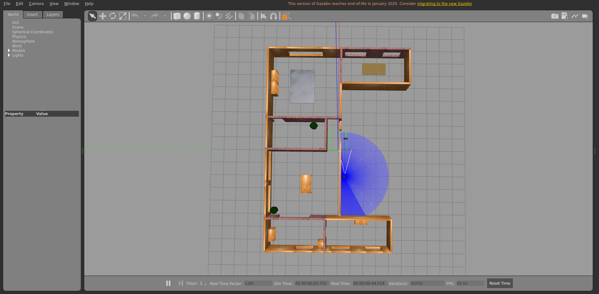
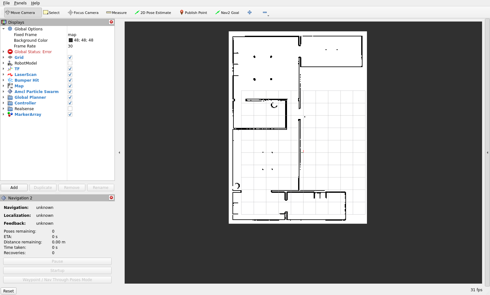
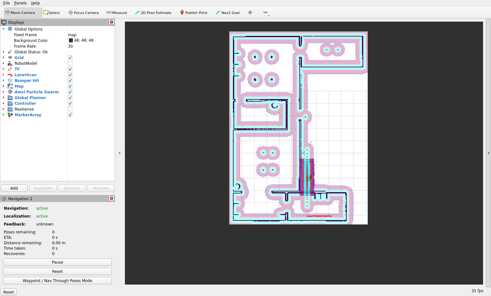
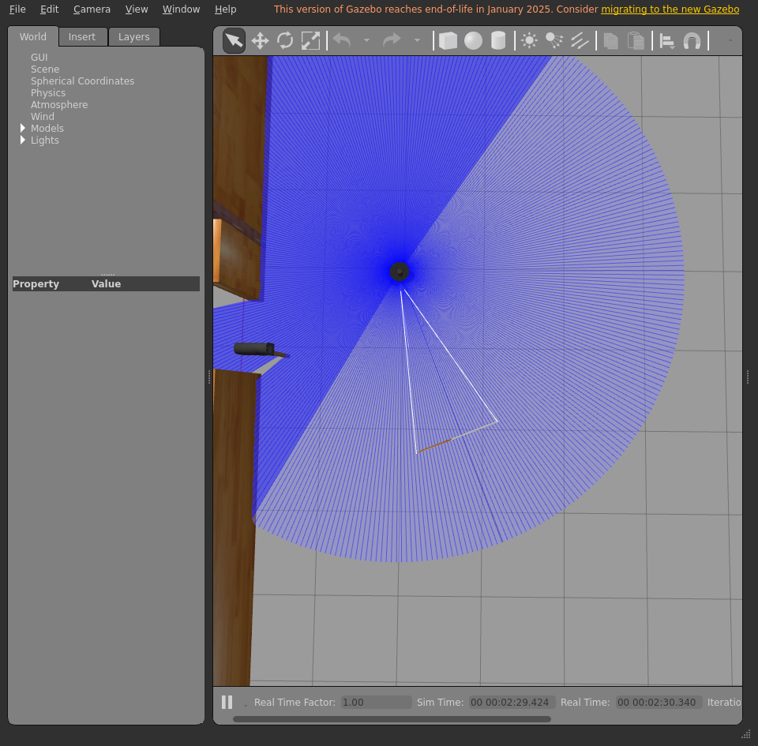
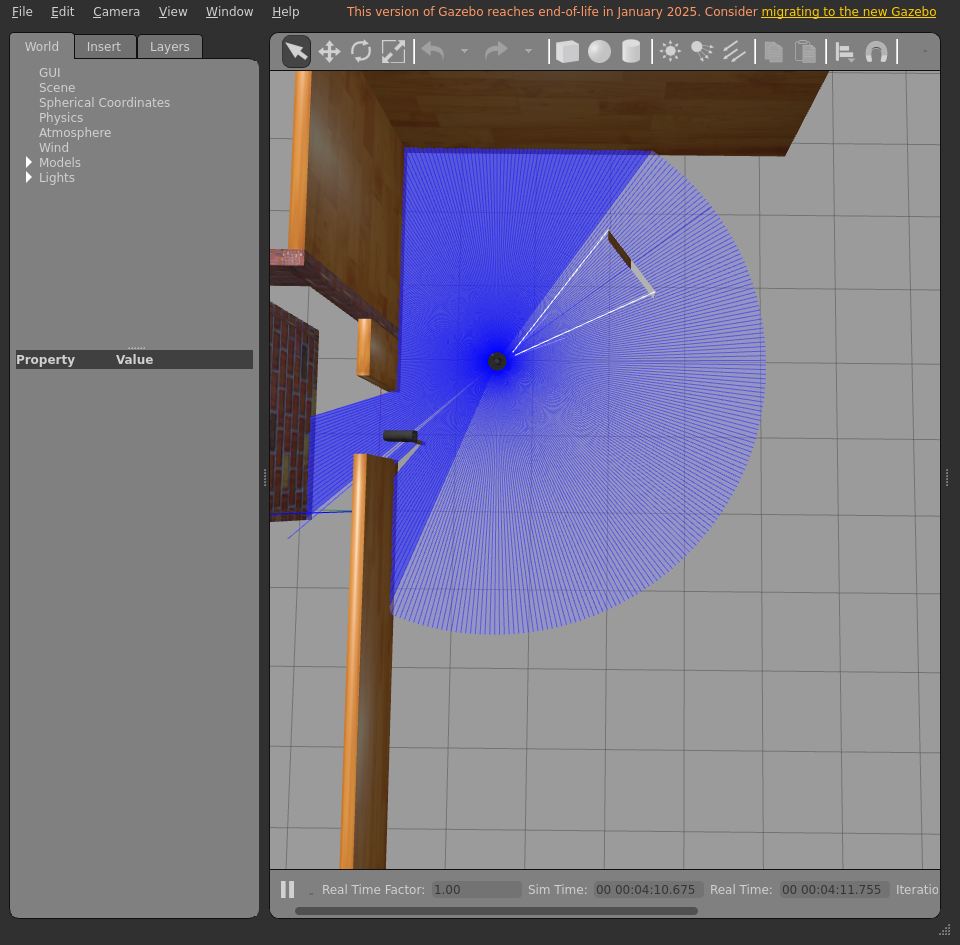
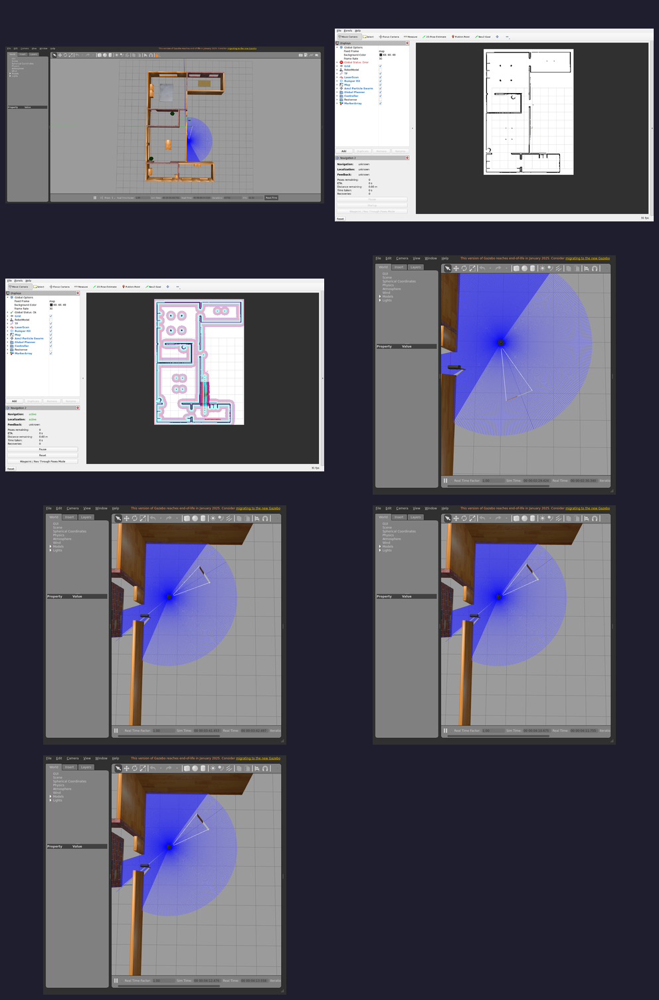

# Integration report — `feature/dev-setup`

| Field | Value |
|-------|-------|
| Result | **FAIL ❌** |
| Branch | `feature/dev-setup` |
| Commit | `f916046` |
| Run at (UTC) | 20260708T173347Z |
| Host | bragg3d-Precision-7560 |
| ROS setup | /opt/ros/humble/setup.bash |
| Model | waffle |
| Terminal | xterm |

## Steps walked

- Terminal 1 — Gazebo + TurtleBot3
- Terminal 2 — Nav2
- Localization — seed AMCL initial pose
- Direct Nav2 goal — drive to kitchen (bypasses the LLM)
- Terminal 3 — Nav2 API server
- Terminal 4 — LLM voice node

## Feature verdict

- Robot navigated correctly: **no**
- Notes: somehow gazebo and rviz2 are no longer aligned, the robot couldnt get through the door because theyre still not in the same pos across softwares

## Artifacts (screenshots / posters — slideshow material)










## Terminal logs (last 300 lines each)

<details><summary><code>1-gazebo</code></summary>

```
=== 1-gazebo ===
[INFO] [launch]: All log files can be found below /home/ubuntu/.ros/log/2026-07-08-17-33-47-875850-bragg3d-Precision-7560-1567
[INFO] [launch]: Default logging verbosity is set to INFO
urdf_file_name : turtlebot3_waffle.urdf
urdf_file_name : turtlebot3_waffle.urdf
urdf_file_name : turtlebot3_waffle.urdf
[INFO] [gzserver-1]: process started with pid [1575]
[INFO] [gzclient-2]: process started with pid [1577]
[INFO] [robot_state_publisher-3]: process started with pid [1579]
[INFO] [spawn_entity.py-4]: process started with pid [1581]
[robot_state_publisher-3] [INFO] [1783532028.855233492] [robot_state_publisher]: got segment base_footprint
[robot_state_publisher-3] [INFO] [1783532028.855301643] [robot_state_publisher]: got segment base_link
[robot_state_publisher-3] [INFO] [1783532028.855307517] [robot_state_publisher]: got segment base_scan
[robot_state_publisher-3] [INFO] [1783532028.855311097] [robot_state_publisher]: got segment camera_depth_frame
[robot_state_publisher-3] [INFO] [1783532028.855314628] [robot_state_publisher]: got segment camera_depth_optical_frame
[robot_state_publisher-3] [INFO] [1783532028.855318298] [robot_state_publisher]: got segment camera_link
[robot_state_publisher-3] [INFO] [1783532028.855321890] [robot_state_publisher]: got segment camera_rgb_frame
[robot_state_publisher-3] [INFO] [1783532028.855325207] [robot_state_publisher]: got segment camera_rgb_optical_frame
[robot_state_publisher-3] [INFO] [1783532028.855328568] [robot_state_publisher]: got segment caster_back_left_link
[robot_state_publisher-3] [INFO] [1783532028.855331787] [robot_state_publisher]: got segment caster_back_right_link
[robot_state_publisher-3] [INFO] [1783532028.855335158] [robot_state_publisher]: got segment imu_link
[robot_state_publisher-3] [INFO] [1783532028.855338388] [robot_state_publisher]: got segment wheel_left_link
[robot_state_publisher-3] [INFO] [1783532028.855341657] [robot_state_publisher]: got segment wheel_right_link
[spawn_entity.py-4] [INFO] [1783532029.107005514] [spawn_entity]: Spawn Entity started
[spawn_entity.py-4] [INFO] [1783532029.107215174] [spawn_entity]: Loading entity XML from file /opt/ros/humble/share/turtlebot3_gazebo/models/turtlebot3_waffle/model.sdf
[spawn_entity.py-4] [INFO] [1783532029.107806386] [spawn_entity]: Waiting for service /spawn_entity, timeout = 30
[spawn_entity.py-4] [INFO] [1783532029.108010440] [spawn_entity]: Waiting for service /spawn_entity
[spawn_entity.py-4] [INFO] [1783532029.861352721] [spawn_entity]: Calling service /spawn_entity
[gzserver-1] [INFO] [1783532030.094497887] [turtlebot3_imu]: <initial_orientation_as_reference> is unset, using default value of false to comply with REP 145 (world as orientation reference)
[spawn_entity.py-4] [INFO] [1783532030.150661561] [spawn_entity]: Spawn status: SpawnEntity: Successfully spawned entity [waffle]
[INFO] [spawn_entity.py-4]: process has finished cleanly [pid 1581]
[gzserver-1] [INFO] [1783532030.654803471] [camera_driver]: Publishing camera info to [/camera/camera_info]
[gzserver-1] [INFO] [1783532030.760187902] [turtlebot3_diff_drive]: Wheel pair 1 separation set to [0.287000m]
[gzserver-1] [INFO] [1783532030.760227074] [turtlebot3_diff_drive]: Wheel pair 1 diameter set to [0.066000m]
[gzserver-1] [INFO] [1783532030.760590026] [turtlebot3_diff_drive]: Subscribed to [/cmd_vel]
[gzserver-1] [INFO] [1783532030.761341249] [turtlebot3_diff_drive]: Advertise odometry on [/odom]
[gzserver-1] [INFO] [1783532030.762185486] [turtlebot3_diff_drive]: Publishing odom transforms between [odom] and [base_footprint]
[gzserver-1] [INFO] [1783532030.766884203] [turtlebot3_joint_state]: Going to publish joint [wheel_left_joint]
[gzserver-1] [INFO] [1783532030.766901500] [turtlebot3_joint_state]: Going to publish joint [wheel_right_joint]
```

</details>

<details><summary><code>2-nav2</code></summary>

```
=== 2-nav2 ===
[INFO] [launch]: All log files can be found below /home/ubuntu/.ros/log/2026-07-08-17-34-35-109604-bragg3d-Precision-7560-2521
[INFO] [launch]: Default logging verbosity is set to INFO
[INFO] [robot_state_publisher-1]: process started with pid [2573]
[INFO] [rviz2-2]: process started with pid [2575]
[INFO] [component_container_isolated-3]: process started with pid [2577]
[robot_state_publisher-1] [INFO] [1783532075.682054300] [robot_state_publisher]: got segment base_footprint
[robot_state_publisher-1] [INFO] [1783532075.682126738] [robot_state_publisher]: got segment base_link
[robot_state_publisher-1] [INFO] [1783532075.682132890] [robot_state_publisher]: got segment base_scan
[robot_state_publisher-1] [INFO] [1783532075.682136607] [robot_state_publisher]: got segment camera_depth_frame
[robot_state_publisher-1] [INFO] [1783532075.682140435] [robot_state_publisher]: got segment camera_depth_optical_frame
[robot_state_publisher-1] [INFO] [1783532075.682144405] [robot_state_publisher]: got segment camera_link
[robot_state_publisher-1] [INFO] [1783532075.682147971] [robot_state_publisher]: got segment camera_rgb_frame
[robot_state_publisher-1] [INFO] [1783532075.682151558] [robot_state_publisher]: got segment camera_rgb_optical_frame
[robot_state_publisher-1] [INFO] [1783532075.682155174] [robot_state_publisher]: got segment caster_back_left_link
[robot_state_publisher-1] [INFO] [1783532075.682158549] [robot_state_publisher]: got segment caster_back_right_link
[robot_state_publisher-1] [INFO] [1783532075.682162012] [robot_state_publisher]: got segment imu_link
[robot_state_publisher-1] [INFO] [1783532075.682165488] [robot_state_publisher]: got segment wheel_left_link
[robot_state_publisher-1] [INFO] [1783532075.682168998] [robot_state_publisher]: got segment wheel_right_link
[component_container_isolated-3] [INFO] [1783532075.719677188] [nav2_container]: Load Library: /opt/ros/humble/lib/libmap_server_core.so
[component_container_isolated-3] [INFO] [1783532075.727604970] [nav2_container]: Found class: rclcpp_components::NodeFactoryTemplate<nav2_map_server::CostmapFilterInfoServer>
[component_container_isolated-3] [INFO] [1783532075.727651589] [nav2_container]: Found class: rclcpp_components::NodeFactoryTemplate<nav2_map_server::MapSaver>
[component_container_isolated-3] [INFO] [1783532075.727656329] [nav2_container]: Found class: rclcpp_components::NodeFactoryTemplate<nav2_map_server::MapServer>
[component_container_isolated-3] [INFO] [1783532075.727660382] [nav2_container]: Instantiate class: rclcpp_components::NodeFactoryTemplate<nav2_map_server::MapServer>
[component_container_isolated-3] [INFO] [1783532075.730534052] [map_server]: 
[component_container_isolated-3] 	map_server lifecycle node launched. 
[component_container_isolated-3] 	Waiting on external lifecycle transitions to activate
[component_container_isolated-3] 	See https://design.ros2.org/articles/node_lifecycle.html for more information.
[component_container_isolated-3] [INFO] [1783532075.730579583] [map_server]: Creating
[INFO] [launch_ros.actions.load_composable_nodes]: Loaded node '/map_server' in container '/nav2_container'
[component_container_isolated-3] [INFO] [1783532075.732457649] [nav2_container]: Load Library: /opt/ros/humble/lib/libamcl_core.so
[component_container_isolated-3] [INFO] [1783532075.734272562] [nav2_container]: Found class: rclcpp_components::NodeFactoryTemplate<nav2_amcl::AmclNode>
[component_container_isolated-3] [INFO] [1783532075.734292480] [nav2_container]: Instantiate class: rclcpp_components::NodeFactoryTemplate<nav2_amcl::AmclNode>
[component_container_isolated-3] [INFO] [1783532075.736435156] [amcl]: 
[component_container_isolated-3] 	amcl lifecycle node launched. 
[component_container_isolated-3] 	Waiting on external lifecycle transitions to activate
[component_container_isolated-3] 	See https://design.ros2.org/articles/node_lifecycle.html for more information.
[component_container_isolated-3] [INFO] [1783532075.737019001] [amcl]: Creating
[INFO] [launch_ros.actions.load_composable_nodes]: Loaded node '/amcl' in container '/nav2_container'
[component_container_isolated-3] [INFO] [1783532075.738749226] [nav2_container]: Load Library: /opt/ros/humble/lib/libnav2_lifecycle_manager_core.so
[component_container_isolated-3] [INFO] [1783532075.739182711] [nav2_container]: Found class: rclcpp_components::NodeFactoryTemplate<nav2_lifecycle_manager::LifecycleManager>
[component_container_isolated-3] [INFO] [1783532075.739197473] [nav2_container]: Instantiate class: rclcpp_components::NodeFactoryTemplate<nav2_lifecycle_manager::LifecycleManager>
[component_container_isolated-3] [INFO] [1783532075.741137450] [lifecycle_manager_localization]: Creating
[component_container_isolated-3] [INFO] [1783532075.742273102] [lifecycle_manager_localization]: Creating and initializing lifecycle service clients
[INFO] [launch_ros.actions.load_composable_nodes]: Loaded node '/lifecycle_manager_localization' in container '/nav2_container'
[component_container_isolated-3] [INFO] [1783532075.742986289] [lifecycle_manager_localization]: Starting managed nodes bringup...
[component_container_isolated-3] [INFO] [1783532075.743010094] [lifecycle_manager_localization]: Configuring map_server
[component_container_isolated-3] [INFO] [1783532075.743097194] [map_server]: Configuring
[component_container_isolated-3] [INFO] [1783532075.743134956] [map_io]: Loading yaml file: /nav2gpt/nav2gpt_ws/install/ros2ai/share/ros2ai/maps/house.yaml
[component_container_isolated-3] [INFO] [1783532075.743289534] [map_io]: resolution: 0.05
[component_container_isolated-3] [INFO] [1783532075.743294381] [map_io]: origin[0]: -5.75
[component_container_isolated-3] [INFO] [1783532075.743296882] [map_io]: origin[1]: -5.13
[component_container_isolated-3] [INFO] [1783532075.743299360] [map_io]: origin[2]: 0
[component_container_isolated-3] [INFO] [1783532075.743301798] [map_io]: free_thresh: 0.25
[component_container_isolated-3] [INFO] [1783532075.743304246] [map_io]: occupied_thresh: 0.65
[component_container_isolated-3] [INFO] [1783532075.743306996] [map_io]: mode: trinary
[component_container_isolated-3] [INFO] [1783532075.743309674] [map_io]: negate: 0
[component_container_isolated-3] [INFO] [1783532075.743433556] [map_io]: Loading image_file: /nav2gpt/nav2gpt_ws/install/ros2ai/share/ros2ai/maps/house.pgm
[component_container_isolated-3] [INFO] [1783532075.747617099] [map_io]: Read map /nav2gpt/nav2gpt_ws/install/ros2ai/share/ros2ai/maps/house.pgm: 311 X 223 map @ 0.05 m/cell
[component_container_isolated-3] [INFO] [1783532075.748446983] [lifecycle_manager_localization]: Configuring amcl
[component_container_isolated-3] [INFO] [1783532075.748520048] [amcl]: Configuring
[component_container_isolated-3] [INFO] [1783532075.748584038] [amcl]: initTransforms
[component_container_isolated-3] [INFO] [1783532075.751063132] [amcl]: initPubSub
[component_container_isolated-3] [INFO] [1783532075.751520560] [amcl]: Subscribed to map topic.
[component_container_isolated-3] [INFO] [1783532075.752223680] [lifecycle_manager_localization]: Activating map_server
[component_container_isolated-3] [INFO] [1783532075.752302194] [map_server]: Activating
[component_container_isolated-3] [INFO] [1783532075.752417124] [map_server]: Creating bond (map_server) to lifecycle manager.
[component_container_isolated-3] [INFO] [1783532075.752476330] [amcl]: Received a 311 X 223 map @ 0.050 m/pix
[rviz2-2] [INFO] [1783532075.770444423] [rviz2]: Stereo is NOT SUPPORTED
[rviz2-2] [INFO] [1783532075.770500826] [rviz2]: OpenGl version: 4.6 (GLSL 4.6)
[rviz2-2] [INFO] [1783532075.783914363] [rviz2]: Stereo is NOT SUPPORTED
[component_container_isolated-3] [WARN] [1783532075.839723795] [amcl]: New subscription discovered on topic '/particle_cloud', requesting incompatible QoS. No messages will be sent to it. Last incompatible policy: RELIABILITY_QOS_POLICY
[component_container_isolated-3] [INFO] [1783532075.853545431] [lifecycle_manager_localization]: Server map_server connected with bond.
[component_container_isolated-3] [INFO] [1783532075.853705909] [lifecycle_manager_localization]: Activating amcl
[component_container_isolated-3] [INFO] [1783532075.853820121] [amcl]: Activating
[component_container_isolated-3] [INFO] [1783532075.853847956] [amcl]: Creating bond (amcl) to lifecycle manager.
[component_container_isolated-3] [INFO] [1783532075.901359930] [nav2_container]: Load Library: /opt/ros/humble/lib/libcontroller_server_core.so
[component_container_isolated-3] [INFO] [1783532075.902891792] [nav2_container]: Found class: rclcpp_components::NodeFactoryTemplate<nav2_controller::ControllerServer>
[component_container_isolated-3] [INFO] [1783532075.902936892] [nav2_container]: Instantiate class: rclcpp_components::NodeFactoryTemplate<nav2_controller::ControllerServer>
[component_container_isolated-3] [INFO] [1783532075.905646420] [controller_server]: 
[component_container_isolated-3] 	controller_server lifecycle node launched. 
[component_container_isolated-3] 	Waiting on external lifecycle transitions to activate
[component_container_isolated-3] 	See https://design.ros2.org/articles/node_lifecycle.html for more information.
[component_container_isolated-3] [INFO] [1783532075.907870492] [controller_server]: Creating controller server
[component_container_isolated-3] [INFO] [1783532075.910814279] [local_costmap.local_costmap]: 
[component_container_isolated-3] 	local_costmap lifecycle node launched. 
[component_container_isolated-3] 	Waiting on external lifecycle transitions to activate
[component_container_isolated-3] 	See https://design.ros2.org/articles/node_lifecycle.html for more information.
[component_container_isolated-3] [INFO] [1783532075.911298537] [local_costmap.local_costmap]: Creating Costmap
[INFO] [launch_ros.actions.load_composable_nodes]: Loaded node '/controller_server' in container '/nav2_container'
[component_container_isolated-3] [INFO] [1783532075.913487098] [nav2_container]: Load Library: /opt/ros/humble/lib/libsmoother_server_core.so
[component_container_isolated-3] [INFO] [1783532075.914409655] [nav2_container]: Found class: rclcpp_components::NodeFactoryTemplate<nav2_smoother::SmootherServer>
[component_container_isolated-3] [INFO] [1783532075.914434012] [nav2_container]: Instantiate class: rclcpp_components::NodeFactoryTemplate<nav2_smoother::SmootherServer>
[component_container_isolated-3] [INFO] [1783532075.917311751] [smoother_server]: 
[component_container_isolated-3] 	smoother_server lifecycle node launched. 
[component_container_isolated-3] 	Waiting on external lifecycle transitions to activate
[component_container_isolated-3] 	See https://design.ros2.org/articles/node_lifecycle.html for more information.
[component_container_isolated-3] [INFO] [1783532075.918290501] [smoother_server]: Creating smoother server
[INFO] [launch_ros.actions.load_composable_nodes]: Loaded node '/smoother_server' in container '/nav2_container'
[component_container_isolated-3] [INFO] [1783532075.920856447] [nav2_container]: Load Library: /opt/ros/humble/lib/libplanner_server_core.so
[component_container_isolated-3] [INFO] [1783532075.921430148] [nav2_container]: Found class: rclcpp_components::NodeFactoryTemplate<nav2_planner::PlannerServer>
[component_container_isolated-3] [INFO] [1783532075.921450372] [nav2_container]: Instantiate class: rclcpp_components::NodeFactoryTemplate<nav2_planner::PlannerServer>
[component_container_isolated-3] [INFO] [1783532075.924557641] [planner_server]: 
[component_container_isolated-3] 	planner_server lifecycle node launched. 
[component_container_isolated-3] 	Waiting on external lifecycle transitions to activate
[component_container_isolated-3] 	See https://design.ros2.org/articles/node_lifecycle.html for more information.
[component_container_isolated-3] [INFO] [1783532075.925422919] [planner_server]: Creating
[component_container_isolated-3] [INFO] [1783532075.928191868] [global_costmap.global_costmap]: 
[component_container_isolated-3] 	global_costmap lifecycle node launched. 
[component_container_isolated-3] 	Waiting on external lifecycle transitions to activate
[component_container_isolated-3] 	See https://design.ros2.org/articles/node_lifecycle.html for more information.
[component_container_isolated-3] [INFO] [1783532075.928517245] [global_costmap.global_costmap]: Creating Costmap
[INFO] [launch_ros.actions.load_composable_nodes]: Loaded node '/planner_server' in container '/nav2_container'
[rviz2-2] [INFO] [1783532075.930103934] [rviz2]: Trying to create a map of size 311 x 223 using 1 swatches
[component_container_isolated-3] [INFO] [1783532075.931259234] [nav2_container]: Load Library: /opt/ros/humble/lib/libbehavior_server_core.so
[component_container_isolated-3] [INFO] [1783532075.933646673] [nav2_container]: Found class: rclcpp_components::NodeFactoryTemplate<behavior_server::BehaviorServer>
[component_container_isolated-3] [INFO] [1783532075.933725972] [nav2_container]: Instantiate class: rclcpp_components::NodeFactoryTemplate<behavior_server::BehaviorServer>
[rviz2-2] [ERROR] [1783532075.936100168] [rviz2]: Vertex Program:rviz/glsl120/indexed_8bit_image.vert Fragment Program:rviz/glsl120/indexed_8bit_image.frag GLSL link result : 
[rviz2-2] active samplers with a different type refer to the same texture image unit
[component_container_isolated-3] [INFO] [1783532075.936891354] [behavior_server]: 
[component_container_isolated-3] 	behavior_server lifecycle node launched. 
[component_container_isolated-3] 	Waiting on external lifecycle transitions to activate
[component_container_isolated-3] 	See https://design.ros2.org/articles/node_lifecycle.html for more information.
[INFO] [launch_ros.actions.load_composable_nodes]: Loaded node '/behavior_server' in container '/nav2_container'
[component_container_isolated-3] [INFO] [1783532075.939191221] [nav2_container]: Load Library: /opt/ros/humble/lib/libbt_navigator_core.so
[component_container_isolated-3] [INFO] [1783532075.940204090] [nav2_container]: Found class: rclcpp_components::NodeFactoryTemplate<nav2_bt_navigator::BtNavigator>
[component_container_isolated-3] [INFO] [1783532075.940223680] [nav2_container]: Instantiate class: rclcpp_components::NodeFactoryTemplate<nav2_bt_navigator::BtNavigator>
[component_container_isolated-3] [INFO] [1783532075.943484476] [bt_navigator]: 
[component_container_isolated-3] 	bt_navigator lifecycle node launched. 
[component_container_isolated-3] 	Waiting on external lifecycle transitions to activate
[component_container_isolated-3] 	See https://design.ros2.org/articles/node_lifecycle.html for more information.
[component_container_isolated-3] [INFO] [1783532075.943567057] [bt_navigator]: Creating
[INFO] [launch_ros.actions.load_composable_nodes]: Loaded node '/bt_navigator' in container '/nav2_container'
[component_container_isolated-3] [INFO] [1783532075.945231731] [nav2_container]: Load Library: /opt/ros/humble/lib/libwaypoint_follower_core.so
[component_container_isolated-3] [INFO] [1783532075.945742114] [nav2_container]: Found class: rclcpp_components::NodeFactoryTemplate<nav2_waypoint_follower::WaypointFollower>
[component_container_isolated-3] [INFO] [1783532075.945764978] [nav2_container]: Instantiate class: rclcpp_components::NodeFactoryTemplate<nav2_waypoint_follower::WaypointFollower>
[component_container_isolated-3] [INFO] [1783532075.948695537] [waypoint_follower]: 
[component_container_isolated-3] 	waypoint_follower lifecycle node launched. 
[component_container_isolated-3] 	Waiting on external lifecycle transitions to activate
[component_container_isolated-3] 	See https://design.ros2.org/articles/node_lifecycle.html for more information.
[component_container_isolated-3] [INFO] [1783532075.949137060] [waypoint_follower]: Creating
[INFO] [launch_ros.actions.load_composable_nodes]: Loaded node '/waypoint_follower' in container '/nav2_container'
[component_container_isolated-3] [INFO] [1783532075.951824146] [nav2_container]: Load Library: /opt/ros/humble/lib/libvelocity_smoother_core.so
[component_container_isolated-3] [INFO] [1783532075.952526001] [nav2_container]: Found class: rclcpp_components::NodeFactoryTemplate<nav2_velocity_smoother::VelocitySmoother>
[component_container_isolated-3] [INFO] [1783532075.952552140] [nav2_container]: Instantiate class: rclcpp_components::NodeFactoryTemplate<nav2_velocity_smoother::VelocitySmoother>
[component_container_isolated-3] [INFO] [1783532075.954820628] [lifecycle_manager_localization]: Server amcl connected with bond.
[component_container_isolated-3] [INFO] [1783532075.954852434] [lifecycle_manager_localization]: Managed nodes are active
[component_container_isolated-3] [INFO] [1783532075.954866744] [lifecycle_manager_localization]: Creating bond timer...
[component_container_isolated-3] [INFO] [1783532075.955623687] [velocity_smoother]: 
[component_container_isolated-3] 	velocity_smoother lifecycle node launched. 
[component_container_isolated-3] 	Waiting on external lifecycle transitions to activate
[component_container_isolated-3] 	See https://design.ros2.org/articles/node_lifecycle.html for more information.
[INFO] [launch_ros.actions.load_composable_nodes]: Loaded node '/velocity_smoother' in container '/nav2_container'
[component_container_isolated-3] [INFO] [1783532075.957023725] [nav2_container]: Found class: rclcpp_components::NodeFactoryTemplate<nav2_lifecycle_manager::LifecycleManager>
[component_container_isolated-3] [INFO] [1783532075.957042172] [nav2_container]: Instantiate class: rclcpp_components::NodeFactoryTemplate<nav2_lifecycle_manager::LifecycleManager>
[component_container_isolated-3] [INFO] [1783532075.959512241] [lifecycle_manager_navigation]: Creating
[component_container_isolated-3] [INFO] [1783532075.960142526] [lifecycle_manager_navigation]: Creating and initializing lifecycle service clients
[INFO] [launch_ros.actions.load_composable_nodes]: Loaded node '/lifecycle_manager_navigation' in container '/nav2_container'
[component_container_isolated-3] [INFO] [1783532075.962501512] [lifecycle_manager_navigation]: Starting managed nodes bringup...
[component_container_isolated-3] [INFO] [1783532075.962528865] [lifecycle_manager_navigation]: Configuring controller_server
[component_container_isolated-3] [INFO] [1783532075.962605229] [controller_server]: Configuring controller interface
[component_container_isolated-3] [INFO] [1783532075.962711789] [controller_server]: getting goal checker plugins..
[component_container_isolated-3] [INFO] [1783532075.962785900] [controller_server]: Controller frequency set to 20.0000Hz
[component_container_isolated-3] [INFO] [1783532075.962821463] [local_costmap.local_costmap]: Configuring
[component_container_isolated-3] [INFO] [1783532075.964065988] [local_costmap.local_costmap]: Using plugin "voxel_layer"
[component_container_isolated-3] [INFO] [1783532075.965877301] [local_costmap.local_costmap]: Subscribed to Topics: scan
[component_container_isolated-3] [INFO] [1783532075.968004033] [local_costmap.local_costmap]: Initialized plugin "voxel_layer"
[component_container_isolated-3] [INFO] [1783532075.968038651] [local_costmap.local_costmap]: Using plugin "inflation_layer"
[component_container_isolated-3] [INFO] [1783532075.968554875] [local_costmap.local_costmap]: Initialized plugin "inflation_layer"
[component_container_isolated-3] [INFO] [1783532075.970709271] [controller_server]: Created progress_checker : progress_checker of type nav2_controller::SimpleProgressChecker
[component_container_isolated-3] [INFO] [1783532075.971168906] [controller_server]: Created goal checker : general_goal_checker of type nav2_controller::SimpleGoalChecker
[component_container_isolated-3] [INFO] [1783532075.971366102] [controller_server]: Controller Server has general_goal_checker  goal checkers available.
[component_container_isolated-3] [INFO] [1783532075.972391270] [controller_server]: Created controller : FollowPath of type dwb_core::DWBLocalPlanner
[component_container_isolated-3] [INFO] [1783532075.972983612] [controller_server]: Setting transform_tolerance to 0.200000
[component_container_isolated-3] [INFO] [1783532075.977106144] [controller_server]: Using critic "RotateToGoal" (dwb_critics::RotateToGoalCritic)
[component_container_isolated-3] [INFO] [1783532075.977429008] [controller_server]: Critic plugin initialized
[component_container_isolated-3] [INFO] [1783532075.977593071] [controller_server]: Using critic "Oscillation" (dwb_critics::OscillationCritic)
[component_container_isolated-3] [INFO] [1783532075.977898720] [controller_server]: Critic plugin initialized
[component_container_isolated-3] [INFO] [1783532075.977973816] [controller_server]: Using critic "BaseObstacle" (dwb_critics::BaseObstacleCritic)
[component_container_isolated-3] [INFO] [1783532075.978100194] [controller_server]: Critic plugin initialized
[component_container_isolated-3] [INFO] [1783532075.978185063] [controller_server]: Using critic "GoalAlign" (dwb_critics::GoalAlignCritic)
[component_container_isolated-3] [INFO] [1783532075.978400619] [controller_server]: Critic plugin initialized
[component_container_isolated-3] [INFO] [1783532075.978469705] [controller_server]: Using critic "PathAlign" (dwb_critics::PathAlignCritic)
[component_container_isolated-3] [INFO] [1783532075.978758821] [controller_server]: Critic plugin initialized
[component_container_isolated-3] [INFO] [1783532075.978867986] [controller_server]: Using critic "PathDist" (dwb_critics::PathDistCritic)
[component_container_isolated-3] [INFO] [1783532075.979032535] [controller_server]: Critic plugin initialized
[component_container_isolated-3] [INFO] [1783532075.979140105] [controller_server]: Using critic "GoalDist" (dwb_critics::GoalDistCritic)
[component_container_isolated-3] [INFO] [1783532075.979294426] [controller_server]: Critic plugin initialized
[component_container_isolated-3] [INFO] [1783532075.979313196] [controller_server]: Controller Server has FollowPath  controllers available.
[component_container_isolated-3] [INFO] [1783532075.981333813] [lifecycle_manager_navigation]: Configuring smoother_server
[component_container_isolated-3] [INFO] [1783532075.981437954] [smoother_server]: Configuring smoother server
[component_container_isolated-3] [INFO] [1783532075.983976094] [smoother_server]: Created smoother : simple_smoother of type nav2_smoother::SimpleSmoother
[component_container_isolated-3] [INFO] [1783532075.984399642] [smoother_server]: Smoother Server has simple_smoother  smoothers available.
[component_container_isolated-3] [INFO] [1783532075.985669860] [lifecycle_manager_navigation]: Configuring planner_server
[component_container_isolated-3] [INFO] [1783532075.985741936] [planner_server]: Configuring
[component_container_isolated-3] [INFO] [1783532075.985783357] [global_costmap.global_costmap]: Configuring
[component_container_isolated-3] [INFO] [1783532075.987126038] [global_costmap.global_costmap]: Using plugin "static_layer"
[component_container_isolated-3] [INFO] [1783532075.987560546] [global_costmap.global_costmap]: Subscribing to the map topic (/map) with transient local durability
[component_container_isolated-3] [INFO] [1783532075.987752272] [global_costmap.global_costmap]: Initialized plugin "static_layer"
[component_container_isolated-3] [INFO] [1783532075.987764769] [global_costmap.global_costmap]: Using plugin "obstacle_layer"
[component_container_isolated-3] [INFO] [1783532075.988172234] [global_costmap.global_costmap]: Subscribed to Topics: scan
[component_container_isolated-3] [INFO] [1783532075.989071287] [global_costmap.global_costmap]: Initialized plugin "obstacle_layer"
[component_container_isolated-3] [INFO] [1783532075.989086782] [global_costmap.global_costmap]: Using plugin "inflation_layer"
[component_container_isolated-3] [INFO] [1783532075.989452113] [global_costmap.global_costmap]: Initialized plugin "inflation_layer"
[component_container_isolated-3] [INFO] [1783532075.990760627] [global_costmap.global_costmap]: StaticLayer: Resizing costmap to 311 X 223 at 0.050000 m/pix
[component_container_isolated-3] [INFO] [1783532075.990977760] [planner_server]: Created global planner plugin GridBased of type nav2_navfn_planner/NavfnPlanner
[component_container_isolated-3] [INFO] [1783532075.990998258] [planner_server]: Configuring plugin GridBased of type NavfnPlanner
[component_container_isolated-3] [INFO] [1783532075.991280732] [planner_server]: Planner Server has GridBased  planners available.
[component_container_isolated-3] [INFO] [1783532075.993246067] [lifecycle_manager_navigation]: Configuring behavior_server
[component_container_isolated-3] [INFO] [1783532075.993314733] [behavior_server]: Configuring
[component_container_isolated-3] [INFO] [1783532075.994664059] [behavior_server]: Creating behavior plugin spin of type nav2_behaviors/Spin
[component_container_isolated-3] [INFO] [1783532075.995104234] [behavior_server]: Configuring spin
[component_container_isolated-3] [INFO] [1783532075.996262164] [behavior_server]: Creating behavior plugin backup of type nav2_behaviors/BackUp
[component_container_isolated-3] [INFO] [1783532075.996775649] [behavior_server]: Configuring backup
[component_container_isolated-3] [INFO] [1783532075.998146351] [behavior_server]: Creating behavior plugin drive_on_heading of type nav2_behaviors/DriveOnHeading
[component_container_isolated-3] [INFO] [1783532075.998641830] [behavior_server]: Configuring drive_on_heading
[component_container_isolated-3] [INFO] [1783532075.999924380] [behavior_server]: Creating behavior plugin assisted_teleop of type nav2_behaviors/AssistedTeleop
[component_container_isolated-3] [INFO] [1783532076.000997842] [behavior_server]: Configuring assisted_teleop
[component_container_isolated-3] [INFO] [1783532076.002735700] [behavior_server]: Creating behavior plugin wait of type nav2_behaviors/Wait
[component_container_isolated-3] [INFO] [1783532076.003314408] [behavior_server]: Configuring wait
[component_container_isolated-3] [INFO] [1783532076.004502432] [lifecycle_manager_navigation]: Configuring bt_navigator
[component_container_isolated-3] [INFO] [1783532076.004578909] [bt_navigator]: Configuring
[component_container_isolated-3] [INFO] [1783532076.033664369] [lifecycle_manager_navigation]: Configuring waypoint_follower
[component_container_isolated-3] [INFO] [1783532076.033765043] [waypoint_follower]: Configuring
[component_container_isolated-3] [INFO] [1783532076.035908333] [waypoint_follower]: Created waypoint_task_executor : wait_at_waypoint of type nav2_waypoint_follower::WaitAtWaypoint
[component_container_isolated-3] [INFO] [1783532076.036243656] [lifecycle_manager_navigation]: Configuring velocity_smoother
[component_container_isolated-3] [INFO] [1783532076.036311830] [velocity_smoother]: Configuring velocity smoother
[component_container_isolated-3] [INFO] [1783532076.037500109] [lifecycle_manager_navigation]: Activating controller_server
[component_container_isolated-3] [INFO] [1783532076.037601500] [controller_server]: Activating
[component_container_isolated-3] [INFO] [1783532076.037624546] [local_costmap.local_costmap]: Activating
[component_container_isolated-3] [INFO] [1783532076.037635326] [local_costmap.local_costmap]: Checking transform
[component_container_isolated-3] [INFO] [1783532076.037698242] [local_costmap.local_costmap]: start
[component_container_isolated-3] [INFO] [1783532076.041788458] [amcl]: createLaserObject
[component_container_isolated-3] [INFO] [1783532076.288035033] [controller_server]: Creating bond (controller_server) to lifecycle manager.
[component_container_isolated-3] [INFO] [1783532076.389432921] [lifecycle_manager_navigation]: Server controller_server connected with bond.
[component_container_isolated-3] [INFO] [1783532076.389485155] [lifecycle_manager_navigation]: Activating smoother_server
[component_container_isolated-3] [INFO] [1783532076.389634023] [smoother_server]: Activating
[component_container_isolated-3] [INFO] [1783532076.389662450] [smoother_server]: Creating bond (smoother_server) to lifecycle manager.
[component_container_isolated-3] [INFO] [1783532076.490679036] [lifecycle_manager_navigation]: Server smoother_server connected with bond.
[component_container_isolated-3] [INFO] [1783532076.490717319] [lifecycle_manager_navigation]: Activating planner_server
[component_container_isolated-3] [INFO] [1783532076.490882173] [planner_server]: Activating
[component_container_isolated-3] [INFO] [1783532076.490922213] [global_costmap.global_costmap]: Activating
[component_container_isolated-3] [INFO] [1783532076.490930588] [global_costmap.global_costmap]: Checking transform
[component_container_isolated-3] [INFO] [1783532108.127605221] [amcl]: initialPoseReceived
[component_container_isolated-3] [WARN] [1783532108.127718909] [amcl]: Failed to transform initial pose in time (Lookup would require extrapolation into the future.  Requested time 77.500000 but the latest data is at time 77.477000, when looking up transform from frame [base_footprint] to frame [odom])
[component_container_isolated-3] [INFO] [1783532108.127733662] [amcl]: Setting pose (77.500000): -1.997 -0.500 0.002
[component_container_isolated-3] [INFO] [1783532109.491069064] [global_costmap.global_costmap]: start
[rviz2-2] [INFO] [1783532109.857129971] [rviz2]: Trying to create a map of size 60 x 60 using 1 swatches
[rviz2-2] [INFO] [1783532110.496699368] [rviz2]: Trying to create a map of size 311 x 223 using 1 swatches
[component_container_isolated-3] [INFO] [1783532110.541621162] [planner_server]: Activating plugin GridBased of type NavfnPlanner
[component_container_isolated-3] [INFO] [1783532110.542656310] [planner_server]: Creating bond (planner_server) to lifecycle manager.
[component_container_isolated-3] [INFO] [1783532110.643775034] [lifecycle_manager_navigation]: Server planner_server connected with bond.
[component_container_isolated-3] [INFO] [1783532110.643809377] [lifecycle_manager_navigation]: Activating behavior_server
[component_container_isolated-3] [INFO] [1783532110.643979311] [behavior_server]: Activating
[component_container_isolated-3] [INFO] [1783532110.644000313] [behavior_server]: Activating spin
[component_container_isolated-3] [INFO] [1783532110.644020857] [behavior_server]: Activating backup
[component_container_isolated-3] [INFO] [1783532110.644030262] [behavior_server]: Activating drive_on_heading
[component_container_isolated-3] [INFO] [1783532110.644040033] [behavior_server]: Activating assisted_teleop
[component_container_isolated-3] [INFO] [1783532110.644049589] [behavior_server]: Activating wait
[component_container_isolated-3] [INFO] [1783532110.644059852] [behavior_server]: Creating bond (behavior_server) to lifecycle manager.
[component_container_isolated-3] [INFO] [1783532110.745156494] [lifecycle_manager_navigation]: Server behavior_server connected with bond.
[component_container_isolated-3] [INFO] [1783532110.745193448] [lifecycle_manager_navigation]: Activating bt_navigator
[component_container_isolated-3] [INFO] [1783532110.745357736] [bt_navigator]: Activating
[component_container_isolated-3] [INFO] [1783532110.759460115] [bt_navigator]: Creating bond (bt_navigator) to lifecycle manager.
[component_container_isolated-3] [INFO] [1783532110.860417244] [lifecycle_manager_navigation]: Server bt_navigator connected with bond.
[component_container_isolated-3] [INFO] [1783532110.860477957] [lifecycle_manager_navigation]: Activating waypoint_follower
[component_container_isolated-3] [INFO] [1783532110.860677738] [waypoint_follower]: Activating
[component_container_isolated-3] [INFO] [1783532110.860743176] [waypoint_follower]: Creating bond (waypoint_follower) to lifecycle manager.
[component_container_isolated-3] [INFO] [1783532110.962388384] [lifecycle_manager_navigation]: Server waypoint_follower connected with bond.
[component_container_isolated-3] [INFO] [1783532110.962431237] [lifecycle_manager_navigation]: Activating velocity_smoother
[component_container_isolated-3] [INFO] [1783532110.962599770] [velocity_smoother]: Activating
[component_container_isolated-3] [INFO] [1783532110.962642398] [velocity_smoother]: Creating bond (velocity_smoother) to lifecycle manager.
[component_container_isolated-3] [INFO] [1783532111.063852996] [lifecycle_manager_navigation]: Server velocity_smoother connected with bond.
[component_container_isolated-3] [INFO] [1783532111.063898419] [lifecycle_manager_navigation]: Managed nodes are active
[component_container_isolated-3] [INFO] [1783532111.063904863] [lifecycle_manager_navigation]: Creating bond timer...
[component_container_isolated-3] [INFO] [1783532125.255134988] [global_costmap.global_costmap]: Received request to clear entirely the global_costmap
[component_container_isolated-3] [INFO] [1783532125.776683919] [local_costmap.local_costmap]: Received request to clear entirely the local_costmap
[component_container_isolated-3] [INFO] [1783532128.382228842] [bt_navigator]: Begin navigating from current location (-2.00, -0.50) to (-4.00, 4.00)
[component_container_isolated-3] [INFO] [1783532128.403060065] [controller_server]: Received a goal, begin computing control effort.
[component_container_isolated-3] [WARN] [1783532128.403114701] [controller_server]: No goal checker was specified in parameter 'current_goal_checker'. Server will use only plugin loaded general_goal_checker . This warning will appear once.
[component_container_isolated-3] [INFO] [1783532129.453305851] [controller_server]: Passing new path to controller.
[component_container_isolated-3] [INFO] [1783532130.503309631] [controller_server]: Passing new path to controller.
[component_container_isolated-3] [INFO] [1783532131.503318187] [controller_server]: Passing new path to controller.
[component_container_isolated-3] [INFO] [1783532132.553292563] [controller_server]: Passing new path to controller.
[component_container_isolated-3] [INFO] [1783532133.553292331] [controller_server]: Passing new path to controller.
[component_container_isolated-3] [INFO] [1783532134.603299855] [controller_server]: Passing new path to controller.
[component_container_isolated-3] [INFO] [1783532135.653300037] [controller_server]: Passing new path to controller.
[component_container_isolated-3] [INFO] [1783532136.653306506] [controller_server]: Passing new path to controller.
[component_container_isolated-3] [INFO] [1783532137.703313511] [controller_server]: Passing new path to controller.
[component_container_isolated-3] [INFO] [1783532138.703318575] [controller_server]: Passing new path to controller.
[component_container_isolated-3] [INFO] [1783532139.753301841] [controller_server]: Passing new path to controller.
[component_container_isolated-3] [INFO] [1783532140.803308190] [controller_server]: Passing new path to controller.
[component_container_isolated-3] [WARN] [1783532141.774636733] [planner_server]: Planner loop missed its desired rate of 20.0000 Hz. Current loop rate is 10.0000 Hz
[component_container_isolated-3] [INFO] [1783532141.803308275] [controller_server]: Passing new path to controller.
[component_container_isolated-3] [INFO] [1783532142.853291771] [controller_server]: Passing new path to controller.
[component_container_isolated-3] [WARN] [1783532143.833222700] [planner_server]: GridBased: failed to create plan with tolerance 0.50.
[component_container_isolated-3] [WARN] [1783532143.833283836] [planner_server]: Planning algorithm GridBased failed to generate a valid path to (-4.00, 4.00)
[component_container_isolated-3] [WARN] [1783532143.833291439] [planner_server]: [compute_path_to_pose] [ActionServer] Aborting handle.
[component_container_isolated-3] [INFO] [1783532143.852544548] [global_costmap.global_costmap]: Received request to clear entirely the global_costmap
[component_container_isolated-3] [WARN] [1783532144.493896336] [planner_server]: GridBased: failed to create plan with tolerance 0.50.
[component_container_isolated-3] [WARN] [1783532144.493958262] [planner_server]: Planning algorithm GridBased failed to generate a valid path to (-4.00, 4.00)
[component_container_isolated-3] [WARN] [1783532144.493971230] [planner_server]: [compute_path_to_pose] [ActionServer] Aborting handle.
[component_container_isolated-3] [ERROR] [1783532144.532591233] [bt_navigator_navigate_to_pose_rclcpp_node]: Failed to get result for follow_path in node halt!
[component_container_isolated-3] [INFO] [1783532144.532762889] [local_costmap.local_costmap]: Received request to clear entirely the local_costmap
[component_container_isolated-3] [INFO] [1783532144.532976448] [global_costmap.global_costmap]: Received request to clear entirely the global_costmap
[component_container_isolated-3] [WARN] [1783532144.533415679] [BehaviorTreeEngine]: Behavior Tree tick rate 100.00 was exceeded!
[component_container_isolated-3] [INFO] [1783532144.553295066] [controller_server]: Goal was canceled. Stopping the robot.
[component_container_isolated-3] [INFO] [1783532144.553336568] [controller_server]: [follow_path] [ActionServer] Client requested to cancel the goal. Cancelling.
[component_container_isolated-3] [WARN] [1783532145.494148370] [planner_server]: GridBased: failed to create plan with tolerance 0.50.
[component_container_isolated-3] [WARN] [1783532145.494195398] [planner_server]: Planning algorithm GridBased failed to generate a valid path to (-4.00, 4.00)
[component_container_isolated-3] [WARN] [1783532145.494206434] [planner_server]: [compute_path_to_pose] [ActionServer] Aborting handle.
[component_container_isolated-3] [INFO] [1783532145.513581393] [global_costmap.global_costmap]: Received request to clear entirely the global_costmap
[component_container_isolated-3] [WARN] [1783532146.494735205] [planner_server]: GridBased: failed to create plan with tolerance 0.50.
[component_container_isolated-3] [WARN] [1783532146.494872378] [planner_server]: Planning algorithm GridBased failed to generate a valid path to (-4.00, 4.00)
[component_container_isolated-3] [WARN] [1783532146.494893219] [planner_server]: [compute_path_to_pose] [ActionServer] Aborting handle.
[component_container_isolated-3] [INFO] [1783532146.513693860] [behavior_server]: Running spin
[component_container_isolated-3] [INFO] [1783532146.513763332] [behavior_server]: Turning 1.57 for spin behavior.
[component_container_isolated-3] [INFO] [1783532148.313879003] [behavior_server]: spin completed successfully
[component_container_isolated-3] [WARN] [1783532148.344372269] [planner_server]: GridBased: failed to create plan with tolerance 0.50.
[component_container_isolated-3] [WARN] [1783532148.344413845] [planner_server]: Planning algorithm GridBased failed to generate a valid path to (-4.00, 4.00)
[component_container_isolated-3] [WARN] [1783532148.344422786] [planner_server]: [compute_path_to_pose] [ActionServer] Aborting handle.
[component_container_isolated-3] [INFO] [1783532148.363586514] [global_costmap.global_costmap]: Received request to clear entirely the global_costmap
[component_container_isolated-3] [WARN] [1783532148.494649386] [planner_server]: GridBased: failed to create plan with tolerance 0.50.
[component_container_isolated-3] [WARN] [1783532148.494778610] [planner_server]: Planning algorithm GridBased failed to generate a valid path to (-4.00, 4.00)
[component_container_isolated-3] [WARN] [1783532148.494801622] [planner_server]: [compute_path_to_pose] [ActionServer] Aborting handle.
[component_container_isolated-3] [INFO] [1783532148.513867247] [behavior_server]: Running wait
[component_container_isolated-3] [INFO] [1783532153.514107680] [behavior_server]: wait completed successfully
[component_container_isolated-3] [WARN] [1783532153.544546998] [planner_server]: GridBased: failed to create plan with tolerance 0.50.
[component_container_isolated-3] [WARN] [1783532153.544636866] [planner_server]: Planning algorithm GridBased failed to generate a valid path to (-4.00, 4.00)
[component_container_isolated-3] [WARN] [1783532153.544651955] [planner_server]: [compute_path_to_pose] [ActionServer] Aborting handle.
[component_container_isolated-3] [INFO] [1783532153.563519032] [global_costmap.global_costmap]: Received request to clear entirely the global_costmap
[component_container_isolated-3] [WARN] [1783532154.494813489] [planner_server]: GridBased: failed to create plan with tolerance 0.50.
[component_container_isolated-3] [WARN] [1783532154.494934231] [planner_server]: Planning algorithm GridBased failed to generate a valid path to (-4.00, 4.00)
[component_container_isolated-3] [WARN] [1783532154.494954488] [planner_server]: [compute_path_to_pose] [ActionServer] Aborting handle.
[component_container_isolated-3] [INFO] [1783532154.513796155] [behavior_server]: Running backup
[component_container_isolated-3] [INFO] [1783532154.513897523] [behavior_server]: DriveOnHeading: no acceleration or deceleration limits set
[component_container_isolated-3] [INFO] [1783532160.614047973] [behavior_server]: backup completed successfully
[component_container_isolated-3] [WARN] [1783532160.644364393] [planner_server]: GridBased: failed to create plan with tolerance 0.50.
[component_container_isolated-3] [WARN] [1783532160.644410790] [planner_server]: Planning algorithm GridBased failed to generate a valid path to (-4.00, 4.00)
[component_container_isolated-3] [WARN] [1783532160.644421734] [planner_server]: [compute_path_to_pose] [ActionServer] Aborting handle.
[component_container_isolated-3] [INFO] [1783532160.663540121] [global_costmap.global_costmap]: Received request to clear entirely the global_costmap
[component_container_isolated-3] [WARN] [1783532161.494458797] [planner_server]: GridBased: failed to create plan with tolerance 0.50.
[component_container_isolated-3] [WARN] [1783532161.494523079] [planner_server]: Planning algorithm GridBased failed to generate a valid path to (-4.00, 4.00)
[component_container_isolated-3] [WARN] [1783532161.494533480] [planner_server]: [compute_path_to_pose] [ActionServer] Aborting handle.
[component_container_isolated-3] [INFO] [1783532161.513626079] [local_costmap.local_costmap]: Received request to clear entirely the local_costmap
[component_container_isolated-3] [INFO] [1783532161.513931623] [global_costmap.global_costmap]: Received request to clear entirely the global_costmap
[component_container_isolated-3] [WARN] [1783532162.495171299] [planner_server]: GridBased: failed to create plan with tolerance 0.50.
[component_container_isolated-3] [WARN] [1783532162.495278015] [planner_server]: Planning algorithm GridBased failed to generate a valid path to (-4.00, 4.00)
[component_container_isolated-3] [WARN] [1783532162.495296421] [planner_server]: [compute_path_to_pose] [ActionServer] Aborting handle.
[component_container_isolated-3] [INFO] [1783532162.513609909] [global_costmap.global_costmap]: Received request to clear entirely the global_costmap
[component_container_isolated-3] [WARN] [1783532163.494669901] [planner_server]: GridBased: failed to create plan with tolerance 0.50.
[component_container_isolated-3] [WARN] [1783532163.494723271] [planner_server]: Planning algorithm GridBased failed to generate a valid path to (-4.00, 4.00)
[component_container_isolated-3] [WARN] [1783532163.494754717] [planner_server]: [compute_path_to_pose] [ActionServer] Aborting handle.
[component_container_isolated-3] [INFO] [1783532163.513673846] [behavior_server]: Running spin
[component_container_isolated-3] [INFO] [1783532163.513748482] [behavior_server]: Turning 1.57 for spin behavior.
[component_container_isolated-3] [INFO] [1783532165.313897727] [behavior_server]: spin completed successfully
[component_container_isolated-3] [WARN] [1783532165.344335643] [planner_server]: GridBased: failed to create plan with tolerance 0.50.
[component_container_isolated-3] [WARN] [1783532165.344376520] [planner_server]: Planning algorithm GridBased failed to generate a valid path to (-4.00, 4.00)
[component_container_isolated-3] [WARN] [1783532165.344385599] [planner_server]: [compute_path_to_pose] [ActionServer] Aborting handle.
[component_container_isolated-3] [INFO] [1783532165.363525777] [global_costmap.global_costmap]: Received request to clear entirely the global_costmap
[component_container_isolated-3] [WARN] [1783532165.495052567] [planner_server]: GridBased: failed to create plan with tolerance 0.50.
[component_container_isolated-3] [WARN] [1783532165.495097086] [planner_server]: Planning algorithm GridBased failed to generate a valid path to (-4.00, 4.00)
[component_container_isolated-3] [WARN] [1783532165.495107331] [planner_server]: [compute_path_to_pose] [ActionServer] Aborting handle.
[component_container_isolated-3] [WARN] [1783532165.523540992] [bt_navigator]: [navigate_to_pose] [ActionServer] Aborting handle.
[component_container_isolated-3] [ERROR] [1783532165.523708475] [bt_navigator]: Goal failed
[component_container_isolated-3] [INFO] [1783532216.233597737] [bt_navigator]: Begin navigating from current location (1.92, -1.23) to (-4.00, 4.00)
[component_container_isolated-3] [WARN] [1783532216.235401185] [planner_server]: GridBased: failed to create plan with tolerance 0.50.
[component_container_isolated-3] [WARN] [1783532216.235460830] [planner_server]: Planning algorithm GridBased failed to generate a valid path to (-4.00, 4.00)
[component_container_isolated-3] [WARN] [1783532216.235477269] [planner_server]: [compute_path_to_pose] [ActionServer] Aborting handle.
[component_container_isolated-3] [INFO] [1783532216.253809332] [global_costmap.global_costmap]: Received request to clear entirely the global_costmap
[component_container_isolated-3] [WARN] [1783532216.495560457] [planner_server]: GridBased: failed to create plan with tolerance 0.50.
[component_container_isolated-3] [WARN] [1783532216.495689586] [planner_server]: Planning algorithm GridBased failed to generate a valid path to (-4.00, 4.00)
[component_container_isolated-3] [WARN] [1783532216.495710142] [planner_server]: [compute_path_to_pose] [ActionServer] Aborting handle.
[component_container_isolated-3] [INFO] [1783532216.513959263] [behavior_server]: Running wait
[component_container_isolated-3] [INFO] [1783532221.514077842] [behavior_server]: wait completed successfully
[component_container_isolated-3] [WARN] [1783532221.545287090] [planner_server]: GridBased: failed to create plan with tolerance 0.50.
[component_container_isolated-3] [WARN] [1783532221.545328798] [planner_server]: Planning algorithm GridBased failed to generate a valid path to (-4.00, 4.00)
[component_container_isolated-3] [WARN] [1783532221.545337584] [planner_server]: [compute_path_to_pose] [ActionServer] Aborting handle.
[component_container_isolated-3] [INFO] [1783532221.563778094] [global_costmap.global_costmap]: Received request to clear entirely the global_costmap
[component_container_isolated-3] [WARN] [1783532222.495602051] [planner_server]: GridBased: failed to create plan with tolerance 0.50.
[component_container_isolated-3] [WARN] [1783532222.495668350] [planner_server]: Planning algorithm GridBased failed to generate a valid path to (-4.00, 4.00)
[component_container_isolated-3] [WARN] [1783532222.495679199] [planner_server]: [compute_path_to_pose] [ActionServer] Aborting handle.
[component_container_isolated-3] [INFO] [1783532222.513927901] [behavior_server]: Running backup
[component_container_isolated-3] [INFO] [1783532228.614154245] [behavior_server]: backup completed successfully
[component_container_isolated-3] [WARN] [1783532228.645337473] [planner_server]: GridBased: failed to create plan with tolerance 0.50.
[component_container_isolated-3] [WARN] [1783532228.645380017] [planner_server]: Planning algorithm GridBased failed to generate a valid path to (-4.00, 4.00)
[component_container_isolated-3] [WARN] [1783532228.645389755] [planner_server]: [compute_path_to_pose] [ActionServer] Aborting handle.
[component_container_isolated-3] [INFO] [1783532228.663756881] [global_costmap.global_costmap]: Received request to clear entirely the global_costmap
[component_container_isolated-3] [WARN] [1783532229.495449157] [planner_server]: GridBased: failed to create plan with tolerance 0.50.
[component_container_isolated-3] [WARN] [1783532229.495493475] [planner_server]: Planning algorithm GridBased failed to generate a valid path to (-4.00, 4.00)
[component_container_isolated-3] [WARN] [1783532229.495502758] [planner_server]: [compute_path_to_pose] [ActionServer] Aborting handle.
[component_container_isolated-3] [INFO] [1783532229.513863864] [local_costmap.local_costmap]: Received request to clear entirely the local_costmap
[component_container_isolated-3] [INFO] [1783532229.514154893] [global_costmap.global_costmap]: Received request to clear entirely the global_costmap
[component_container_isolated-3] [WARN] [1783532230.495883807] [planner_server]: GridBased: failed to create plan with tolerance 0.50.
[component_container_isolated-3] [WARN] [1783532230.495944134] [planner_server]: Planning algorithm GridBased failed to generate a valid path to (-4.00, 4.00)
[component_container_isolated-3] [WARN] [1783532230.495954347] [planner_server]: [compute_path_to_pose] [ActionServer] Aborting handle.
[component_container_isolated-3] [INFO] [1783532230.513855954] [global_costmap.global_costmap]: Received request to clear entirely the global_costmap
[component_container_isolated-3] [WARN] [1783532231.495576122] [planner_server]: GridBased: failed to create plan with tolerance 0.50.
[component_container_isolated-3] [WARN] [1783532231.495621952] [planner_server]: Planning algorithm GridBased failed to generate a valid path to (-4.00, 4.00)
[component_container_isolated-3] [WARN] [1783532231.495632288] [planner_server]: [compute_path_to_pose] [ActionServer] Aborting handle.
[component_container_isolated-3] [INFO] [1783532231.513915499] [behavior_server]: Running spin
[component_container_isolated-3] [INFO] [1783532231.514010072] [behavior_server]: Turning 1.57 for spin behavior.
[component_container_isolated-3] [INFO] [1783532233.314137940] [behavior_server]: spin completed successfully
[component_container_isolated-3] [WARN] [1783532233.345245103] [planner_server]: GridBased: failed to create plan with tolerance 0.50.
[component_container_isolated-3] [WARN] [1783532233.345289334] [planner_server]: Planning algorithm GridBased failed to generate a valid path to (-4.00, 4.00)
[component_container_isolated-3] [WARN] [1783532233.345297509] [planner_server]: [compute_path_to_pose] [ActionServer] Aborting handle.
[component_container_isolated-3] [INFO] [1783532233.363761389] [global_costmap.global_costmap]: Received request to clear entirely the global_costmap
[component_container_isolated-3] [WARN] [1783532233.495417844] [planner_server]: GridBased: failed to create plan with tolerance 0.50.
[component_container_isolated-3] [WARN] [1783532233.495460270] [planner_server]: Planning algorithm GridBased failed to generate a valid path to (-4.00, 4.00)
[component_container_isolated-3] [WARN] [1783532233.495468749] [planner_server]: [compute_path_to_pose] [ActionServer] Aborting handle.
[component_container_isolated-3] [INFO] [1783532233.514206296] [behavior_server]: Running wait
[component_container_isolated-3] [INFO] [1783532238.514417293] [behavior_server]: wait completed successfully
[component_container_isolated-3] [WARN] [1783532238.545255105] [planner_server]: GridBased: failed to create plan with tolerance 0.50.
[component_container_isolated-3] [WARN] [1783532238.545316270] [planner_server]: Planning algorithm GridBased failed to generate a valid path to (-4.00, 4.00)
[component_container_isolated-3] [WARN] [1783532238.545329072] [planner_server]: [compute_path_to_pose] [ActionServer] Aborting handle.
[component_container_isolated-3] [INFO] [1783532238.563775131] [global_costmap.global_costmap]: Received request to clear entirely the global_costmap
[component_container_isolated-3] [WARN] [1783532239.495384497] [planner_server]: GridBased: failed to create plan with tolerance 0.50.
[component_container_isolated-3] [WARN] [1783532239.495451902] [planner_server]: Planning algorithm GridBased failed to generate a valid path to (-4.00, 4.00)
[component_container_isolated-3] [WARN] [1783532239.495463478] [planner_server]: [compute_path_to_pose] [ActionServer] Aborting handle.
[component_container_isolated-3] [INFO] [1783532239.513946255] [behavior_server]: Running backup
[component_container_isolated-3] [INFO] [1783532245.614113234] [behavior_server]: backup completed successfully
[component_container_isolated-3] [WARN] [1783532245.645399293] [planner_server]: GridBased: failed to create plan with tolerance 0.50.
[component_container_isolated-3] [WARN] [1783532245.645444276] [planner_server]: Planning algorithm GridBased failed to generate a valid path to (-4.00, 4.00)
[component_container_isolated-3] [WARN] [1783532245.645453282] [planner_server]: [compute_path_to_pose] [ActionServer] Aborting handle.
[component_container_isolated-3] [INFO] [1783532245.663760647] [global_costmap.global_costmap]: Received request to clear entirely the global_costmap
[component_container_isolated-3] [WARN] [1783532246.495523484] [planner_server]: GridBased: failed to create plan with tolerance 0.50.
[component_container_isolated-3] [WARN] [1783532246.495649774] [planner_server]: Planning algorithm GridBased failed to generate a valid path to (-4.00, 4.00)
[component_container_isolated-3] [WARN] [1783532246.495666792] [planner_server]: [compute_path_to_pose] [ActionServer] Aborting handle.
[component_container_isolated-3] [WARN] [1783532246.523813046] [bt_navigator]: [navigate_to_pose] [ActionServer] Aborting handle.
[component_container_isolated-3] [ERROR] [1783532246.524062620] [bt_navigator]: Goal failed
```

</details>

<details><summary><code>2b-initpose</code></summary>

```
=== 2b-initpose ===
Auto-detecting the robot's spawn pose from Gazebo...
Initial pose source: Gazebo (live)  ->  x=-1.997260 y=-0.499998 qz=0.000880 qw=1.000000
Waiting for the amcl node to come up...
Seeding AMCL initial pose in 'map' frame...
AMCL is publishing /amcl_pose — localized (attempt 1).
```

</details>

<details><summary><code>2c-navgoal</code></summary>

```
      y: -0.003314979681314851
      z: 0.9664545064519344
      w: -0.2568141270484099
navigation_time:
  sec: 36
  nanosec: 800000000
estimated_time_remaining:
  sec: 0
  nanosec: 0
number_of_recoveries: 14
distance_remaining: 0.0

Feedback:
    current_pose:
  header:
    stamp:
      sec: 134
      nanosec: 495000000
    frame_id: map
  pose:
    position:
      x: 1.9295619521854315
      y: -1.2698188162097725
      z: 0.010010374120894327
    orientation:
      x: -0.0010963652783091953
      y: -0.003314979681314851
      z: 0.9664545064519344
      w: -0.2568141270484099
navigation_time:
  sec: 36
  nanosec: 800000000
estimated_time_remaining:
  sec: 0
  nanosec: 0
number_of_recoveries: 14
distance_remaining: 0.0

Feedback:
    current_pose:
  header:
    stamp:
      sec: 134
      nanosec: 529000000
    frame_id: map
  pose:
    position:
      x: 1.9252867786136658
      y: -1.2669766062246088
      z: 0.010012680426888314
    orientation:
      x: -0.000960173194334298
      y: -0.003242963506247555
      z: 0.9622497809633854
      w: -0.2721468726460968
navigation_time:
  sec: 36
  nanosec: 800000000
estimated_time_remaining:
  sec: 0
  nanosec: 0
number_of_recoveries: 14
distance_remaining: 0.0

Feedback:
    current_pose:
  header:
    stamp:
      sec: 134
      nanosec: 529000000
    frame_id: map
  pose:
    position:
      x: 1.9252867786136658
      y: -1.2669766062246088
      z: 0.010012680426888314
    orientation:
      x: -0.000960173194334298
      y: -0.003242963506247555
      z: 0.9622497809633854
      w: -0.2721468726460968
navigation_time:
  sec: 36
  nanosec: 800000000
estimated_time_remaining:
  sec: 0
  nanosec: 0
number_of_recoveries: 14
distance_remaining: 0.0

Feedback:
    current_pose:
  header:
    stamp:
      sec: 134
      nanosec: 529000000
    frame_id: map
  pose:
    position:
      x: 1.9252867786136658
      y: -1.2669766062246088
      z: 0.010012680426888314
    orientation:
      x: -0.000960173194334298
      y: -0.003242963506247555
      z: 0.9622497809633854
      w: -0.2721468726460968
navigation_time:
  sec: 36
  nanosec: 800000000
estimated_time_remaining:
  sec: 0
  nanosec: 0
number_of_recoveries: 14
distance_remaining: 0.0

Feedback:
    current_pose:
  header:
    stamp:
      sec: 134
      nanosec: 529000000
    frame_id: map
  pose:
    position:
      x: 1.9252867786136658
      y: -1.2669766062246088
      z: 0.010012680426888314
    orientation:
      x: -0.000960173194334298
      y: -0.003242963506247555
      z: 0.9622497809633854
      w: -0.2721468726460968
navigation_time:
  sec: 36
  nanosec: 800000000
estimated_time_remaining:
  sec: 0
  nanosec: 0
number_of_recoveries: 14
distance_remaining: 0.0

Feedback:
    current_pose:
  header:
    stamp:
      sec: 134
      nanosec: 563000000
    frame_id: map
  pose:
    position:
      x: 1.9209942715132167
      y: -1.2641301435790762
      z: 0.010011437333838111
    orientation:
      x: -0.000816422003224275
      y: -0.0031585499205456025
      z: 0.9584381020190629
      w: -0.28528189850673785
navigation_time:
  sec: 36
  nanosec: 800000000
estimated_time_remaining:
  sec: 0
  nanosec: 0
number_of_recoveries: 14
distance_remaining: 0.0

Feedback:
    current_pose:
  header:
    stamp:
      sec: 134
      nanosec: 563000000
    frame_id: map
  pose:
    position:
      x: 1.9209942715132167
      y: -1.2641301435790762
      z: 0.010011437333838111
    orientation:
      x: -0.000816422003224275
      y: -0.0031585499205456025
      z: 0.9584381020190629
      w: -0.28528189850673785
navigation_time:
  sec: 36
  nanosec: 800000000
estimated_time_remaining:
  sec: 0
  nanosec: 0
number_of_recoveries: 14
distance_remaining: 0.0

Feedback:
    current_pose:
  header:
    stamp:
      sec: 134
      nanosec: 563000000
    frame_id: map
  pose:
    position:
      x: 1.9209942715132167
      y: -1.2641301435790762
      z: 0.010011437333838111
    orientation:
      x: -0.000816422003224275
      y: -0.0031585499205456025
      z: 0.9584381020190629
      w: -0.28528189850673785
navigation_time:
  sec: 36
  nanosec: 800000000
estimated_time_remaining:
  sec: 0
  nanosec: 0
number_of_recoveries: 14
distance_remaining: 0.0

Feedback:
    current_pose:
  header:
    stamp:
      sec: 134
      nanosec: 597000000
    frame_id: map
  pose:
    position:
      x: 1.9166820439020513
      y: -1.2612822348792254
      z: 0.01000764363628312
    orientation:
      x: -0.000665102673020361
      y: -0.0030582707681482625
      z: 0.9553868254607744
      w: -0.2953408511437706
navigation_time:
  sec: 36
  nanosec: 900000000
estimated_time_remaining:
  sec: 0
  nanosec: 0
number_of_recoveries: 14
distance_remaining: 0.0

Feedback:
    current_pose:
  header:
    stamp:
      sec: 134
      nanosec: 597000000
    frame_id: map
  pose:
    position:
      x: 1.9166820439020513
      y: -1.2612822348792254
      z: 0.01000764363628312
    orientation:
      x: -0.000665102673020361
      y: -0.0030582707681482625
      z: 0.9553868254607744
      w: -0.2953408511437706
navigation_time:
  sec: 36
  nanosec: 900000000
estimated_time_remaining:
  sec: 0
  nanosec: 0
number_of_recoveries: 14
distance_remaining: 0.0

Feedback:
    current_pose:
  header:
    stamp:
      sec: 134
      nanosec: 597000000
    frame_id: map
  pose:
    position:
      x: 1.9166820439020513
      y: -1.2612822348792254
      z: 0.01000764363628312
    orientation:
      x: -0.000665102673020361
      y: -0.0030582707681482625
      z: 0.9553868254607744
      w: -0.2953408511437706
navigation_time:
  sec: 36
  nanosec: 900000000
estimated_time_remaining:
  sec: 0
  nanosec: 0
number_of_recoveries: 14
distance_remaining: 0.0

Feedback:
    current_pose:
  header:
    stamp:
      sec: 134
      nanosec: 597000000
    frame_id: map
  pose:
    position:
      x: 1.9166820439020513
      y: -1.2612822348792254
      z: 0.01000764363628312
    orientation:
      x: -0.000665102673020361
      y: -0.0030582707681482625
      z: 0.9553868254607744
      w: -0.2953408511437706
navigation_time:
  sec: 36
  nanosec: 900000000
estimated_time_remaining:
  sec: 0
  nanosec: 0
number_of_recoveries: 14
distance_remaining: 0.0

Feedback:
    current_pose:
  header:
    stamp:
      sec: 134
      nanosec: 631000000
    frame_id: map
  pose:
    position:
      x: 1.9126077665678884
      y: -1.2586018526700076
      z: 0.010003869914209597
    orientation:
      x: -0.0005171760882280502
      y: -0.002954979445317536
      z: 0.9531005130326263
      w: -0.30263907989933503
navigation_time:
  sec: 36
  nanosec: 900000000
estimated_time_remaining:
  sec: 0
  nanosec: 0
number_of_recoveries: 14
distance_remaining: 0.0

Feedback:
    current_pose:
  header:
    stamp:
      sec: 134
      nanosec: 631000000
    frame_id: map
  pose:
    position:
      x: 1.9126077665678884
      y: -1.2586018526700076
      z: 0.010003869914209597
    orientation:
      x: -0.0005171760882280502
      y: -0.002954979445317536
      z: 0.9531005130326263
      w: -0.30263907989933503
navigation_time:
  sec: 36
  nanosec: 900000000
estimated_time_remaining:
  sec: 0
  nanosec: 0
number_of_recoveries: 14
distance_remaining: 0.0

Feedback:
    current_pose:
  header:
    stamp:
      sec: 134
      nanosec: 631000000
    frame_id: map
  pose:
    position:
      x: 1.9126077665678884
      y: -1.2586018526700076
      z: 0.010003869914209597
    orientation:
      x: -0.0005171760882280502
      y: -0.002954979445317536
      z: 0.9531005130326263
      w: -0.30263907989933503
navigation_time:
  sec: 36
  nanosec: 900000000
estimated_time_remaining:
  sec: 0
  nanosec: 0
number_of_recoveries: 15
distance_remaining: 0.0

Feedback:
    current_pose:
  header:
    stamp:
      sec: 134
      nanosec: 665000000
    frame_id: map
  pose:
    position:
      x: 1.9126189421278499
      y: -1.2585972272476587
      z: 0.009999732841244837
    orientation:
      x: -0.0005169404458932676
      y: -0.0029844759010593646
      z: 0.9519069254866387
      w: -0.3063723729169234
navigation_time:
  sec: 36
  nanosec: 900000000
estimated_time_remaining:
  sec: 0
  nanosec: 0
number_of_recoveries: 15
distance_remaining: 0.0

Feedback:
    current_pose:
  header:
    stamp:
      sec: 134
      nanosec: 665000000
    frame_id: map
  pose:
    position:
      x: 1.9126189421278499
      y: -1.2585972272476587
      z: 0.009999732841244837
    orientation:
      x: -0.0005169404458932676
      y: -0.0029844759010593646
      z: 0.9519069254866387
      w: -0.3063723729169234
navigation_time:
  sec: 36
  nanosec: 900000000
estimated_time_remaining:
  sec: 0
  nanosec: 0
number_of_recoveries: 15
distance_remaining: 0.0

Feedback:
    current_pose:
  header:
    stamp:
      sec: 134
      nanosec: 665000000
    frame_id: map
  pose:
    position:
      x: 1.9126189421278499
      y: -1.2585972272476587
      z: 0.009999732841244837
    orientation:
      x: -0.0005169404458932676
      y: -0.0029844759010593646
      z: 0.9519069254866387
      w: -0.3063723729169234
navigation_time:
  sec: 36
  nanosec: 900000000
estimated_time_remaining:
  sec: 0
  nanosec: 0
number_of_recoveries: 15
distance_remaining: 0.0

Feedback:
    current_pose:
  header:
    stamp:
      sec: 134
      nanosec: 699000000
    frame_id: map
  pose:
    position:
      x: 1.9126216184328426
      y: -1.2585962936246424
      z: 0.010007356825945526
    orientation:
      x: -0.0005160241370925268
      y: -0.0030000824533861796
      z: 0.9516311672137575
      w: -0.30722769213035517
navigation_time:
  sec: 37
  nanosec: 0
estimated_time_remaining:
  sec: 0
  nanosec: 0
number_of_recoveries: 15
distance_remaining: 0.0

Feedback:
    current_pose:
  header:
    stamp:
      sec: 134
      nanosec: 699000000
    frame_id: map
  pose:
    position:
      x: 1.9126216184328426
      y: -1.2585962936246424
      z: 0.010007356825945526
    orientation:
      x: -0.0005160241370925268
      y: -0.0030000824533861796
      z: 0.9516311672137575
      w: -0.30722769213035517
navigation_time:
  sec: 37
  nanosec: 0
estimated_time_remaining:
  sec: 0
  nanosec: 0
number_of_recoveries: 15
distance_remaining: 0.0

Feedback:
    current_pose:
  header:
    stamp:
      sec: 134
      nanosec: 699000000
    frame_id: map
  pose:
    position:
      x: 1.9126216184328426
      y: -1.2585962936246424
      z: 0.010007356825945526
    orientation:
      x: -0.0005160241370925268
      y: -0.0030000824533861796
      z: 0.9516311672137575
      w: -0.30722769213035517
navigation_time:
  sec: 37
  nanosec: 0
estimated_time_remaining:
  sec: 0
  nanosec: 0
number_of_recoveries: 15
distance_remaining: 0.0

Feedback:
    current_pose:
  header:
    stamp:
      sec: 134
      nanosec: 699000000
    frame_id: map
  pose:
    position:
      x: 1.9126216184328426
      y: -1.2585962936246424
      z: 0.010007356825945526
    orientation:
      x: -0.0005160241370925268
      y: -0.0030000824533861796
      z: 0.9516311672137575
      w: -0.30722769213035517
navigation_time:
  sec: 37
  nanosec: 0
estimated_time_remaining:
  sec: 0
  nanosec: 0
number_of_recoveries: 15
distance_remaining: 0.0

Feedback:
    current_pose:
  header:
    stamp:
      sec: 134
      nanosec: 733000000
    frame_id: map
  pose:
    position:
      x: 1.9126217211320278
      y: -1.2585991206609022
      z: 0.010005299486538206
    orientation:
      x: -0.0005160406715488433
      y: -0.00300232838739114
      z: 0.9517098306910285
      w: -0.3069839049401994
navigation_time:
  sec: 37
  nanosec: 0
estimated_time_remaining:
  sec: 0
  nanosec: 0
number_of_recoveries: 15
distance_remaining: 0.0

Feedback:
    current_pose:
  header:
    stamp:
      sec: 134
      nanosec: 733000000
    frame_id: map
  pose:
    position:
      x: 1.9126217211320278
      y: -1.2585991206609022
      z: 0.010005299486538206
    orientation:
      x: -0.0005160406715488433
      y: -0.00300232838739114
      z: 0.9517098306910285
      w: -0.3069839049401994
navigation_time:
  sec: 37
  nanosec: 0
estimated_time_remaining:
  sec: 0
  nanosec: 0
number_of_recoveries: 15
distance_remaining: 0.0

Feedback:
    current_pose:
  header:
    stamp:
      sec: 134
      nanosec: 733000000
    frame_id: map
  pose:
    position:
      x: 1.9126217211320278
      y: -1.2585991206609022
      z: 0.010005299486538206
    orientation:
      x: -0.0005160406715488433
      y: -0.00300232838739114
      z: 0.9517098306910285
      w: -0.3069839049401994
navigation_time:
  sec: 37
  nanosec: 0
estimated_time_remaining:
  sec: 0
  nanosec: 0
number_of_recoveries: 15
distance_remaining: 0.0

Feedback:
    current_pose:
  header:
    stamp:
      sec: 134
      nanosec: 767000000
    frame_id: map
  pose:
    position:
      x: 1.9126206333345792
      y: -1.258600417628968
      z: 0.010003163258092657
    orientation:
      x: -0.0005161435973250832
      y: -0.0030029581700290685
      z: 0.9517400196137096
      w: -0.3068902913154989
navigation_time:
  sec: 37
  nanosec: 0
estimated_time_remaining:
  sec: 0
  nanosec: 0
number_of_recoveries: 15
distance_remaining: 0.0

Feedback:
    current_pose:
  header:
    stamp:
      sec: 134
      nanosec: 767000000
    frame_id: map
  pose:
    position:
      x: 1.9126206333345792
      y: -1.258600417628968
      z: 0.010003163258092657
    orientation:
      x: -0.0005161435973250832
      y: -0.0030029581700290685
      z: 0.9517400196137096
      w: -0.3068902913154989
navigation_time:
  sec: 37
  nanosec: 0
estimated_time_remaining:
  sec: 0
  nanosec: 0
number_of_recoveries: 15
distance_remaining: 0.0

Feedback:
    current_pose:
  header:
    stamp:
      sec: 134
      nanosec: 767000000
    frame_id: map
  pose:
    position:
      x: 1.9126206333345792
      y: -1.258600417628968
      z: 0.010003163258092657
    orientation:
      x: -0.0005161435973250832
      y: -0.0030029581700290685
      z: 0.9517400196137096
      w: -0.3068902913154989
navigation_time:
  sec: 37
  nanosec: 0
estimated_time_remaining:
  sec: 0
  nanosec: 0
number_of_recoveries: 15
distance_remaining: 0.0

Feedback:
    current_pose:
  header:
    stamp:
      sec: 134
      nanosec: 767000000
    frame_id: map
  pose:
    position:
      x: 1.9126206333345792
      y: -1.258600417628968
      z: 0.010003163258092657
    orientation:
      x: -0.0005161435973250832
      y: -0.0030029581700290685
      z: 0.9517400196137096
      w: -0.3068902913154989
navigation_time:
  sec: 37
  nanosec: 100000000
estimated_time_remaining:
  sec: 0
  nanosec: 0
number_of_recoveries: 15
distance_remaining: 0.0

Feedback:
    current_pose:
  header:
    stamp:
      sec: 134
      nanosec: 801000000
    frame_id: map
  pose:
    position:
      x: 1.9126195011846192
      y: -1.2586012638705093
      z: 0.00999706727490422
    orientation:
      x: -0.0005161752827703886
      y: -0.0030023815185430953
      z: 0.9517471764844239
      w: -0.3068681008547829
navigation_time:
  sec: 37
  nanosec: 100000000
estimated_time_remaining:
  sec: 0
  nanosec: 0
number_of_recoveries: 15
distance_remaining: 0.0

Result:
    result: {}

Goal finished with status: ABORTED

Goal finished. Look above for the result: 'Goal finished with status: SUCCEEDED'
means Nav2 pathed there. ABORTED/REJECTED means planning or control failed —
the lines above name the reason.
```

</details>

<details><summary><code>3-apiserver</code></summary>

```
=== 3-apiserver ===
[INFO] [1783532181.153390912] [nav2_api_server]: Nav2 API Server is ready
[INFO] [1783532216.233012647] [basic_navigator]: Navigating to goal: -4.0 4.0...
[INFO] [1783532216.234219186] [nav2_api_server]: Navigating to (-4.00, 4.00, 180 deg)...
[INFO] [1783532246.537027849] [nav2_api_server]: goToPose result: TaskResult.FAILED
```

</details>

<details><summary><code>4-voice</code></summary>

```
=== 4-voice ===
[INFO] [1783532189.411749126] [nav_gpt]: connected to goToPose server
Press Enter to start recording, or 'x' to inject a canned transcript... [DEV MODE] Using canned transcript: 'Go to the kitchen'
LLM raw output: [
    {
        "service": "/goToPose",
        "args": {
            "x": -4,
            "y": 4,
            "theta": 180
        }
    }
]
Executing goToPose with x=-4, y=4, theta=180
ros2ai_msgs.srv.Nav2Gpt_Response(status=False)
```

</details>

