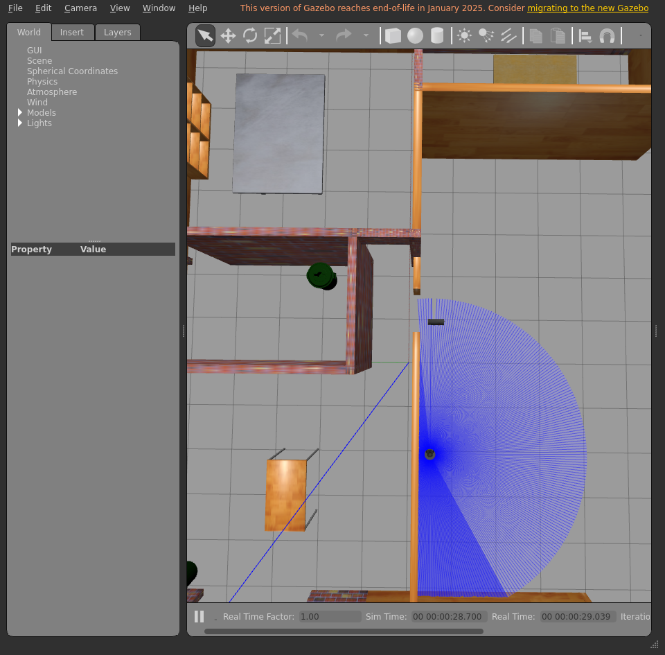
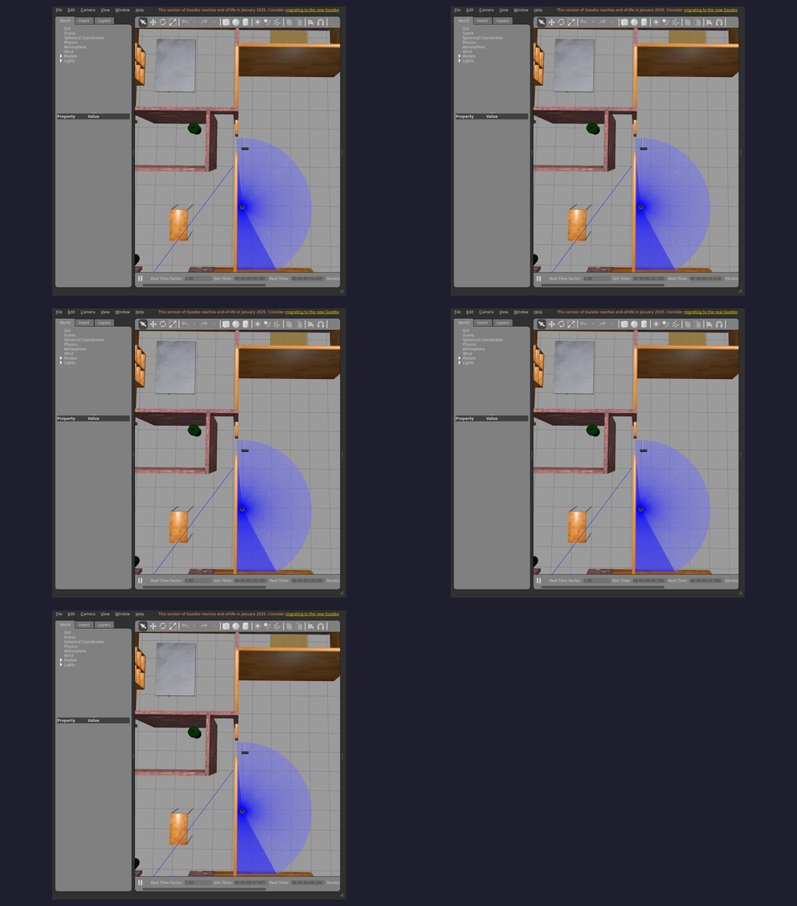

# Integration report — `feature/dev-setup`

| Field | Value |
|-------|-------|
| Result | **FAIL ❌** |
| Branch | `feature/dev-setup` |
| Commit | `927ab3f` |
| Run at (UTC) | 20260708T175039Z |
| Host | bragg3d-Precision-7560 |
| ROS setup | /opt/ros/humble/setup.bash |
| Model | burger |
| Terminal | xterm |

## Steps walked

- Terminal 1 — Gazebo + TurtleBot3
- Terminal 2 — Nav2
- Localization — seed AMCL initial pose
- Direct Nav2 goal — drive to kitchen (bypasses the LLM)
- Terminal 3 — Nav2 API server
- Terminal 4 — LLM voice node

## Feature verdict

- Robot navigated correctly: **no**
- Notes: rviz2 issue, terminal needs further inspection.

## Artifacts (screenshots / posters — slideshow material)







## Terminal logs (last 300 lines each)

<details><summary><code>1-gazebo</code></summary>

```
=== 1-gazebo ===
[INFO] [launch]: All log files can be found below /home/ubuntu/.ros/log/2026-07-08-17-50-40-174122-bragg3d-Precision-7560-1591
[INFO] [launch]: Default logging verbosity is set to INFO
urdf_file_name : turtlebot3_burger.urdf
urdf_file_name : turtlebot3_burger.urdf
urdf_file_name : turtlebot3_burger.urdf
[INFO] [gzserver-1]: process started with pid [1593]
[INFO] [gzclient-2]: process started with pid [1595]
[INFO] [robot_state_publisher-3]: process started with pid [1597]
[INFO] [spawn_entity.py-4]: process started with pid [1599]
[robot_state_publisher-3] [INFO] [1783533041.120694885] [robot_state_publisher]: got segment base_footprint
[robot_state_publisher-3] [INFO] [1783533041.120762573] [robot_state_publisher]: got segment base_link
[robot_state_publisher-3] [INFO] [1783533041.120768181] [robot_state_publisher]: got segment base_scan
[robot_state_publisher-3] [INFO] [1783533041.120771691] [robot_state_publisher]: got segment caster_back_link
[robot_state_publisher-3] [INFO] [1783533041.120775085] [robot_state_publisher]: got segment imu_link
[robot_state_publisher-3] [INFO] [1783533041.120778474] [robot_state_publisher]: got segment wheel_left_link
[robot_state_publisher-3] [INFO] [1783533041.120781920] [robot_state_publisher]: got segment wheel_right_link
[spawn_entity.py-4] [INFO] [1783533041.382624896] [spawn_entity]: Spawn Entity started
[spawn_entity.py-4] [INFO] [1783533041.382848811] [spawn_entity]: Loading entity XML from file /opt/ros/humble/share/turtlebot3_gazebo/models/turtlebot3_burger/model.sdf
[spawn_entity.py-4] [INFO] [1783533041.383485390] [spawn_entity]: Waiting for service /spawn_entity, timeout = 30
[spawn_entity.py-4] [INFO] [1783533041.383774616] [spawn_entity]: Waiting for service /spawn_entity
[spawn_entity.py-4] [INFO] [1783533042.136992507] [spawn_entity]: Calling service /spawn_entity
[gzserver-1] [INFO] [1783533042.387867672] [turtlebot3_imu]: <initial_orientation_as_reference> is unset, using default value of false to comply with REP 145 (world as orientation reference)
[spawn_entity.py-4] [INFO] [1783533042.437771483] [spawn_entity]: Spawn status: SpawnEntity: Successfully spawned entity [burger]
[gzserver-1] [INFO] [1783533042.546336464] [turtlebot3_diff_drive]: Wheel pair 1 separation set to [0.160000m]
[gzserver-1] [INFO] [1783533042.546375331] [turtlebot3_diff_drive]: Wheel pair 1 diameter set to [0.066000m]
[gzserver-1] [INFO] [1783533042.546714438] [turtlebot3_diff_drive]: Subscribed to [/cmd_vel]
[gzserver-1] [INFO] [1783533042.547420462] [turtlebot3_diff_drive]: Advertise odometry on [/odom]
[gzserver-1] [INFO] [1783533042.548178438] [turtlebot3_diff_drive]: Publishing odom transforms between [odom] and [base_footprint]
[gzserver-1] [INFO] [1783533042.552530210] [turtlebot3_joint_state]: Going to publish joint [wheel_left_joint]
[gzserver-1] [INFO] [1783533042.552546697] [turtlebot3_joint_state]: Going to publish joint [wheel_right_joint]
[INFO] [spawn_entity.py-4]: process has finished cleanly [pid 1599]
```

</details>

<details><summary><code>2-nav2</code></summary>

```
=== 2-nav2 ===
[INFO] [launch]: All log files can be found below /home/ubuntu/.ros/log/2026-07-08-17-50-52-421632-bragg3d-Precision-7560-2159
[INFO] [launch]: Default logging verbosity is set to INFO
[ERROR] [launch]: Caught exception in launch (see debug for traceback): Caught multiple exceptions when trying to load file of format [py]:
 - FileNotFoundError: [Errno 2] No such file or directory: '/opt/ros/humble/share/nav2_bringup/urdf/turtlebot3_burger.urdf'
 - InvalidFrontendLaunchFileError: The launch file may have a syntax error, or its format is unknown
```

</details>

<details><summary><code>2b-initpose</code></summary>

```
=== 2b-initpose ===
Auto-detecting the robot's spawn pose from Gazebo...
Initial pose source: Gazebo (live)  ->  x=-1.999940 y=-0.500001 qz=0.000000 qw=1.000000
Waiting for the amcl node to come up...
```

</details>

<details><summary><code>2c-navgoal</code></summary>

```
=== 2c-navgoal ===
Letting localization + costmaps settle before planning...
Clearing costmaps for a clean start...
```

</details>

<details><summary><code>3-apiserver</code></summary>

```
=== 3-apiserver ===
[INFO] [1783533069.436482030] [nav2_api_server]: Nav2 API Server is ready
```

</details>

<details><summary><code>4-voice</code></summary>

```
=== 4-voice ===
[INFO] [1783533072.913314985] [nav_gpt]: connected to goToPose server
Press Enter to start recording, or 'x' to inject a canned transcript... 
```

</details>

