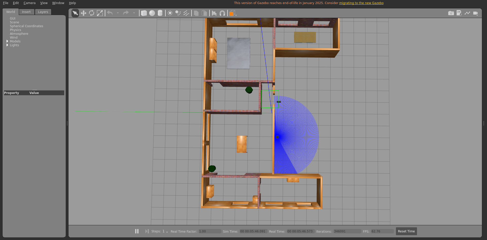
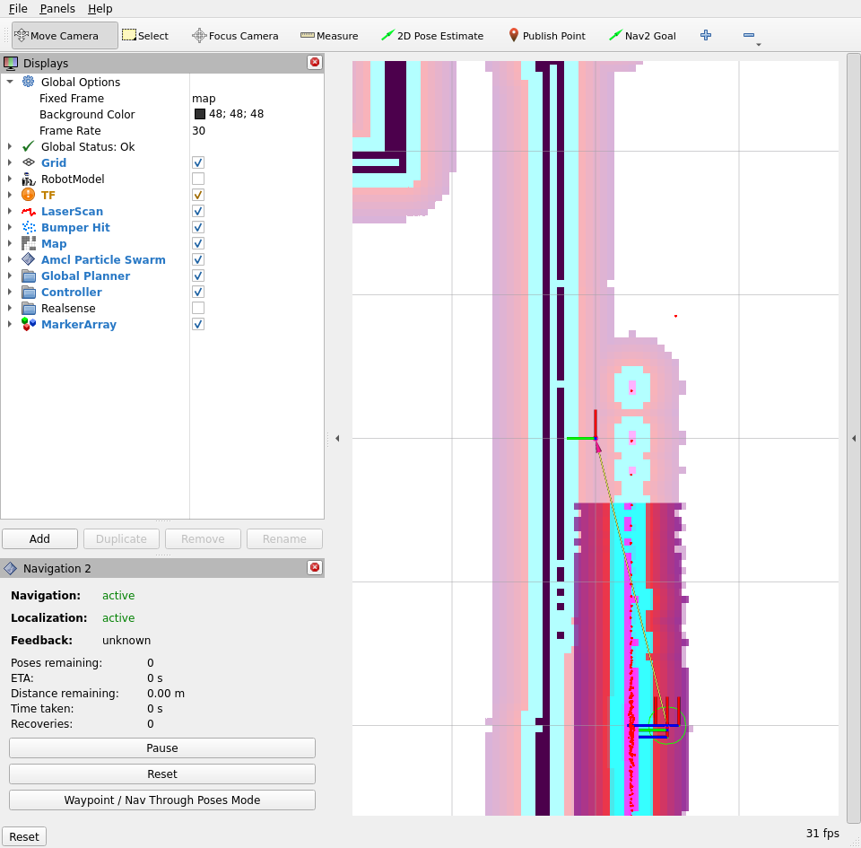
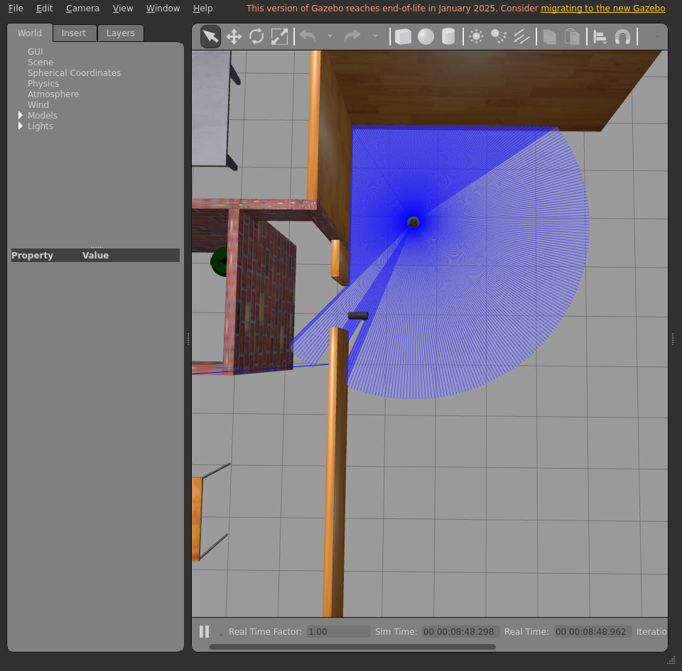
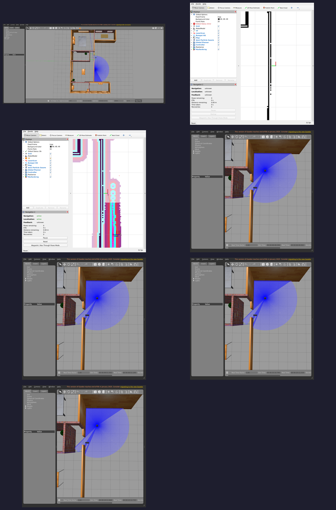

# Integration report — `feature/dev-setup`

| Field | Value |
|-------|-------|
| Result | **FAIL ❌** |
| Branch | `feature/dev-setup` |
| Commit | `cc4887e` |
| Run at (UTC) | 20260708T180750Z |
| Host | bragg3d-Precision-7560 |
| ROS setup | /opt/ros/humble/setup.bash |
| Model | burger |
| Terminal | xterm |

## Steps walked

- Terminal 1 — Gazebo + TurtleBot3
- Terminal 2 — Nav2
- Localization — seed AMCL initial pose
- Direct Nav2 goal — drive to kitchen (bypasses the LLM)
- Terminal 3 — Nav2 API server
- Terminal 4 — LLM voice node

## Feature verdict

- Robot navigated correctly: **no**
- Notes: when you compare the two screens, the rviz2 screen's robot sits right in front of the entrance to the house, while the gazebo robot sits almost in the top left corner, going past the door. the rviz2 robot sees the collisions with walls from gazebo, but then rviz2 doesnt match gazebo so the robot remains misaligned between the two.

## Artifacts (screenshots / posters — slideshow material)









## Terminal logs (last 300 lines each)

<details><summary><code>1-gazebo</code></summary>

```
=== 1-gazebo ===
[INFO] [launch]: All log files can be found below /home/ubuntu/.ros/log/2026-07-08-18-07-51-023283-bragg3d-Precision-7560-1967
[INFO] [launch]: Default logging verbosity is set to INFO
urdf_file_name : turtlebot3_burger.urdf
urdf_file_name : turtlebot3_burger.urdf
urdf_file_name : turtlebot3_burger.urdf
[INFO] [gzserver-1]: process started with pid [1976]
[INFO] [gzclient-2]: process started with pid [1978]
[INFO] [robot_state_publisher-3]: process started with pid [1980]
[INFO] [spawn_entity.py-4]: process started with pid [1982]
[robot_state_publisher-3] [INFO] [1783534072.007833646] [robot_state_publisher]: got segment base_footprint
[robot_state_publisher-3] [INFO] [1783534072.007896238] [robot_state_publisher]: got segment base_link
[robot_state_publisher-3] [INFO] [1783534072.007902545] [robot_state_publisher]: got segment base_scan
[robot_state_publisher-3] [INFO] [1783534072.007906101] [robot_state_publisher]: got segment caster_back_link
[robot_state_publisher-3] [INFO] [1783534072.007909599] [robot_state_publisher]: got segment imu_link
[robot_state_publisher-3] [INFO] [1783534072.007913061] [robot_state_publisher]: got segment wheel_left_link
[robot_state_publisher-3] [INFO] [1783534072.007916508] [robot_state_publisher]: got segment wheel_right_link
[spawn_entity.py-4] [INFO] [1783534072.265923496] [spawn_entity]: Spawn Entity started
[spawn_entity.py-4] [INFO] [1783534072.266138784] [spawn_entity]: Loading entity XML from file /opt/ros/humble/share/turtlebot3_gazebo/models/turtlebot3_burger/model.sdf
[spawn_entity.py-4] [INFO] [1783534072.266603411] [spawn_entity]: Waiting for service /spawn_entity, timeout = 30
[spawn_entity.py-4] [INFO] [1783534072.266789434] [spawn_entity]: Waiting for service /spawn_entity
[spawn_entity.py-4] [INFO] [1783534091.549874676] [spawn_entity]: Calling service /spawn_entity
[gzserver-1] [INFO] [1783534093.205548932] [turtlebot3_imu]: <initial_orientation_as_reference> is unset, using default value of false to comply with REP 145 (world as orientation reference)
[spawn_entity.py-4] [INFO] [1783534093.256349104] [spawn_entity]: Spawn status: SpawnEntity: Successfully spawned entity [burger]
[gzserver-1] [INFO] [1783534093.378635801] [turtlebot3_diff_drive]: Wheel pair 1 separation set to [0.160000m]
[gzserver-1] [INFO] [1783534093.378684442] [turtlebot3_diff_drive]: Wheel pair 1 diameter set to [0.066000m]
[gzserver-1] [INFO] [1783534093.379037049] [turtlebot3_diff_drive]: Subscribed to [/cmd_vel]
[gzserver-1] [INFO] [1783534093.379701034] [turtlebot3_diff_drive]: Advertise odometry on [/odom]
[gzserver-1] [INFO] [1783534093.380481533] [turtlebot3_diff_drive]: Publishing odom transforms between [odom] and [base_footprint]
[gzserver-1] [INFO] [1783534093.385185264] [turtlebot3_joint_state]: Going to publish joint [wheel_left_joint]
[gzserver-1] [INFO] [1783534093.385200957] [turtlebot3_joint_state]: Going to publish joint [wheel_right_joint]
[INFO] [spawn_entity.py-4]: process has finished cleanly [pid 1982]
```

</details>

<details><summary><code>2-nav2</code></summary>

```
=== 2-nav2 ===
[INFO] [launch]: All log files can be found below /home/ubuntu/.ros/log/2026-07-08-18-14-00-443375-bragg3d-Precision-7560-4500
[INFO] [launch]: Default logging verbosity is set to INFO
[INFO] [robot_state_publisher-1]: process started with pid [4551]
[INFO] [rviz2-2]: process started with pid [4553]
[INFO] [component_container_isolated-3]: process started with pid [4555]
[robot_state_publisher-1] [INFO] [1783534441.022943901] [robot_state_publisher]: got segment ${namespace}base_footprint
[robot_state_publisher-1] [INFO] [1783534441.022999720] [robot_state_publisher]: got segment ${namespace}base_link
[robot_state_publisher-1] [INFO] [1783534441.023005994] [robot_state_publisher]: got segment ${namespace}base_scan
[robot_state_publisher-1] [INFO] [1783534441.023009978] [robot_state_publisher]: got segment ${namespace}caster_back_link
[robot_state_publisher-1] [INFO] [1783534441.023013629] [robot_state_publisher]: got segment ${namespace}imu_link
[robot_state_publisher-1] [INFO] [1783534441.023017163] [robot_state_publisher]: got segment ${namespace}wheel_left_link
[robot_state_publisher-1] [INFO] [1783534441.023020750] [robot_state_publisher]: got segment ${namespace}wheel_right_link
[component_container_isolated-3] [INFO] [1783534441.057645054] [nav2_container]: Load Library: /opt/ros/humble/lib/libmap_server_core.so
[component_container_isolated-3] [INFO] [1783534441.064827696] [nav2_container]: Found class: rclcpp_components::NodeFactoryTemplate<nav2_map_server::CostmapFilterInfoServer>
[component_container_isolated-3] [INFO] [1783534441.064868116] [nav2_container]: Found class: rclcpp_components::NodeFactoryTemplate<nav2_map_server::MapSaver>
[component_container_isolated-3] [INFO] [1783534441.064873833] [nav2_container]: Found class: rclcpp_components::NodeFactoryTemplate<nav2_map_server::MapServer>
[component_container_isolated-3] [INFO] [1783534441.064877648] [nav2_container]: Instantiate class: rclcpp_components::NodeFactoryTemplate<nav2_map_server::MapServer>
[component_container_isolated-3] [INFO] [1783534441.067488128] [map_server]: 
[INFO] [launch_ros.actions.load_composable_nodes]: Loaded node '/map_server' in container '/nav2_container'
[component_container_isolated-3] 	map_server lifecycle node launched. 
[component_container_isolated-3] 	Waiting on external lifecycle transitions to activate
[component_container_isolated-3] 	See https://design.ros2.org/articles/node_lifecycle.html for more information.
[component_container_isolated-3] [INFO] [1783534441.067527708] [map_server]: Creating
[component_container_isolated-3] [INFO] [1783534441.069330684] [nav2_container]: Load Library: /opt/ros/humble/lib/libamcl_core.so
[component_container_isolated-3] [INFO] [1783534441.071027657] [nav2_container]: Found class: rclcpp_components::NodeFactoryTemplate<nav2_amcl::AmclNode>
[component_container_isolated-3] [INFO] [1783534441.071045546] [nav2_container]: Instantiate class: rclcpp_components::NodeFactoryTemplate<nav2_amcl::AmclNode>
[component_container_isolated-3] [INFO] [1783534441.073143017] [amcl]: 
[component_container_isolated-3] 	amcl lifecycle node launched. 
[component_container_isolated-3] 	Waiting on external lifecycle transitions to activate
[component_container_isolated-3] 	See https://design.ros2.org/articles/node_lifecycle.html for more information.
[component_container_isolated-3] [INFO] [1783534441.073387564] [amcl]: Creating
[INFO] [launch_ros.actions.load_composable_nodes]: Loaded node '/amcl' in container '/nav2_container'
[component_container_isolated-3] [INFO] [1783534441.075496708] [nav2_container]: Load Library: /opt/ros/humble/lib/libnav2_lifecycle_manager_core.so
[component_container_isolated-3] [INFO] [1783534441.075989451] [nav2_container]: Found class: rclcpp_components::NodeFactoryTemplate<nav2_lifecycle_manager::LifecycleManager>
[component_container_isolated-3] [INFO] [1783534441.076007845] [nav2_container]: Instantiate class: rclcpp_components::NodeFactoryTemplate<nav2_lifecycle_manager::LifecycleManager>
[component_container_isolated-3] [INFO] [1783534441.078085724] [lifecycle_manager_localization]: Creating
[component_container_isolated-3] [INFO] [1783534441.079279071] [lifecycle_manager_localization]: Creating and initializing lifecycle service clients
[INFO] [launch_ros.actions.load_composable_nodes]: Loaded node '/lifecycle_manager_localization' in container '/nav2_container'
[component_container_isolated-3] [INFO] [1783534441.079977728] [lifecycle_manager_localization]: Starting managed nodes bringup...
[component_container_isolated-3] [INFO] [1783534441.080007598] [lifecycle_manager_localization]: Configuring map_server
[component_container_isolated-3] [INFO] [1783534441.080095486] [map_server]: Configuring
[component_container_isolated-3] [INFO] [1783534441.080138194] [map_io]: Loading yaml file: /nav2gpt/nav2gpt_ws/install/ros2ai/share/ros2ai/maps/house.yaml
[component_container_isolated-3] [INFO] [1783534441.080288066] [map_io]: resolution: 0.05
[component_container_isolated-3] [INFO] [1783534441.080293015] [map_io]: origin[0]: -5.75
[component_container_isolated-3] [INFO] [1783534441.080295663] [map_io]: origin[1]: -5.13
[component_container_isolated-3] [INFO] [1783534441.080298173] [map_io]: origin[2]: 0
[component_container_isolated-3] [INFO] [1783534441.080300945] [map_io]: free_thresh: 0.25
[component_container_isolated-3] [INFO] [1783534441.080305363] [map_io]: occupied_thresh: 0.65
[component_container_isolated-3] [INFO] [1783534441.080308438] [map_io]: mode: trinary
[component_container_isolated-3] [INFO] [1783534441.080311256] [map_io]: negate: 0
[component_container_isolated-3] [INFO] [1783534441.080432871] [map_io]: Loading image_file: /nav2gpt/nav2gpt_ws/install/ros2ai/share/ros2ai/maps/house.pgm
[component_container_isolated-3] [INFO] [1783534441.084782774] [map_io]: Read map /nav2gpt/nav2gpt_ws/install/ros2ai/share/ros2ai/maps/house.pgm: 311 X 223 map @ 0.05 m/cell
[component_container_isolated-3] [INFO] [1783534441.085415119] [lifecycle_manager_localization]: Configuring amcl
[component_container_isolated-3] [INFO] [1783534441.085494923] [amcl]: Configuring
[component_container_isolated-3] [INFO] [1783534441.085573883] [amcl]: initTransforms
[component_container_isolated-3] [INFO] [1783534441.087927250] [amcl]: initPubSub
[component_container_isolated-3] [INFO] [1783534441.088381229] [amcl]: Subscribed to map topic.
[component_container_isolated-3] [INFO] [1783534441.089100330] [lifecycle_manager_localization]: Activating map_server
[component_container_isolated-3] [INFO] [1783534441.089151352] [map_server]: Activating
[component_container_isolated-3] [INFO] [1783534441.089221504] [map_server]: Creating bond (map_server) to lifecycle manager.
[component_container_isolated-3] [INFO] [1783534441.089256429] [amcl]: Received a 311 X 223 map @ 0.050 m/pix
[rviz2-2] [INFO] [1783534441.100163622] [rviz2]: Stereo is NOT SUPPORTED
[rviz2-2] [INFO] [1783534441.100219132] [rviz2]: OpenGl version: 4.6 (GLSL 4.6)
[rviz2-2] [INFO] [1783534441.115456739] [rviz2]: Stereo is NOT SUPPORTED
[component_container_isolated-3] [WARN] [1783534441.167218344] [amcl]: New subscription discovered on topic '/particle_cloud', requesting incompatible QoS. No messages will be sent to it. Last incompatible policy: RELIABILITY_QOS_POLICY
[component_container_isolated-3] [INFO] [1783534441.190124647] [lifecycle_manager_localization]: Server map_server connected with bond.
[component_container_isolated-3] [INFO] [1783534441.190199782] [lifecycle_manager_localization]: Activating amcl
[component_container_isolated-3] [INFO] [1783534441.190281920] [amcl]: Activating
[component_container_isolated-3] [INFO] [1783534441.190301404] [amcl]: Creating bond (amcl) to lifecycle manager.
[component_container_isolated-3] [INFO] [1783534441.240567780] [nav2_container]: Load Library: /opt/ros/humble/lib/libcontroller_server_core.so
[component_container_isolated-3] [INFO] [1783534441.242050170] [nav2_container]: Found class: rclcpp_components::NodeFactoryTemplate<nav2_controller::ControllerServer>
[component_container_isolated-3] [INFO] [1783534441.242071166] [nav2_container]: Instantiate class: rclcpp_components::NodeFactoryTemplate<nav2_controller::ControllerServer>
[component_container_isolated-3] [INFO] [1783534441.244611497] [controller_server]: 
[component_container_isolated-3] 	controller_server lifecycle node launched. 
[component_container_isolated-3] 	Waiting on external lifecycle transitions to activate
[component_container_isolated-3] 	See https://design.ros2.org/articles/node_lifecycle.html for more information.
[rviz2-2] [INFO] [1783534441.245890602] [rviz2]: Trying to create a map of size 311 x 223 using 1 swatches
[component_container_isolated-3] [INFO] [1783534441.246821481] [controller_server]: Creating controller server
[component_container_isolated-3] [INFO] [1783534441.249718732] [local_costmap.local_costmap]: 
[component_container_isolated-3] 	local_costmap lifecycle node launched. 
[component_container_isolated-3] 	Waiting on external lifecycle transitions to activate
[component_container_isolated-3] 	See https://design.ros2.org/articles/node_lifecycle.html for more information.
[component_container_isolated-3] [INFO] [1783534441.250064674] [local_costmap.local_costmap]: Creating Costmap
[INFO] [launch_ros.actions.load_composable_nodes]: Loaded node '/controller_server' in container '/nav2_container'
[component_container_isolated-3] [INFO] [1783534441.251901766] [nav2_container]: Load Library: /opt/ros/humble/lib/libsmoother_server_core.so
[component_container_isolated-3] [INFO] [1783534441.252788764] [nav2_container]: Found class: rclcpp_components::NodeFactoryTemplate<nav2_smoother::SmootherServer>
[component_container_isolated-3] [INFO] [1783534441.252808495] [nav2_container]: Instantiate class: rclcpp_components::NodeFactoryTemplate<nav2_smoother::SmootherServer>
[component_container_isolated-3] [INFO] [1783534441.254653140] [amcl]: createLaserObject
[component_container_isolated-3] [INFO] [1783534441.255242066] [smoother_server]: 
[component_container_isolated-3] 	smoother_server lifecycle node launched. 
[component_container_isolated-3] 	Waiting on external lifecycle transitions to activate
[component_container_isolated-3] 	See https://design.ros2.org/articles/node_lifecycle.html for more information.
[component_container_isolated-3] [INFO] [1783534441.256152693] [smoother_server]: Creating smoother server
[INFO] [launch_ros.actions.load_composable_nodes]: Loaded node '/smoother_server' in container '/nav2_container'
[rviz2-2] [ERROR] [1783534441.257640050] [rviz2]: Vertex Program:rviz/glsl120/indexed_8bit_image.vert Fragment Program:rviz/glsl120/indexed_8bit_image.frag GLSL link result : 
[rviz2-2] active samplers with a different type refer to the same texture image unit
[component_container_isolated-3] [INFO] [1783534441.257920453] [nav2_container]: Load Library: /opt/ros/humble/lib/libplanner_server_core.so
[component_container_isolated-3] [INFO] [1783534441.258469786] [nav2_container]: Found class: rclcpp_components::NodeFactoryTemplate<nav2_planner::PlannerServer>
[component_container_isolated-3] [INFO] [1783534441.258484030] [nav2_container]: Instantiate class: rclcpp_components::NodeFactoryTemplate<nav2_planner::PlannerServer>
[component_container_isolated-3] [INFO] [1783534441.261080237] [planner_server]: 
[component_container_isolated-3] 	planner_server lifecycle node launched. 
[component_container_isolated-3] 	Waiting on external lifecycle transitions to activate
[component_container_isolated-3] 	See https://design.ros2.org/articles/node_lifecycle.html for more information.
[component_container_isolated-3] [INFO] [1783534441.261877740] [planner_server]: Creating
[component_container_isolated-3] [INFO] [1783534441.264408558] [global_costmap.global_costmap]: 
[component_container_isolated-3] 	global_costmap lifecycle node launched. 
[component_container_isolated-3] 	Waiting on external lifecycle transitions to activate
[component_container_isolated-3] 	See https://design.ros2.org/articles/node_lifecycle.html for more information.
[component_container_isolated-3] [INFO] [1783534441.264644623] [global_costmap.global_costmap]: Creating Costmap
[INFO] [launch_ros.actions.load_composable_nodes]: Loaded node '/planner_server' in container '/nav2_container'
[component_container_isolated-3] [INFO] [1783534441.266997779] [nav2_container]: Load Library: /opt/ros/humble/lib/libbehavior_server_core.so
[component_container_isolated-3] [INFO] [1783534441.268768581] [nav2_container]: Found class: rclcpp_components::NodeFactoryTemplate<behavior_server::BehaviorServer>
[component_container_isolated-3] [INFO] [1783534441.268788306] [nav2_container]: Instantiate class: rclcpp_components::NodeFactoryTemplate<behavior_server::BehaviorServer>
[component_container_isolated-3] [INFO] [1783534441.271327056] [behavior_server]: 
[component_container_isolated-3] 	behavior_server lifecycle node launched. 
[component_container_isolated-3] 	Waiting on external lifecycle transitions to activate
[component_container_isolated-3] 	See https://design.ros2.org/articles/node_lifecycle.html for more information.
[INFO] [launch_ros.actions.load_composable_nodes]: Loaded node '/behavior_server' in container '/nav2_container'
[component_container_isolated-3] [INFO] [1783534441.273419070] [nav2_container]: Load Library: /opt/ros/humble/lib/libbt_navigator_core.so
[component_container_isolated-3] [INFO] [1783534441.274385280] [nav2_container]: Found class: rclcpp_components::NodeFactoryTemplate<nav2_bt_navigator::BtNavigator>
[component_container_isolated-3] [INFO] [1783534441.274400970] [nav2_container]: Instantiate class: rclcpp_components::NodeFactoryTemplate<nav2_bt_navigator::BtNavigator>
[component_container_isolated-3] [INFO] [1783534441.277373980] [bt_navigator]: 
[component_container_isolated-3] 	bt_navigator lifecycle node launched. 
[component_container_isolated-3] 	Waiting on external lifecycle transitions to activate
[component_container_isolated-3] 	See https://design.ros2.org/articles/node_lifecycle.html for more information.
[component_container_isolated-3] [INFO] [1783534441.277398702] [bt_navigator]: Creating
[INFO] [launch_ros.actions.load_composable_nodes]: Loaded node '/bt_navigator' in container '/nav2_container'
[component_container_isolated-3] [INFO] [1783534441.278591882] [nav2_container]: Load Library: /opt/ros/humble/lib/libwaypoint_follower_core.so
[component_container_isolated-3] [INFO] [1783534441.278952429] [nav2_container]: Found class: rclcpp_components::NodeFactoryTemplate<nav2_waypoint_follower::WaypointFollower>
[component_container_isolated-3] [INFO] [1783534441.278964235] [nav2_container]: Instantiate class: rclcpp_components::NodeFactoryTemplate<nav2_waypoint_follower::WaypointFollower>
[component_container_isolated-3] [INFO] [1783534441.281707751] [waypoint_follower]: 
[component_container_isolated-3] 	waypoint_follower lifecycle node launched. 
[component_container_isolated-3] 	Waiting on external lifecycle transitions to activate
[component_container_isolated-3] 	See https://design.ros2.org/articles/node_lifecycle.html for more information.
[component_container_isolated-3] [INFO] [1783534441.281948859] [waypoint_follower]: Creating
[INFO] [launch_ros.actions.load_composable_nodes]: Loaded node '/waypoint_follower' in container '/nav2_container'
[component_container_isolated-3] [INFO] [1783534441.283187870] [nav2_container]: Load Library: /opt/ros/humble/lib/libvelocity_smoother_core.so
[component_container_isolated-3] [INFO] [1783534441.283663946] [nav2_container]: Found class: rclcpp_components::NodeFactoryTemplate<nav2_velocity_smoother::VelocitySmoother>
[component_container_isolated-3] [INFO] [1783534441.283679742] [nav2_container]: Instantiate class: rclcpp_components::NodeFactoryTemplate<nav2_velocity_smoother::VelocitySmoother>
[component_container_isolated-3] [INFO] [1783534441.286395044] [velocity_smoother]: 
[component_container_isolated-3] 	velocity_smoother lifecycle node launched. 
[component_container_isolated-3] 	Waiting on external lifecycle transitions to activate
[component_container_isolated-3] 	See https://design.ros2.org/articles/node_lifecycle.html for more information.
[INFO] [launch_ros.actions.load_composable_nodes]: Loaded node '/velocity_smoother' in container '/nav2_container'
[component_container_isolated-3] [INFO] [1783534441.287650575] [nav2_container]: Found class: rclcpp_components::NodeFactoryTemplate<nav2_lifecycle_manager::LifecycleManager>
[component_container_isolated-3] [INFO] [1783534441.287668093] [nav2_container]: Instantiate class: rclcpp_components::NodeFactoryTemplate<nav2_lifecycle_manager::LifecycleManager>
[component_container_isolated-3] [INFO] [1783534441.289961476] [lifecycle_manager_navigation]: Creating
[component_container_isolated-3] [INFO] [1783534441.290696089] [lifecycle_manager_navigation]: Creating and initializing lifecycle service clients
[component_container_isolated-3] [INFO] [1783534441.290972585] [lifecycle_manager_localization]: Server amcl connected with bond.
[component_container_isolated-3] [INFO] [1783534441.290998395] [lifecycle_manager_localization]: Managed nodes are active
[component_container_isolated-3] [INFO] [1783534441.291011437] [lifecycle_manager_localization]: Creating bond timer...
[INFO] [launch_ros.actions.load_composable_nodes]: Loaded node '/lifecycle_manager_navigation' in container '/nav2_container'
[component_container_isolated-3] [INFO] [1783534441.293455030] [lifecycle_manager_navigation]: Starting managed nodes bringup...
[component_container_isolated-3] [INFO] [1783534441.293481704] [lifecycle_manager_navigation]: Configuring controller_server
[component_container_isolated-3] [INFO] [1783534441.293562402] [controller_server]: Configuring controller interface
[component_container_isolated-3] [INFO] [1783534441.293673441] [controller_server]: getting goal checker plugins..
[component_container_isolated-3] [INFO] [1783534441.293741580] [controller_server]: Controller frequency set to 20.0000Hz
[component_container_isolated-3] [INFO] [1783534441.293797137] [local_costmap.local_costmap]: Configuring
[component_container_isolated-3] [INFO] [1783534441.295015004] [local_costmap.local_costmap]: Using plugin "voxel_layer"
[component_container_isolated-3] [INFO] [1783534441.296854114] [local_costmap.local_costmap]: Subscribed to Topics: scan
[component_container_isolated-3] [INFO] [1783534441.298779989] [local_costmap.local_costmap]: Initialized plugin "voxel_layer"
[component_container_isolated-3] [INFO] [1783534441.298804227] [local_costmap.local_costmap]: Using plugin "inflation_layer"
[component_container_isolated-3] [INFO] [1783534441.299201190] [local_costmap.local_costmap]: Initialized plugin "inflation_layer"
[component_container_isolated-3] [INFO] [1783534441.301286037] [controller_server]: Created progress_checker : progress_checker of type nav2_controller::SimpleProgressChecker
[component_container_isolated-3] [INFO] [1783534441.301709053] [controller_server]: Created goal checker : general_goal_checker of type nav2_controller::SimpleGoalChecker
[component_container_isolated-3] [INFO] [1783534441.301917595] [controller_server]: Controller Server has general_goal_checker  goal checkers available.
[component_container_isolated-3] [INFO] [1783534441.302938168] [controller_server]: Created controller : FollowPath of type dwb_core::DWBLocalPlanner
[component_container_isolated-3] [INFO] [1783534441.303609954] [controller_server]: Setting transform_tolerance to 0.200000
[component_container_isolated-3] [INFO] [1783534441.308101912] [controller_server]: Using critic "RotateToGoal" (dwb_critics::RotateToGoalCritic)
[component_container_isolated-3] [INFO] [1783534441.308473590] [controller_server]: Critic plugin initialized
[component_container_isolated-3] [INFO] [1783534441.308619779] [controller_server]: Using critic "Oscillation" (dwb_critics::OscillationCritic)
[component_container_isolated-3] [INFO] [1783534441.308913779] [controller_server]: Critic plugin initialized
[component_container_isolated-3] [INFO] [1783534441.309007866] [controller_server]: Using critic "BaseObstacle" (dwb_critics::BaseObstacleCritic)
[component_container_isolated-3] [INFO] [1783534441.309154772] [controller_server]: Critic plugin initialized
[component_container_isolated-3] [INFO] [1783534441.309246072] [controller_server]: Using critic "GoalAlign" (dwb_critics::GoalAlignCritic)
[component_container_isolated-3] [INFO] [1783534441.309454061] [controller_server]: Critic plugin initialized
[component_container_isolated-3] [INFO] [1783534441.309555973] [controller_server]: Using critic "PathAlign" (dwb_critics::PathAlignCritic)
[component_container_isolated-3] [INFO] [1783534441.309818508] [controller_server]: Critic plugin initialized
[component_container_isolated-3] [INFO] [1783534441.309933150] [controller_server]: Using critic "PathDist" (dwb_critics::PathDistCritic)
[component_container_isolated-3] [INFO] [1783534441.310119741] [controller_server]: Critic plugin initialized
[component_container_isolated-3] [INFO] [1783534441.310207902] [controller_server]: Using critic "GoalDist" (dwb_critics::GoalDistCritic)
[component_container_isolated-3] [INFO] [1783534441.310376068] [controller_server]: Critic plugin initialized
[component_container_isolated-3] [INFO] [1783534441.310406191] [controller_server]: Controller Server has FollowPath  controllers available.
[component_container_isolated-3] [INFO] [1783534441.312105667] [lifecycle_manager_navigation]: Configuring smoother_server
[component_container_isolated-3] [INFO] [1783534441.312171119] [smoother_server]: Configuring smoother server
[component_container_isolated-3] [INFO] [1783534441.314044663] [smoother_server]: Created smoother : simple_smoother of type nav2_smoother::SimpleSmoother
[component_container_isolated-3] [INFO] [1783534441.314300710] [smoother_server]: Smoother Server has simple_smoother  smoothers available.
[component_container_isolated-3] [INFO] [1783534441.315456578] [lifecycle_manager_navigation]: Configuring planner_server
[component_container_isolated-3] [INFO] [1783534441.315523615] [planner_server]: Configuring
[component_container_isolated-3] [INFO] [1783534441.315550077] [global_costmap.global_costmap]: Configuring
[component_container_isolated-3] [INFO] [1783534441.316768391] [global_costmap.global_costmap]: Using plugin "static_layer"
[component_container_isolated-3] [INFO] [1783534441.317207622] [global_costmap.global_costmap]: Subscribing to the map topic (/map) with transient local durability
[component_container_isolated-3] [INFO] [1783534441.317409749] [global_costmap.global_costmap]: Initialized plugin "static_layer"
[component_container_isolated-3] [INFO] [1783534441.317421855] [global_costmap.global_costmap]: Using plugin "obstacle_layer"
[component_container_isolated-3] [INFO] [1783534441.317805242] [global_costmap.global_costmap]: Subscribed to Topics: scan
[component_container_isolated-3] [INFO] [1783534441.318853396] [global_costmap.global_costmap]: Initialized plugin "obstacle_layer"
[component_container_isolated-3] [INFO] [1783534441.318870688] [global_costmap.global_costmap]: Using plugin "inflation_layer"
[component_container_isolated-3] [INFO] [1783534441.319176810] [global_costmap.global_costmap]: Initialized plugin "inflation_layer"
[component_container_isolated-3] [INFO] [1783534441.320679455] [global_costmap.global_costmap]: StaticLayer: Resizing costmap to 311 X 223 at 0.050000 m/pix
[component_container_isolated-3] [INFO] [1783534441.320929460] [planner_server]: Created global planner plugin GridBased of type nav2_navfn_planner/NavfnPlanner
[component_container_isolated-3] [INFO] [1783534441.320949852] [planner_server]: Configuring plugin GridBased of type NavfnPlanner
[component_container_isolated-3] [INFO] [1783534441.321278813] [planner_server]: Planner Server has GridBased  planners available.
[component_container_isolated-3] [INFO] [1783534441.323223111] [lifecycle_manager_navigation]: Configuring behavior_server
[component_container_isolated-3] [INFO] [1783534441.323288673] [behavior_server]: Configuring
[component_container_isolated-3] [INFO] [1783534441.324865893] [behavior_server]: Creating behavior plugin spin of type nav2_behaviors/Spin
[component_container_isolated-3] [INFO] [1783534441.325424286] [behavior_server]: Configuring spin
[component_container_isolated-3] [INFO] [1783534441.326636895] [behavior_server]: Creating behavior plugin backup of type nav2_behaviors/BackUp
[component_container_isolated-3] [INFO] [1783534441.327080880] [behavior_server]: Configuring backup
[component_container_isolated-3] [INFO] [1783534441.328228238] [behavior_server]: Creating behavior plugin drive_on_heading of type nav2_behaviors/DriveOnHeading
[component_container_isolated-3] [INFO] [1783534441.328690674] [behavior_server]: Configuring drive_on_heading
[component_container_isolated-3] [INFO] [1783534441.329847149] [behavior_server]: Creating behavior plugin assisted_teleop of type nav2_behaviors/AssistedTeleop
[component_container_isolated-3] [INFO] [1783534441.330760556] [behavior_server]: Configuring assisted_teleop
[component_container_isolated-3] [INFO] [1783534441.332455883] [behavior_server]: Creating behavior plugin wait of type nav2_behaviors/Wait
[component_container_isolated-3] [INFO] [1783534441.332882792] [behavior_server]: Configuring wait
[component_container_isolated-3] [INFO] [1783534441.333951203] [lifecycle_manager_navigation]: Configuring bt_navigator
[component_container_isolated-3] [INFO] [1783534441.334026655] [bt_navigator]: Configuring
[component_container_isolated-3] [INFO] [1783534441.360458608] [lifecycle_manager_navigation]: Configuring waypoint_follower
[component_container_isolated-3] [INFO] [1783534441.360549032] [waypoint_follower]: Configuring
[component_container_isolated-3] [INFO] [1783534441.362846151] [waypoint_follower]: Created waypoint_task_executor : wait_at_waypoint of type nav2_waypoint_follower::WaitAtWaypoint
[component_container_isolated-3] [INFO] [1783534441.363212053] [lifecycle_manager_navigation]: Configuring velocity_smoother
[component_container_isolated-3] [INFO] [1783534441.363288138] [velocity_smoother]: Configuring velocity smoother
[component_container_isolated-3] [INFO] [1783534441.364434793] [lifecycle_manager_navigation]: Activating controller_server
[component_container_isolated-3] [INFO] [1783534441.364499485] [controller_server]: Activating
[component_container_isolated-3] [INFO] [1783534441.364541968] [local_costmap.local_costmap]: Activating
[component_container_isolated-3] [INFO] [1783534441.364566503] [local_costmap.local_costmap]: Checking transform
[component_container_isolated-3] [INFO] [1783534441.364642059] [local_costmap.local_costmap]: start
[component_container_isolated-3] [INFO] [1783534441.615095545] [controller_server]: Creating bond (controller_server) to lifecycle manager.
[component_container_isolated-3] [INFO] [1783534441.716418586] [lifecycle_manager_navigation]: Server controller_server connected with bond.
[component_container_isolated-3] [INFO] [1783534441.716470499] [lifecycle_manager_navigation]: Activating smoother_server
[component_container_isolated-3] [INFO] [1783534441.716613100] [smoother_server]: Activating
[component_container_isolated-3] [INFO] [1783534441.716649019] [smoother_server]: Creating bond (smoother_server) to lifecycle manager.
[component_container_isolated-3] [INFO] [1783534441.817657335] [lifecycle_manager_navigation]: Server smoother_server connected with bond.
[component_container_isolated-3] [INFO] [1783534441.817715046] [lifecycle_manager_navigation]: Activating planner_server
[component_container_isolated-3] [INFO] [1783534441.817840068] [planner_server]: Activating
[component_container_isolated-3] [INFO] [1783534441.817882802] [global_costmap.global_costmap]: Activating
[component_container_isolated-3] [INFO] [1783534441.817893670] [global_costmap.global_costmap]: Checking transform
[component_container_isolated-3] [INFO] [1783534462.240019775] [amcl]: initialPoseReceived
[component_container_isolated-3] [INFO] [1783534462.240101591] [amcl]: Setting pose (368.500000): -2.000 -0.500 0.000
[component_container_isolated-3] [INFO] [1783534463.318012712] [global_costmap.global_costmap]: start
[rviz2-2] [INFO] [1783534463.592150933] [rviz2]: Trying to create a map of size 60 x 60 using 1 swatches
[rviz2-2] [INFO] [1783534464.328637001] [rviz2]: Trying to create a map of size 311 x 223 using 1 swatches
[component_container_isolated-3] [INFO] [1783534464.368387276] [planner_server]: Activating plugin GridBased of type NavfnPlanner
[component_container_isolated-3] [INFO] [1783534464.368885695] [planner_server]: Creating bond (planner_server) to lifecycle manager.
[component_container_isolated-3] [INFO] [1783534464.469987140] [lifecycle_manager_navigation]: Server planner_server connected with bond.
[component_container_isolated-3] [INFO] [1783534464.470019892] [lifecycle_manager_navigation]: Activating behavior_server
[component_container_isolated-3] [INFO] [1783534464.470249414] [behavior_server]: Activating
[component_container_isolated-3] [INFO] [1783534464.470267459] [behavior_server]: Activating spin
[component_container_isolated-3] [INFO] [1783534464.470281937] [behavior_server]: Activating backup
[component_container_isolated-3] [INFO] [1783534464.470289974] [behavior_server]: Activating drive_on_heading
[component_container_isolated-3] [INFO] [1783534464.470296883] [behavior_server]: Activating assisted_teleop
[component_container_isolated-3] [INFO] [1783534464.470303725] [behavior_server]: Activating wait
[component_container_isolated-3] [INFO] [1783534464.470312224] [behavior_server]: Creating bond (behavior_server) to lifecycle manager.
[component_container_isolated-3] [INFO] [1783534464.571491029] [lifecycle_manager_navigation]: Server behavior_server connected with bond.
[component_container_isolated-3] [INFO] [1783534464.571547773] [lifecycle_manager_navigation]: Activating bt_navigator
[component_container_isolated-3] [INFO] [1783534464.571665267] [bt_navigator]: Activating
[component_container_isolated-3] [INFO] [1783534464.583407432] [bt_navigator]: Creating bond (bt_navigator) to lifecycle manager.
[component_container_isolated-3] [INFO] [1783534464.684384501] [lifecycle_manager_navigation]: Server bt_navigator connected with bond.
[component_container_isolated-3] [INFO] [1783534464.684428163] [lifecycle_manager_navigation]: Activating waypoint_follower
[component_container_isolated-3] [INFO] [1783534464.684581493] [waypoint_follower]: Activating
[component_container_isolated-3] [INFO] [1783534464.684612913] [waypoint_follower]: Creating bond (waypoint_follower) to lifecycle manager.
[component_container_isolated-3] [INFO] [1783534464.785672238] [lifecycle_manager_navigation]: Server waypoint_follower connected with bond.
[component_container_isolated-3] [INFO] [1783534464.785742895] [lifecycle_manager_navigation]: Activating velocity_smoother
[component_container_isolated-3] [INFO] [1783534464.785887578] [velocity_smoother]: Activating
[component_container_isolated-3] [INFO] [1783534464.785931339] [velocity_smoother]: Creating bond (velocity_smoother) to lifecycle manager.
[component_container_isolated-3] [INFO] [1783534464.887076911] [lifecycle_manager_navigation]: Server velocity_smoother connected with bond.
[component_container_isolated-3] [INFO] [1783534464.887120474] [lifecycle_manager_navigation]: Managed nodes are active
[component_container_isolated-3] [INFO] [1783534464.887148240] [lifecycle_manager_navigation]: Creating bond timer...
[component_container_isolated-3] [INFO] [1783534485.639965204] [global_costmap.global_costmap]: Received request to clear entirely the global_costmap
[component_container_isolated-3] [INFO] [1783534486.138648835] [local_costmap.local_costmap]: Received request to clear entirely the local_costmap
[component_container_isolated-3] [INFO] [1783534488.719463699] [bt_navigator]: Begin navigating from current location (-2.00, -0.50) to (-4.00, 4.00)
[component_container_isolated-3] [INFO] [1783534488.740301171] [controller_server]: Received a goal, begin computing control effort.
[component_container_isolated-3] [WARN] [1783534488.740362412] [controller_server]: No goal checker was specified in parameter 'current_goal_checker'. Server will use only plugin loaded general_goal_checker . This warning will appear once.
[component_container_isolated-3] [INFO] [1783534489.790525343] [controller_server]: Passing new path to controller.
[component_container_isolated-3] [INFO] [1783534490.840542767] [controller_server]: Passing new path to controller.
[component_container_isolated-3] [INFO] [1783534491.840545726] [controller_server]: Passing new path to controller.
[component_container_isolated-3] [INFO] [1783534492.890516507] [controller_server]: Passing new path to controller.
[component_container_isolated-3] [INFO] [1783534493.890517758] [controller_server]: Passing new path to controller.
[component_container_isolated-3] [INFO] [1783534494.940543404] [controller_server]: Passing new path to controller.
[component_container_isolated-3] [INFO] [1783534495.990529328] [controller_server]: Passing new path to controller.
[component_container_isolated-3] [INFO] [1783534496.990515001] [controller_server]: Passing new path to controller.
[component_container_isolated-3] [INFO] [1783534498.040580543] [controller_server]: Passing new path to controller.
[component_container_isolated-3] [INFO] [1783534499.040542025] [controller_server]: Passing new path to controller.
[component_container_isolated-3] [INFO] [1783534500.090540552] [controller_server]: Passing new path to controller.
[component_container_isolated-3] [INFO] [1783534501.140550020] [controller_server]: Passing new path to controller.
[component_container_isolated-3] [INFO] [1783534502.140535946] [controller_server]: Passing new path to controller.
[component_container_isolated-3] [INFO] [1783534503.190517669] [controller_server]: Passing new path to controller.
[component_container_isolated-3] [WARN] [1783534504.170554783] [planner_server]: GridBased: failed to create plan with tolerance 0.50.
[component_container_isolated-3] [WARN] [1783534504.170594458] [planner_server]: Planning algorithm GridBased failed to generate a valid path to (-4.00, 4.00)
[component_container_isolated-3] [WARN] [1783534504.170602271] [planner_server]: [compute_path_to_pose] [ActionServer] Aborting handle.
[component_container_isolated-3] [INFO] [1783534504.189649224] [global_costmap.global_costmap]: Received request to clear entirely the global_costmap
[component_container_isolated-3] [WARN] [1783534504.320722257] [planner_server]: GridBased: failed to create plan with tolerance 0.50.
[component_container_isolated-3] [WARN] [1783534504.320761459] [planner_server]: Planning algorithm GridBased failed to generate a valid path to (-4.00, 4.00)
[component_container_isolated-3] [WARN] [1783534504.320769798] [planner_server]: [compute_path_to_pose] [ActionServer] Aborting handle.
[component_container_isolated-3] [INFO] [1783534504.340517028] [controller_server]: Goal was canceled. Stopping the robot.
[component_container_isolated-3] [INFO] [1783534504.340552881] [controller_server]: [follow_path] [ActionServer] Client requested to cancel the goal. Cancelling.
[component_container_isolated-3] [INFO] [1783534504.340698252] [local_costmap.local_costmap]: Received request to clear entirely the local_costmap
[component_container_isolated-3] [INFO] [1783534504.340800639] [global_costmap.global_costmap]: Received request to clear entirely the global_costmap
[component_container_isolated-3] [WARN] [1783534505.321917047] [planner_server]: GridBased: failed to create plan with tolerance 0.50.
[component_container_isolated-3] [WARN] [1783534505.321957084] [planner_server]: Planning algorithm GridBased failed to generate a valid path to (-4.00, 4.00)
[component_container_isolated-3] [WARN] [1783534505.321966865] [planner_server]: [compute_path_to_pose] [ActionServer] Aborting handle.
[component_container_isolated-3] [INFO] [1783534505.339647297] [global_costmap.global_costmap]: Received request to clear entirely the global_costmap
[component_container_isolated-3] [WARN] [1783534506.320971247] [planner_server]: GridBased: failed to create plan with tolerance 0.50.
[component_container_isolated-3] [WARN] [1783534506.321023733] [planner_server]: Planning algorithm GridBased failed to generate a valid path to (-4.00, 4.00)
[component_container_isolated-3] [WARN] [1783534506.321036894] [planner_server]: [compute_path_to_pose] [ActionServer] Aborting handle.
[component_container_isolated-3] [INFO] [1783534506.339850481] [behavior_server]: Running spin
[component_container_isolated-3] [INFO] [1783534506.339915294] [behavior_server]: Turning 1.57 for spin behavior.
[component_container_isolated-3] [INFO] [1783534508.040051429] [behavior_server]: spin completed successfully
[component_container_isolated-3] [WARN] [1783534508.070623024] [planner_server]: GridBased: failed to create plan with tolerance 0.50.
[component_container_isolated-3] [WARN] [1783534508.070661672] [planner_server]: Planning algorithm GridBased failed to generate a valid path to (-4.00, 4.00)
[component_container_isolated-3] [WARN] [1783534508.070669378] [planner_server]: [compute_path_to_pose] [ActionServer] Aborting handle.
[component_container_isolated-3] [INFO] [1783534508.089633315] [global_costmap.global_costmap]: Received request to clear entirely the global_costmap
[component_container_isolated-3] [WARN] [1783534508.320712192] [planner_server]: GridBased: failed to create plan with tolerance 0.50.
[component_container_isolated-3] [WARN] [1783534508.320751563] [planner_server]: Planning algorithm GridBased failed to generate a valid path to (-4.00, 4.00)
[component_container_isolated-3] [WARN] [1783534508.320760275] [planner_server]: [compute_path_to_pose] [ActionServer] Aborting handle.
[component_container_isolated-3] [INFO] [1783534508.339940775] [behavior_server]: Running wait
[component_container_isolated-3] [INFO] [1783534513.340135454] [behavior_server]: wait completed successfully
[component_container_isolated-3] [WARN] [1783534513.370641436] [planner_server]: GridBased: failed to create plan with tolerance 0.50.
[component_container_isolated-3] [WARN] [1783534513.370696278] [planner_server]: Planning algorithm GridBased failed to generate a valid path to (-4.00, 4.00)
[component_container_isolated-3] [WARN] [1783534513.370704428] [planner_server]: [compute_path_to_pose] [ActionServer] Aborting handle.
[component_container_isolated-3] [INFO] [1783534513.389661280] [global_costmap.global_costmap]: Received request to clear entirely the global_costmap
[component_container_isolated-3] [WARN] [1783534514.320766076] [planner_server]: GridBased: failed to create plan with tolerance 0.50.
[component_container_isolated-3] [WARN] [1783534514.320808830] [planner_server]: Planning algorithm GridBased failed to generate a valid path to (-4.00, 4.00)
[component_container_isolated-3] [WARN] [1783534514.320825243] [planner_server]: [compute_path_to_pose] [ActionServer] Aborting handle.
[component_container_isolated-3] [INFO] [1783534514.339820774] [behavior_server]: Running backup
[component_container_isolated-3] [INFO] [1783534514.339936559] [behavior_server]: DriveOnHeading: no acceleration or deceleration limits set
[component_container_isolated-3] [INFO] [1783534520.440027747] [behavior_server]: backup completed successfully
[component_container_isolated-3] [WARN] [1783534520.470713006] [planner_server]: GridBased: failed to create plan with tolerance 0.50.
[component_container_isolated-3] [WARN] [1783534520.470760166] [planner_server]: Planning algorithm GridBased failed to generate a valid path to (-4.00, 4.00)
[component_container_isolated-3] [WARN] [1783534520.470769542] [planner_server]: [compute_path_to_pose] [ActionServer] Aborting handle.
[component_container_isolated-3] [INFO] [1783534520.489650698] [global_costmap.global_costmap]: Received request to clear entirely the global_costmap
[component_container_isolated-3] [WARN] [1783534521.320836327] [planner_server]: GridBased: failed to create plan with tolerance 0.50.
[component_container_isolated-3] [WARN] [1783534521.320883767] [planner_server]: Planning algorithm GridBased failed to generate a valid path to (-4.00, 4.00)
[component_container_isolated-3] [WARN] [1783534521.320893751] [planner_server]: [compute_path_to_pose] [ActionServer] Aborting handle.
[component_container_isolated-3] [INFO] [1783534521.339693142] [local_costmap.local_costmap]: Received request to clear entirely the local_costmap
[component_container_isolated-3] [INFO] [1783534521.339822454] [global_costmap.global_costmap]: Received request to clear entirely the global_costmap
[component_container_isolated-3] [WARN] [1783534522.320890735] [planner_server]: GridBased: failed to create plan with tolerance 0.50.
[component_container_isolated-3] [WARN] [1783534522.320933039] [planner_server]: Planning algorithm GridBased failed to generate a valid path to (-4.00, 4.00)
[component_container_isolated-3] [WARN] [1783534522.320941858] [planner_server]: [compute_path_to_pose] [ActionServer] Aborting handle.
[component_container_isolated-3] [INFO] [1783534522.339695008] [global_costmap.global_costmap]: Received request to clear entirely the global_costmap
[component_container_isolated-3] [WARN] [1783534523.320805797] [planner_server]: GridBased: failed to create plan with tolerance 0.50.
[component_container_isolated-3] [WARN] [1783534523.320875486] [planner_server]: Planning algorithm GridBased failed to generate a valid path to (-4.00, 4.00)
[component_container_isolated-3] [WARN] [1783534523.320886412] [planner_server]: [compute_path_to_pose] [ActionServer] Aborting handle.
[component_container_isolated-3] [INFO] [1783534523.339846958] [behavior_server]: Running spin
[component_container_isolated-3] [INFO] [1783534523.339910797] [behavior_server]: Turning 1.57 for spin behavior.
[component_container_isolated-3] [INFO] [1783534525.040045856] [behavior_server]: spin completed successfully
[component_container_isolated-3] [WARN] [1783534525.070602386] [planner_server]: GridBased: failed to create plan with tolerance 0.50.
[component_container_isolated-3] [WARN] [1783534525.070652174] [planner_server]: Planning algorithm GridBased failed to generate a valid path to (-4.00, 4.00)
[component_container_isolated-3] [WARN] [1783534525.070663853] [planner_server]: [compute_path_to_pose] [ActionServer] Aborting handle.
[component_container_isolated-3] [INFO] [1783534525.089648143] [global_costmap.global_costmap]: Received request to clear entirely the global_costmap
[component_container_isolated-3] [WARN] [1783534525.321945857] [planner_server]: Planner loop missed its desired rate of 20.0000 Hz. Current loop rate is 5.0000 Hz
[component_container_isolated-3] [INFO] [1783534525.340104326] [controller_server]: Received a goal, begin computing control effort.
[component_container_isolated-3] [INFO] [1783534526.390345013] [controller_server]: Passing new path to controller.
[component_container_isolated-3] [INFO] [1783534527.440367189] [controller_server]: Passing new path to controller.
[component_container_isolated-3] [INFO] [1783534528.440342861] [controller_server]: Passing new path to controller.
[component_container_isolated-3] [INFO] [1783534529.490345374] [controller_server]: Passing new path to controller.
[component_container_isolated-3] [INFO] [1783534530.490341599] [controller_server]: Passing new path to controller.
[component_container_isolated-3] [WARN] [1783534531.501152641] [planner_server]: GridBased: failed to create plan with tolerance 0.50.
[component_container_isolated-3] [WARN] [1783534531.501194144] [planner_server]: Planning algorithm GridBased failed to generate a valid path to (-4.00, 4.00)
[component_container_isolated-3] [WARN] [1783534531.501202131] [planner_server]: [compute_path_to_pose] [ActionServer] Aborting handle.
[component_container_isolated-3] [INFO] [1783534531.519636103] [global_costmap.global_costmap]: Received request to clear entirely the global_costmap
[component_container_isolated-3] [WARN] [1783534532.320910858] [planner_server]: GridBased: failed to create plan with tolerance 0.50.
[component_container_isolated-3] [WARN] [1783534532.320953695] [planner_server]: Planning algorithm GridBased failed to generate a valid path to (-4.00, 4.00)
[component_container_isolated-3] [WARN] [1783534532.320962090] [planner_server]: [compute_path_to_pose] [ActionServer] Aborting handle.
[component_container_isolated-3] [INFO] [1783534532.340340470] [controller_server]: Goal was canceled. Stopping the robot.
[component_container_isolated-3] [INFO] [1783534532.340371952] [controller_server]: [follow_path] [ActionServer] Client requested to cancel the goal. Cancelling.
[component_container_isolated-3] [WARN] [1783534532.349615240] [bt_navigator]: [navigate_to_pose] [ActionServer] Aborting handle.
[component_container_isolated-3] [ERROR] [1783534532.349691265] [bt_navigator]: Goal failed
[rviz2-2] [INFO] [1783534563.752370442] [rviz2]: Trying to create a map of size 311 x 223 using 1 swatches
```

</details>

<details><summary><code>2b-initpose</code></summary>

```
=== 2b-initpose ===
Auto-detecting the robot's spawn pose from Gazebo...
Initial pose source: Gazebo (live)  ->  x=-1.999920 y=-0.500001 qz=0.000005 qw=1.000000
Waiting for the amcl node to come up...
Seeding AMCL initial pose in 'map' frame...
AMCL is publishing /amcl_pose — localized (attempt 1).
```

</details>

<details><summary><code>2c-navgoal</code></summary>

```
      y: -0.0003282695114239373
      z: 0.3955052890610736
      w: 0.9184633473112626
navigation_time:
  sec: 43
  nanosec: 300000000
estimated_time_remaining:
  sec: 0
  nanosec: 0
number_of_recoveries: 16
distance_remaining: 0.0

Feedback:
    current_pose:
  header:
    stamp:
      sec: 438
      nanosec: 295000000
    frame_id: map
  pose:
    position:
      x: 2.9795251716177718
      y: -0.6300521843315291
      z: 0.012178012101596167
    orientation:
      x: -0.0007336277226340525
      y: -0.0003282695114239373
      z: 0.3955052890610736
      w: 0.9184633473112626
navigation_time:
  sec: 43
  nanosec: 300000000
estimated_time_remaining:
  sec: 0
  nanosec: 0
number_of_recoveries: 16
distance_remaining: 0.0

Feedback:
    current_pose:
  header:
    stamp:
      sec: 438
      nanosec: 295000000
    frame_id: map
  pose:
    position:
      x: 2.9795251716177718
      y: -0.6300521843315291
      z: 0.012178012101596167
    orientation:
      x: -0.0007336277226340525
      y: -0.0003282695114239373
      z: 0.3955052890610736
      w: 0.9184633473112626
navigation_time:
  sec: 43
  nanosec: 300000000
estimated_time_remaining:
  sec: 0
  nanosec: 0
number_of_recoveries: 16
distance_remaining: 0.0

Feedback:
    current_pose:
  header:
    stamp:
      sec: 438
      nanosec: 329000000
    frame_id: map
  pose:
    position:
      x: 2.985595275757169
      y: -0.6236300696764475
      z: 0.012225784316985556
    orientation:
      x: -0.0007463174407496567
      y: -0.0003688016753118774
      z: 0.39597773462784575
      w: 0.9182597348651422
navigation_time:
  sec: 43
  nanosec: 300000000
estimated_time_remaining:
  sec: 0
  nanosec: 0
number_of_recoveries: 16
distance_remaining: 0.0

Feedback:
    current_pose:
  header:
    stamp:
      sec: 438
      nanosec: 329000000
    frame_id: map
  pose:
    position:
      x: 2.985595275757169
      y: -0.6236300696764475
      z: 0.012225784316985556
    orientation:
      x: -0.0007463174407496567
      y: -0.0003688016753118774
      z: 0.39597773462784575
      w: 0.9182597348651422
navigation_time:
  sec: 43
  nanosec: 300000000
estimated_time_remaining:
  sec: 0
  nanosec: 0
number_of_recoveries: 16
distance_remaining: 0.0

Feedback:
    current_pose:
  header:
    stamp:
      sec: 438
      nanosec: 329000000
    frame_id: map
  pose:
    position:
      x: 2.985595275757169
      y: -0.6236300696764475
      z: 0.012225784316985556
    orientation:
      x: -0.0007463174407496567
      y: -0.0003688016753118774
      z: 0.39597773462784575
      w: 0.9182597348651422
navigation_time:
  sec: 43
  nanosec: 300000000
estimated_time_remaining:
  sec: 0
  nanosec: 0
number_of_recoveries: 16
distance_remaining: 0.0

Feedback:
    current_pose:
  header:
    stamp:
      sec: 438
      nanosec: 329000000
    frame_id: map
  pose:
    position:
      x: 2.985595275757169
      y: -0.6236300696764475
      z: 0.012225784316985556
    orientation:
      x: -0.0007463174407496567
      y: -0.0003688016753118774
      z: 0.39597773462784575
      w: 0.9182597348651422
navigation_time:
  sec: 43
  nanosec: 300000000
estimated_time_remaining:
  sec: 0
  nanosec: 0
number_of_recoveries: 16
distance_remaining: 0.0

Feedback:
    current_pose:
  header:
    stamp:
      sec: 438
      nanosec: 363000000
    frame_id: map
  pose:
    position:
      x: 2.9916470662069163
      y: -0.617196406204938
      z: 0.012281851068124811
    orientation:
      x: -0.0007670876471836735
      y: -0.0004042017403732753
      z: 0.3974821660108257
      w: 0.9176094898707385
navigation_time:
  sec: 43
  nanosec: 300000000
estimated_time_remaining:
  sec: 0
  nanosec: 0
number_of_recoveries: 16
distance_remaining: 0.0

Feedback:
    current_pose:
  header:
    stamp:
      sec: 438
      nanosec: 363000000
    frame_id: map
  pose:
    position:
      x: 2.9916470662069163
      y: -0.617196406204938
      z: 0.012281851068124811
    orientation:
      x: -0.0007670876471836735
      y: -0.0004042017403732753
      z: 0.3974821660108257
      w: 0.9176094898707385
navigation_time:
  sec: 43
  nanosec: 300000000
estimated_time_remaining:
  sec: 0
  nanosec: 0
number_of_recoveries: 16
distance_remaining: 0.0

Feedback:
    current_pose:
  header:
    stamp:
      sec: 438
      nanosec: 363000000
    frame_id: map
  pose:
    position:
      x: 2.9916470662069163
      y: -0.617196406204938
      z: 0.012281851068124811
    orientation:
      x: -0.0007670876471836735
      y: -0.0004042017403732753
      z: 0.3974821660108257
      w: 0.9176094898707385
navigation_time:
  sec: 43
  nanosec: 300000000
estimated_time_remaining:
  sec: 0
  nanosec: 0
number_of_recoveries: 16
distance_remaining: 0.0

Feedback:
    current_pose:
  header:
    stamp:
      sec: 438
      nanosec: 397000000
    frame_id: map
  pose:
    position:
      x: 2.9973669714305884
      y: -0.611082738357627
      z: 0.01232915902476794
    orientation:
      x: -0.0007929215676587838
      y: -0.00040971329465988896
      z: 0.39825203343904697
      w: 0.9172755972291359
navigation_time:
  sec: 43
  nanosec: 400000000
estimated_time_remaining:
  sec: 0
  nanosec: 0
number_of_recoveries: 16
distance_remaining: 0.0

Feedback:
    current_pose:
  header:
    stamp:
      sec: 438
      nanosec: 397000000
    frame_id: map
  pose:
    position:
      x: 2.9973669714305884
      y: -0.611082738357627
      z: 0.01232915902476794
    orientation:
      x: -0.0007929215676587838
      y: -0.00040971329465988896
      z: 0.39825203343904697
      w: 0.9172755972291359
navigation_time:
  sec: 43
  nanosec: 400000000
estimated_time_remaining:
  sec: 0
  nanosec: 0
number_of_recoveries: 16
distance_remaining: 0.0

Feedback:
    current_pose:
  header:
    stamp:
      sec: 438
      nanosec: 397000000
    frame_id: map
  pose:
    position:
      x: 2.9973669714305884
      y: -0.611082738357627
      z: 0.01232915902476794
    orientation:
      x: -0.0007929215676587838
      y: -0.00040971329465988896
      z: 0.39825203343904697
      w: 0.9172755972291359
navigation_time:
  sec: 43
  nanosec: 400000000
estimated_time_remaining:
  sec: 0
  nanosec: 0
number_of_recoveries: 16
distance_remaining: 0.0

Feedback:
    current_pose:
  header:
    stamp:
      sec: 438
      nanosec: 431000000
    frame_id: map
  pose:
    position:
      x: 3.003082326919929
      y: -0.6049624665381742
      z: 0.012377636161347093
    orientation:
      x: -0.000818060842229403
      y: -0.00040215412599323315
      z: 0.3985648098512258
      w: 0.9171397174895292
navigation_time:
  sec: 43
  nanosec: 400000000
estimated_time_remaining:
  sec: 0
  nanosec: 0
number_of_recoveries: 16
distance_remaining: 0.0

Feedback:
    current_pose:
  header:
    stamp:
      sec: 438
      nanosec: 431000000
    frame_id: map
  pose:
    position:
      x: 3.003082326919929
      y: -0.6049624665381742
      z: 0.012377636161347093
    orientation:
      x: -0.000818060842229403
      y: -0.00040215412599323315
      z: 0.3985648098512258
      w: 0.9171397174895292
navigation_time:
  sec: 43
  nanosec: 400000000
estimated_time_remaining:
  sec: 0
  nanosec: 0
number_of_recoveries: 16
distance_remaining: 0.0

Feedback:
    current_pose:
  header:
    stamp:
      sec: 438
      nanosec: 431000000
    frame_id: map
  pose:
    position:
      x: 3.003082326919929
      y: -0.6049624665381742
      z: 0.012377636161347093
    orientation:
      x: -0.000818060842229403
      y: -0.00040215412599323315
      z: 0.3985648098512258
      w: 0.9171397174895292
navigation_time:
  sec: 43
  nanosec: 400000000
estimated_time_remaining:
  sec: 0
  nanosec: 0
number_of_recoveries: 16
distance_remaining: 0.0

Feedback:
    current_pose:
  header:
    stamp:
      sec: 438
      nanosec: 431000000
    frame_id: map
  pose:
    position:
      x: 3.003082326919929
      y: -0.6049624665381742
      z: 0.012377636161347093
    orientation:
      x: -0.000818060842229403
      y: -0.00040215412599323315
      z: 0.3985648098512258
      w: 0.9171397174895292
navigation_time:
  sec: 43
  nanosec: 400000000
estimated_time_remaining:
  sec: 0
  nanosec: 0
number_of_recoveries: 16
distance_remaining: 0.0

Feedback:
    current_pose:
  header:
    stamp:
      sec: 438
      nanosec: 465000000
    frame_id: map
  pose:
    position:
      x: 3.0087881552845492
      y: -0.5988364434385581
      z: 0.012421547715165238
    orientation:
      x: -0.0008485882246401462
      y: -0.00038729256006280545
      z: 0.3995176374311265
      w: 0.9167250336300132
navigation_time:
  sec: 43
  nanosec: 400000000
estimated_time_remaining:
  sec: 0
  nanosec: 0
number_of_recoveries: 16
distance_remaining: 0.0

Feedback:
    current_pose:
  header:
    stamp:
      sec: 438
      nanosec: 465000000
    frame_id: map
  pose:
    position:
      x: 3.0087881552845492
      y: -0.5988364434385581
      z: 0.012421547715165238
    orientation:
      x: -0.0008485882246401462
      y: -0.00038729256006280545
      z: 0.3995176374311265
      w: 0.9167250336300132
navigation_time:
  sec: 43
  nanosec: 400000000
estimated_time_remaining:
  sec: 0
  nanosec: 0
number_of_recoveries: 16
distance_remaining: 0.0

Feedback:
    current_pose:
  header:
    stamp:
      sec: 438
      nanosec: 465000000
    frame_id: map
  pose:
    position:
      x: 3.0087881552845492
      y: -0.5988364434385581
      z: 0.012421547715165238
    orientation:
      x: -0.0008485882246401462
      y: -0.00038729256006280545
      z: 0.3995176374311265
      w: 0.9167250336300132
navigation_time:
  sec: 43
  nanosec: 400000000
estimated_time_remaining:
  sec: 0
  nanosec: 0
number_of_recoveries: 16
distance_remaining: 0.0

Feedback:
    current_pose:
  header:
    stamp:
      sec: 438
      nanosec: 499000000
    frame_id: map
  pose:
    position:
      x: 3.0141645963644956
      y: -0.5930373427842501
      z: 0.01245730461107845
    orientation:
      x: -0.0008865212034443481
      y: -0.0003505196541936031
      z: 0.4005145799096415
      w: 0.9162898899889331
navigation_time:
  sec: 43
  nanosec: 500000000
estimated_time_remaining:
  sec: 0
  nanosec: 0
number_of_recoveries: 16
distance_remaining: 0.0

Feedback:
    current_pose:
  header:
    stamp:
      sec: 438
      nanosec: 499000000
    frame_id: map
  pose:
    position:
      x: 3.0141645963644956
      y: -0.5930373427842501
      z: 0.01245730461107845
    orientation:
      x: -0.0008865212034443481
      y: -0.0003505196541936031
      z: 0.4005145799096415
      w: 0.9162898899889331
navigation_time:
  sec: 43
  nanosec: 500000000
estimated_time_remaining:
  sec: 0
  nanosec: 0
number_of_recoveries: 16
distance_remaining: 0.0

Feedback:
    current_pose:
  header:
    stamp:
      sec: 438
      nanosec: 499000000
    frame_id: map
  pose:
    position:
      x: 3.0141645963644956
      y: -0.5930373427842501
      z: 0.01245730461107845
    orientation:
      x: -0.0008865212034443481
      y: -0.0003505196541936031
      z: 0.4005145799096415
      w: 0.9162898899889331
navigation_time:
  sec: 43
  nanosec: 500000000
estimated_time_remaining:
  sec: 0
  nanosec: 0
number_of_recoveries: 16
distance_remaining: 0.0

Feedback:
    current_pose:
  header:
    stamp:
      sec: 438
      nanosec: 499000000
    frame_id: map
  pose:
    position:
      x: 3.0141645963644956
      y: -0.5930373427842501
      z: 0.01245730461107845
    orientation:
      x: -0.0008865212034443481
      y: -0.0003505196541936031
      z: 0.4005145799096415
      w: 0.9162898899889331
navigation_time:
  sec: 43
  nanosec: 500000000
estimated_time_remaining:
  sec: 0
  nanosec: 0
number_of_recoveries: 16
distance_remaining: 0.0

Feedback:
    current_pose:
  header:
    stamp:
      sec: 438
      nanosec: 533000000
    frame_id: map
  pose:
    position:
      x: 3.019531932985952
      y: -0.587228918558679
      z: 0.01249755350401469
    orientation:
      x: -0.0009188403868612441
      y: -0.00031301246168650434
      z: 0.4010765113332015
      w: 0.9160440435985219
navigation_time:
  sec: 43
  nanosec: 500000000
estimated_time_remaining:
  sec: 0
  nanosec: 0
number_of_recoveries: 16
distance_remaining: 0.0

Feedback:
    current_pose:
  header:
    stamp:
      sec: 438
      nanosec: 533000000
    frame_id: map
  pose:
    position:
      x: 3.019531932985952
      y: -0.587228918558679
      z: 0.01249755350401469
    orientation:
      x: -0.0009188403868612441
      y: -0.00031301246168650434
      z: 0.4010765113332015
      w: 0.9160440435985219
navigation_time:
  sec: 43
  nanosec: 500000000
estimated_time_remaining:
  sec: 0
  nanosec: 0
number_of_recoveries: 16
distance_remaining: 0.0

Feedback:
    current_pose:
  header:
    stamp:
      sec: 438
      nanosec: 533000000
    frame_id: map
  pose:
    position:
      x: 3.019531932985952
      y: -0.587228918558679
      z: 0.01249755350401469
    orientation:
      x: -0.0009188403868612441
      y: -0.00031301246168650434
      z: 0.4010765113332015
      w: 0.9160440435985219
navigation_time:
  sec: 43
  nanosec: 500000000
estimated_time_remaining:
  sec: 0
  nanosec: 0
number_of_recoveries: 16
distance_remaining: 0.0

Feedback:
    current_pose:
  header:
    stamp:
      sec: 438
      nanosec: 567000000
    frame_id: map
  pose:
    position:
      x: 3.025493902207334
      y: -0.5807533561276536
      z: 0.01254663384046473
    orientation:
      x: -0.0009370459284568447
      y: -0.00031835790543164244
      z: 0.40256638098615566
      w: 0.9153902607592465
navigation_time:
  sec: 43
  nanosec: 500000000
estimated_time_remaining:
  sec: 0
  nanosec: 0
number_of_recoveries: 16
distance_remaining: 0.0

Feedback:
    current_pose:
  header:
    stamp:
      sec: 438
      nanosec: 567000000
    frame_id: map
  pose:
    position:
      x: 3.025493902207334
      y: -0.5807533561276536
      z: 0.01254663384046473
    orientation:
      x: -0.0009370459284568447
      y: -0.00031835790543164244
      z: 0.40256638098615566
      w: 0.9153902607592465
navigation_time:
  sec: 43
  nanosec: 500000000
estimated_time_remaining:
  sec: 0
  nanosec: 0
number_of_recoveries: 16
distance_remaining: 0.0

Feedback:
    current_pose:
  header:
    stamp:
      sec: 438
      nanosec: 567000000
    frame_id: map
  pose:
    position:
      x: 3.025493902207334
      y: -0.5807533561276536
      z: 0.01254663384046473
    orientation:
      x: -0.0009370459284568447
      y: -0.00031835790543164244
      z: 0.40256638098615566
      w: 0.9153902607592465
navigation_time:
  sec: 43
  nanosec: 500000000
estimated_time_remaining:
  sec: 0
  nanosec: 0
number_of_recoveries: 16
distance_remaining: 0.0

Feedback:
    current_pose:
  header:
    stamp:
      sec: 438
      nanosec: 601000000
    frame_id: map
  pose:
    position:
      x: 3.0314447519808643
      y: -0.5742295443417232
      z: 0.012594466646837273
    orientation:
      x: -0.0009534927322031945
      y: -0.0003354111245952917
      z: 0.40482916335725705
      w: 0.9143917797347318
navigation_time:
  sec: 43
  nanosec: 600000000
estimated_time_remaining:
  sec: 0
  nanosec: 0
number_of_recoveries: 16
distance_remaining: 0.0

Result:
    result: {}

Goal finished with status: ABORTED

Goal finished. Look above for the result: 'Goal finished with status: SUCCEEDED'
means Nav2 pathed there. ABORTED/REJECTED means planning or control failed —
the lines above name the reason.
```

</details>

<details><summary><code>3-apiserver</code></summary>

```
=== 3-apiserver ===
[INFO] [1783534623.026552754] [nav2_api_server]: Nav2 API Server is ready
```

</details>

<details><summary><code>4-voice</code></summary>

```
=== 4-voice ===
[INFO] [1783534627.403236309] [nav_gpt]: connected to goToPose server
Press Enter to start recording, or 'x' to inject a canned transcript... 
```

</details>

